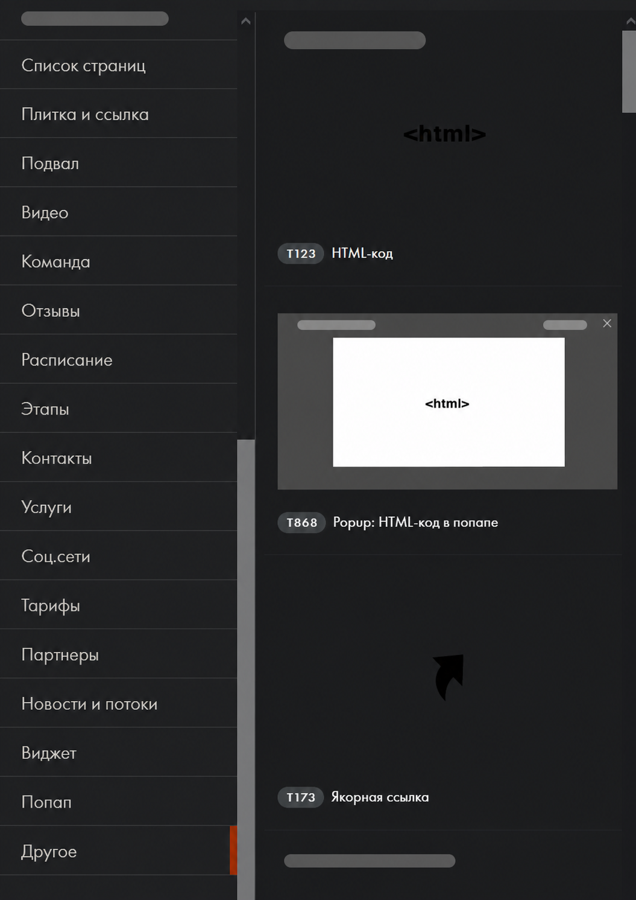

# Интеграция веб-формы с системой обработки заявок

Инструкция описывает передачу данных из формы Tilda Publishing во внешнюю систему обработки заявок. Вместе с заявкой можно передавать параметры из адресной строки, например идентификатор источника и предложения.

> В примерах используются условные значения. Адреса систем, ключи доступа, персональные и коммерческие данные в инструкцию не включены.

Для настройки необходимы доступ к редактору Tilda Publishing и согласованные параметры принимающей системы: адрес обработчика, способ авторизации и состав передаваемых полей.

## Подготовка формы

Чтобы подготовить форму к передаче параметров:

1. Откройте страницу с формой в редакторе Tilda Publishing.
2. Добавьте скрытое поле с именем `offerId`.
3. Добавьте скрытое поле с именем `webmasterId`.


4. В настройках формы укажите согласованный способ отправки данных во внешнюю систему.
5. Сохраните изменения и опубликуйте страницу.

Поле `webmasterId` будет получать значение параметра `ext_web`, а `offerId` — значение параметра `f`.

## Добавление обработчика параметров URL

Чтобы записывать параметры из адресной строки в скрытые поля формы:

1. Добавьте на страницу HTML-блок T123.



2. Вставьте в блок следующий код:

```html
<script>
document.addEventListener('DOMContentLoaded', () => {
  const parameters = new URLSearchParams(window.location.search);
  const fields = {
    ext_web: 'webmasterId',
    f: 'offerId'
  };

  Object.entries(fields).forEach(([parameterName, fieldName]) => {
    const value = parameters.get(parameterName);
    if (!value) return;

    document.querySelectorAll(`input[name="${fieldName}"]`).forEach((field) => {
      field.value = value;
    });
  });
});
</script>
```

3. Сохраните блок и повторно опубликуйте страницу.

Обработчик выполняется после загрузки страницы. Он не меняет вид формы: значения записываются только в скрытые поля.

## Настройка ссылок и перенаправлений

Чтобы передавать параметры из рекламной или партнёрской ссылки:

1. Добавьте к адресу страницы параметры `ext_web` и `f`.
2. Используйте тестовые значения, например `?ext_web=test-source&f=test-offer`.
3. Проверьте, что при переходах и перенаправлениях параметры сохраняются в адресной строке.

Если параметр исчезает до загрузки формы, скрытое поле останется пустым.

## Проверка отправки заявки

Чтобы проверить интеграцию:

1. Откройте опубликованную страницу по тестовой ссылке.
2. Откройте инструменты разработчика браузера и найдите скрытые поля формы.
3. Убедитесь, что поля `webmasterId` и `offerId` содержат тестовые значения.
4. Отправьте тестовую заявку без реальных персональных данных.
5. Проверьте поступление заявки и переданных параметров во внешней системе.

## Что проверить при ошибке

- Скрытые поля не заполняются — проверьте имена параметров в ссылке и имена полей формы.
- Параметры исчезают — проверьте настройки переходов и перенаправлений.
- Поля заполнены, но данные не поступают — проверьте настройки отправки формы, адрес обработчика и требования к авторизации.
- Появляются дубли — убедитесь, что обработчик подключён на странице только один раз.

## Готово

Форма передаёт во внешнюю систему данные заявки и параметры из адресной строки. После изменения формы, скрипта или ссылки повторите тестовую отправку.
