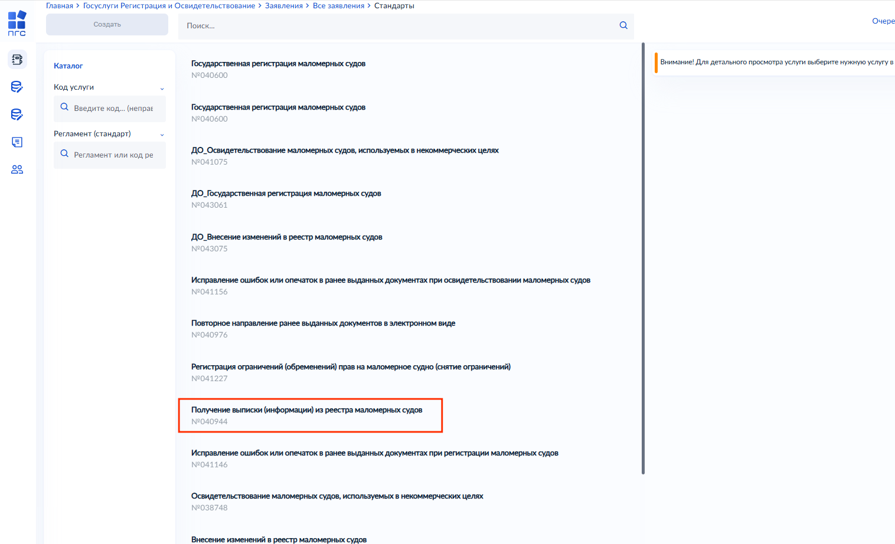
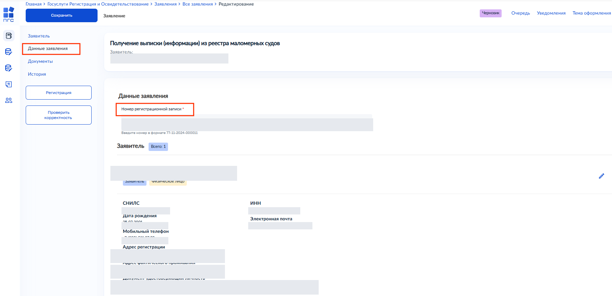
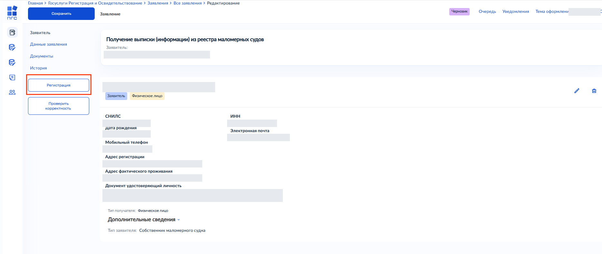
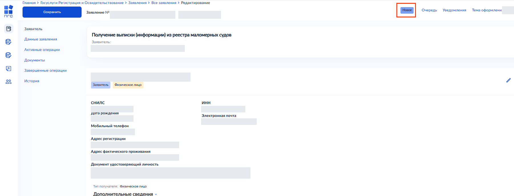
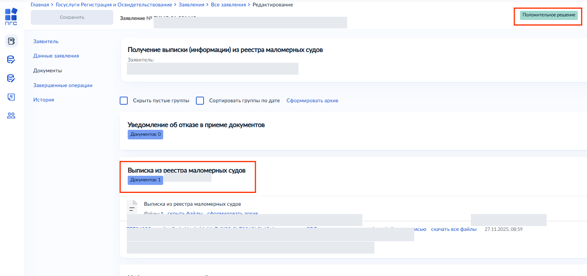

# Подуслуга «Запрос выписки (информации) из реестра маломерных судов»

Инструкция описывает порядок получения выписки из реестра маломерных судов во ФГИС ПГС.

> В иллюстрациях использованы обезличенные демонстрационные данные.

Процесс включает следующие этапы:

1. Авторизация во ФГИС ПГС и выбор подуслуги.
2. Создание запроса и заполнение данных заявителя.
3. Заполнение данных о маломерном судне.
4. Регистрация заявления.
5. Получение выписки из реестра.

## Авторизация во ФГИС ПГС и создание нового дела

Чтобы начать процесс получения выписки из реестра маломерных судов:

1. Перейдите в модуль «Госуслуги Регистрация и Освидетельствование».
2. Откройте реестр заявлений по подуслугам «Услуги по регистрации»: на боковой панели выберите «Заявления».
3. В верхнем левом углу нажмите кнопку «Добавить заявление». Откроется форма выбора стандарта.
4. Выберите стандарт «Получение выписки (информации) из реестра маломерных судов» и нажмите кнопку «Создать».

## Заполнение данных заявителя

Чтобы заполнить данные заявителя:

1. Нажмите кнопку «Создать» для формирования нового дела.
2. В верхнем левом углу нажмите кнопку «Добавить».
3. Выберите тип получателя:

   - «Физическое лицо»;
   - «Юридическое лицо».

4. В блоке «Дополнительные сведения» выберите тип заявителя «Собственник маломерного судна».
5. Заполните поля:

   - ФИО;
   - дата рождения;
   - СНИЛС;
   - телефон;
   - паспортные данные;
   - адрес постоянной регистрации;
   - адрес фактического проживания.

6. Справа от имени заявителя нажмите кнопку «Применить».

## Заполнение данных о маломерном судне

Чтобы получить выписку по конкретному маломерному судну:

1. Перейдите на вкладку «Данные заявителя».
2. Укажите номер реестровой записи в поле «Номер регистрационной записи».

3. Приложите скан-копию заявления в качестве документа.
4. В верхнем левом углу нажмите кнопку «Сохранить».
5. На боковой панели нажмите кнопку «Проверить корректность».

## Регистрация заявления

Чтобы зарегистрировать заявление:

1. На боковой панели нажмите кнопку «Регистрация».

2. Убедитесь, что статус заявления изменился на «Новое».

3. Обновите страницу.
4. Дождитесь появления в нижнем левом углу уведомления о готовности выписки.

## Получение выписки из реестра

Чтобы получить выписку из реестра маломерных судов:

1. Перейдите на вкладку «Документы».
2. Убедитесь, что статус заявления изменился на «Положительное решение».
3. Убедитесь, что в блоке «Выписка из реестра маломерных судов» доступен подготовленный документ.

## Готово

В реестре заявлений сформирована готовая выписка из реестра маломерных судов. Процесс выполнения услуги завершён.
