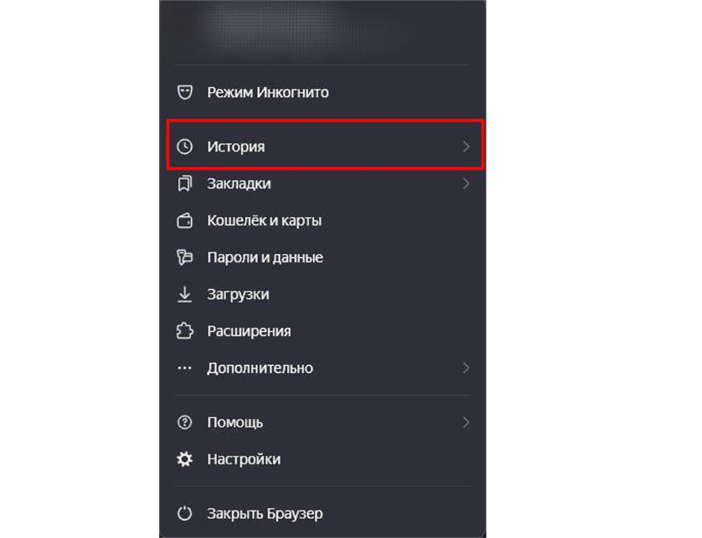
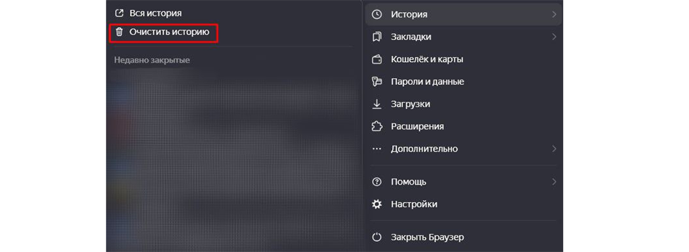
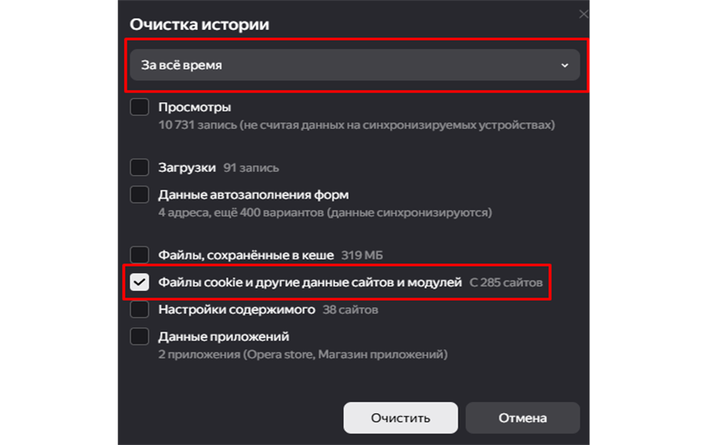
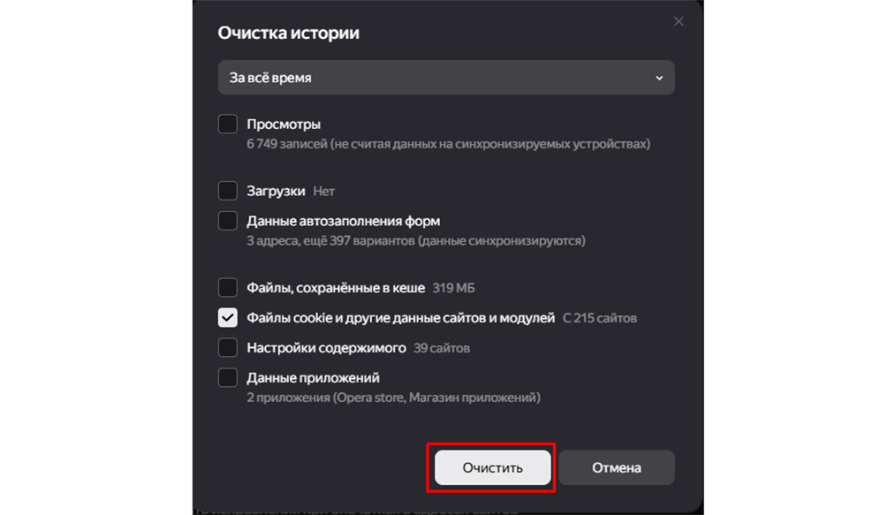

# Файлы cookie в веб-браузерах

Руководство объясняет структуру файлов cookie и предоставляет инструкцию по их очистке в Yandex Browser.
Cookie (куки) — текстовые файлы, которые сервер отправляет пользователю и сохраняет на жестком диске устройства. Они представляют из себя текстовые данные и используются для хранения информации о вашем взаимодействии с сайтом. Основные функции cookies:

1. Идентификация пользователя — сохранение данных для входа в аккаунт, автоматическая проверка прав доступа пользователя.  
2. Персонализация пользовательского интерфейса  — сохранение языковых настроек, внешнего вида сайта.  

Очистка файлов cookies помогает решить проблемы, связанные с ошибками авторизации — корректному входу в аккаунт или вызывать сбои в работе сайта и сохранять конфиденциальность пользователя.

**Пошаговая инструкция: Как очистить cookies файлы в Яндекс Браузере**  
*Перед выполнением убедитесь, что у вас установлена актуальная версия Yandex Browser (25.6.2.418 и выше).*

1. Откройте меню браузера.

2. Выберите пункт «История».

3. Нажмите «Очистить историю»

4. Установите параметры очистки истории:

* Укажите параметр «за всё время».

* Установите галочку в пункте «Файлы cookie и другие данные сайтов и модулей».

5. Нажмите «Очистить».

## Готово! Вы очистили файлы cookies в Yandex Browser
