# 1 Введение

## 1.1 Область применения средства автоматизации

Государственная информационная система обеспечения градостроительной деятельности (далее — ГИСОГД) предназначена для:

1. сбора, документирования, актуализации, обработки, систематизации, учета, хранения и размещения сведений, документов и материалов в соответствии с актуальными требованиями Градостроительного кодекса РФ;

2. обеспечения автоматизации процесса ведения градостроительной деятельности органами исполнительной власти (и подведомственными им учреждениями), органами местного самоуправления городских округов и муниципальных районов;

3. обеспечения подготовки, согласования и утверждения в том числе следующих документов (перечень не является исчерпывающим):

<!-- -->

1. правила землепользования и застройки;

2. проект планировки территории;

3. проект межевания территории;

4. градостроительный план земельного участка;

5. разрешение на отклонение от предельных параметров разрешенного строительства, реконструкции объектов капитального строительства;

6. разрешение на строительство объекта капитального строительства;

7. разрешение на ввод объекта капитального строительства в эксплуатацию;

8. уведомление о соответствии планируемых строительства или реконструкции объектов установленным параметрам / уведомление о соответствии построенных или реконструированных объектов.

<!-- -->

4. обеспечения доступа к картографической составляющей градостроительной документации, содержащейся в ГИСОГД;

5. создания единого информационного пространства (раздела) для ввода, хранения и обработки данных информационных моделей объектов капитального строительства.

## 1.2 Краткое описание возможностей средства автоматизации

Краткое описание возможностей ГИСОГД:

- автоматизация процессов ведения сведений, документов, материалов о развитии территорий, об их застройке, о существующих и планируемых к размещению объектах капитального строительства и иных необходимых для осуществления градостроительной деятельности сведений;

- централизация, упорядочивание хранения и обновления информации об объектах градостроительной деятельности; повышение ее достоверности и эффективности использования;

- формирование единого информационного пространства региона, содержащего сведения о территории, регламентах её использования, земельных участках и объектах капитального строительства, транспортной, социальной и коммунальной инфраструктуре;

- автоматизация процессов предоставления государственных и муниципальных услуг в сфере градостроительства и архитектуры;

- сокращение времени поиска и предварительной обработки информации об объектах градостроительной деятельности;

- минимизация ошибок пользователей при работе с данными, руководителей при принятии управленческих решений, сокращение сроков принятия решений;

- сокращение сроков подготовки градостроительной документации и времени на согласование документов, в том числе межведомственного характера.

## 1.3 Уровень подготовки пользователей

Руководство рассчитано на пользователей, имеющих базовые навыки работы в операционной системе Windows, опыт работы с информационными системами и базами данных через веб-интерфейс.

## 1.4 Перечень эксплуатационной документации, с которой необходимо ознакомиться пользователю

Состав документации, подлежащей изучению, определяется уровнем привилегий учетной записи:

1. для пользователей с ролью «Администратор»:

- руководство пользователя;

- руководство администратора.

2. для остальных ролей — руководство пользователя.

## 1.5 Термины и сокращения

Таблица 1 — Термины и сокращения

| **Сокращение** | **Расшифровка**                                                                   |
|----------------|-----------------------------------------------------------------------------------|
| ВРИ            | Вид разрешённого использования                                                    |
| ГАР            | Государственный адресный реестр                                                   |
| ГИСОГД         | Государственная информационная система обеспечения градостроительной деятельности |
| ГП/СТП         | Генеральный план / схема территориального планирования                            |
| ГПЗУ           | Градостроительный план земельного участка                                         |
| ЕГРН           | Единый государственный реестр недвижимости                                        |
| ЕГРИП          | Единый государственный реестр индивидуальных предпринимателей                     |
| ЕГРЮЛ          | Единый государственный реестр юридических лиц                                     |
| ЗОУИТ          | Зона с особыми условиями использования территории                                 |
| ЗУ             | Земельный участок                                                                 |
| ИЖС            | Индивидуальное жилищное строительство                                             |
| ИМСУ           | Исполнительный орган местного самоуправления                                      |
| ИНН            | Идентификационный номер налогоплательщика                                         |
| ИП             | Индивидуальный предприниматель                                                    |
| ИРД            | Исходно-разрешительная документация                                               |
| КВЗУ           | Кадастровая выписка о земельном участке                                           |
| КВОКС          | Кадастровая выписка об объекте капитального строительства                         |
| КПП            | Код причины постановки на учёт                                                    |
| КРТ            | Комплексное развитие территории                                                   |
| МФЦ            | Многофункциональный центр                                                         |
| МО             | Муниципальное образование                                                         |
| МСК            | Местная система координат                                                         |
| НСИ            | Нормативно-справочная информация                                                  |
| НСПД           | Национальная система пространственных данных                                      |
| ОГРН           | Основной государственный регистрационный номер                                    |
| ОИВ            | Орган исполнительной власти                                                       |
| ОКВЭД          | Общероссийский классификатор видов экономической деятельности                     |
| ОКН            | Объект культурного наследия                                                       |
| ОКПО           | Общероссийский классификатор предприятий и организаций                            |
| ОКС            | Объект капитального строительства                                                 |
| ОКТМО          | Общероссийский классификатор территорий муниципальных образований                 |
| ОМСУ           | Органы местного самоуправления                                                    |
| ПГУ            | Портал государственных услуг                                                      |
| ПЗЗ            | Правила землепользования и застройки                                              |
| ПК             | Персональный компьютер                                                            |
| РВ             | Разрешение на ввод объекта в эксплуатацию                                         |
| РнС            | Разрешение на строительство                                                       |
| РС             | Разрешение на строительство (обозначение в интерфейсе)                            |
| РСТП           | Региональная схема территориального планирования                                  |
| РФ             | Российская Федерация                                                              |
| СИТО           | Инженерно-техническое обеспечение                                                 |
| СМЭВ           | Система межведомственного электронного взаимодействия                             |
| СРЗУ           | Схема расположения земельного участка                                             |
| СТП            | Схема территориального планирования                                               |
| УИН            | Уникальный идентификационный номер                                                |
| ФГИС ТП        | Федеральная государственная информационная система территориального планирования  |
| ФИАС           | Федеральная информационная адресная система                                       |
| ФИО            | Фамилия, имя, отчество                                                            |
| ФЛ             | Физическое лицо                                                                   |
| ЮЛ             | Юридическое лицо                                                                  |
| ЭП             | Электронная подпись                                                               |
| ЭЦП            | Электронная цифровая подпись                                                      |
| SOA            | Сервисно-ориентированная модель                                                   |

# 2 Назначение и условия применения

## 2.1 Виды деятельности, функции, для автоматизации которых предназначено данное средство автоматизации

Объектом автоматизации является деятельность органов исполнительной власти региона с участием органов местного самоуправления, связанная со следующими направлениями:

- ведением государственной информационной системы обеспечения градостроительной деятельности, в том числе с функциями автоматизированной информационно-аналитической поддержки осуществления полномочий в области градостроительной деятельности, в автоматизированном виде;

- предоставлением сведений из государственной информационной системы обеспечения градостроительной деятельности;

- предоставлением государственных и муниципальных услуг в сфере градостроительства, архитектуры и земельных отношений в электронном виде;

- централизованным хранением и использованием при оказании услуг документов территориального планирования, градостроительного зонирования и планировки территорий;

- предоставлением доступа физическим и юридическим лицам к сведениям, документам и материалам из государственной информационной системы обеспечения градостроительной деятельности.

## 2.2 Условия применения средства автоматизации в соответствии с назначением

Архитектура государственной информационной системы обеспечения градостроительной деятельности (ГИСОГД) основана на сервисно-ориентированной модели (SOA). Система является открытой, допускает добавление, изменение или удаление компонентов без изменения архитектуры и построена по принципу многоуровневой клиент-серверной архитектуры. В качестве клиента используются современные веб-браузеры.

Состав сведений, документов и материалов, включаемых в ГИСОГД, определяется частью 4 статьи 56 Градостроительного кодекса Российской Федерации. В ГИСОГД включаются следующие сведения, документы и материалы:

1. карты планируемого размещения объектов федерального значения и положения о территориальном планировании применительно к территории субъекта Российской Федерации;

2. карты планируемого размещения объектов регионального значения и положения о территориальном планировании применительно к территории субъекта Российской Федерации;

3. карты планируемого размещения объектов местного значения муниципальных районов, поселений, муниципальных округов и городских округов; карты функциональных зон; положения о территориальном планировании;

4. региональные нормативы градостроительного проектирования;

5. местные нормативы градостроительного проектирования;

6. правила землепользования и застройки;

7. правила благоустройства территории;

8. основная часть проекта планировки территории;

9. основная часть проекта межевания территории;

10. материалы и результаты инженерных изысканий;

11. сведения о создании искусственного земельного участка;

12. сведения о границах зон с особыми условиями использования территорий, их характеристиках и ограничениях использования земельных участков;

13. положение об особо охраняемой природной территории; лесохозяйственные регламенты лесничества, расположенного на землях лесного фонда;

14. план наземных и подземных коммуникаций с информацией о существующих и проектируемых сетях инженерно-технического обеспечения и электрических сетях;

15. решения о резервировании земель и решения об изъятии земельных участков для государственных или муниципальных нужд;

16. дела о застроенных или подлежащих застройке земельных участках;

17. иные сведения, документы и материалы.

Для систематизации указанных сведений, документов и материалов в соответствии с постановлением Правительства Российской Федерации от 13.03.2020 № 279 «Об информационном обеспечении градостроительной деятельности» в ГИСОГД формируются 18 разделов.

Перечень 18 разделов ГИСОГД и состав размещаемых в них сведений, документов и материалов приведены в разделе 5.1 настоящего Руководства.

Сведения, документы и материалы, содержащиеся в ГИСОГД, систематизируются в соответствии с кадастровым делением территории Российской Федерации согласно части 7 статьи 56 Градостроительного кодекса Российской Федерации.

ГИСОГД обеспечивает возможность подготовки, согласования и утверждения документов, указанных в части 7.1 статьи 56 Градостроительного кодекса Российской Федерации.

Информация в Системе представлена в текстовой форме, в виде карт (схем) в растровом и векторном форматах, а также в форме электронных баз данных. Сведения, содержащиеся в ГИСОГД, являются открытыми и общедоступными, за исключением информации, отнесенной федеральными законами к категории ограниченного доступа. С целью соблюдения единых требований к содержанию, точности, системе классификации и кодирования, структуре, механизмам доступа и обмена цифровой пространственной и связанной с ней атрибутивной информацией хранение и обмен пространственной информацией должны осуществляться в соответствии с нормативными правовыми актами Российской Федерации.

При направлении сведений, документов и материалов для размещения в информационной системе в виде отдельных файлов каждый такой файл подписывается усиленной квалифицированной электронной подписью уполномоченного лица. При передаче сведений, документов и материалов в виде единого пакета в формате ZIP подписывается непосредственно сам пакет (архивный файл), содержащий передаваемые данные.

# 3 Подготовка к работе

## 3.1 Авторизация в Системе

При первом входе в Систему необходимо ввести логин и пароль, предоставленные администратором (рисунок 1).

*Рисунок 1 — Авторизация в системе.*

В случае неверного логина или пароля на экран выводится сообщение об ошибке (рисунок 2).

*Рисунок 2 — Некорректная авторизация.*

Если логин и пароль введены правильно, выполняется вход в Систему (рисунок 3).

*Рисунок 3 — Корректный вход.*

## 3.2 Стартовая страница

Главное окно ГИСОГД содержит следующие функциональные области:

1. «Журнал заявлений» — раздел для работы с входящими заявками и документами:

- «Журнал поступивших заявок»;

- «Выдача градостроительных планов земельных участков (ГПЗУ)»;

- «Выдача разрешений на строительство»;

- «Выдача разрешений на ввод объектов в эксплуатацию»;

- «Уведомления о планируемом строительстве»;

- «Уведомление об окончании строительства».

2. «Реестры документов» — раздел для доступа к нормативной и проектной документации:

- «Документы ГИСОГД»;

- «Территориальное планирование Российской Федерации»;

- «Территориальное планирование муниципальных образований»;

- «Нормативные правовые акты»;

- «Градостроительное зонирование»;

- «Правила благоустройства территории»;

- «Планировка территории»;

- «Инженерные изыскания»;

- «Искусственные земельные участки»;

- «Зоны с особыми условиями использования»;

- «Надземные и подземные коммуникации»;

- «Резервирование земель и изъятие земельных участков»;

- «Дела о земельных участках»;

- «Программы реализации документов территориального планирования»;

- «Особо охраняемые природные территории»;

- «Лесничества»;

- «Информационные модели ОКС»;

- «Иные документы».

3. «Отчеты»:

- «Статистика по разделам и ГИСОГД»;

- «Документы ГИСОГД»;

- «Загруженная графика».

4. «Популярные разделы»:

- «Карта»;

- «Инструкции»;

- «Документы ГИСОГД»;

- «Дело с земельным участком (ЗУ)»;

- «Градостроительный план земельного участка (ГПЗУ)»;

- «Разрешения на строительство»;

- «Объекты капитального строительства (ОКС)»;

- «Разрешения на ввод»;

- «Уведомления».

# 4 Описание операций

## 4.1 Навигация в системе

Меню расположено в левой части экрана и может находиться в развернутом или свернутом состоянии.

Для сворачивания меню нажать кнопку в нижней части меню. Для разворачивания меню нажать соответствующую кнопку.

Для открытия пункта меню навести на него указатель мыши и щелкнуть левой кнопкой. Содержимое выбранного пункта отобразится в правой области экрана (рисунок 4).

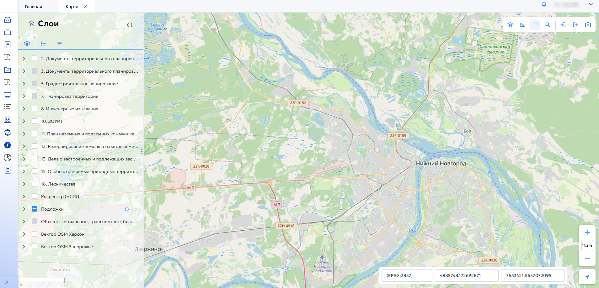

*Рисунок 4 — Открытие пункта меню.*

Если пункт меню содержит вложенные подпункты (является группировочным), его необходимо предварительно раскрыть, нажав кнопку . Работа с группировочным пунктом меню показана на рисунке 5.

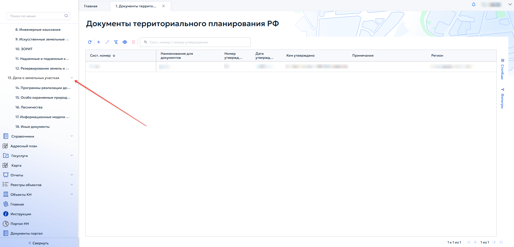

*Рисунок 5 — Работа с группировочным пунктом меню.*

Для просмотра ранее открытых пунктов меню и быстрого переключения между ними предназначена панель вкладок. При открытии нового раздела соответствующая вкладка добавляется на панель. Для перехода к ранее открытому разделу нажать на его вкладку левой кнопкой мыши (рисунок 6).

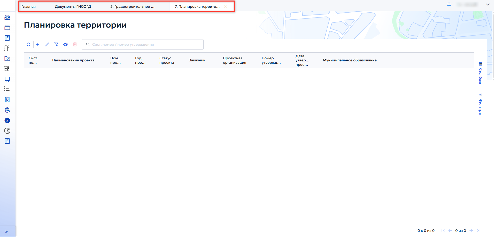

*Рисунок 6 — Панель вкладок.*

## 4.2 Работа с табличными формами

В разделах ГИСОГД на базе платформы «Акцент» для отображения информации используются гибкие и настраиваемые табличные формы. Они предоставляют пользователю возможность поиска, фильтрации, группировки данных.

### 4.2.1 Основные элементы табличной формы

Типовая табличная форма содержит следующие элементы:

1. отображаемый набор записей — данные, представленные в виде строк таблицы;

2. панель инструментов — набор кнопок для управления содержимым таблицы;

3. маркеры записей — элементы для выделения одной или нескольких записей с целью выполнения групповых операций;

4. конструктор таблицы («Шапка») — строка с названиями колонок, которая позволяет:

- изменять порядок колонок (перетаскиванием);

- сортировать данные по возрастанию или убыванию;

- применять фильтры по значениям колонок;

- выполнять поиск по содержимому;

- группировать записи по выбранным полям.

Элементы табличной формы показаны на рисунке 7.

*Рисунок 7 — Типовые элементы табличной формы.*

## 4.3 Управление записями в реестре

Для работы с записями реестра предусмотрены следующие функции:

- обновление;

- добавление;

- удаление;

- редактирование.

Для обновления отображения реестра нажать кнопку . Для добавления новой записи нажать кнопку .

Для редактирования записи нажать кнопку .

Для удаления одной или нескольких записей выделить их с помощью маркеров и нажать кнопку .

На панели инструментов также могут находиться кнопки для «Экспорта» и «Импорта» (или соответствующие кнопки —  и ) в различные форматы.

Для связанных реестров могут быть доступны следующие кнопки:

- кнопка связи (отображение кнопки — ) открывает реестр для выбора существующей записи, которую необходимо связать с текущим объектом;

- кнопка разрыва связи (отображение кнопки — ) разрывает связь с выбранной записью (предварительно выделить запись в списке связанных объектов).

## 4.4 Фильтрация записей

Быстрый поиск по основным атрибутам реестра выполняется с помощью поля поиска (рисунок 8). Для этого указать искомое значение и нажать клавишу Enter.

*Рисунок 8 — Поле поиска.*

Панель фильтров реестра расположена в правой части рабочей области вкладки (рисунок 9).

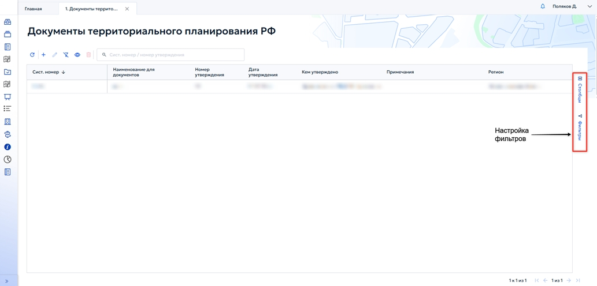

*Рисунок 9 — Фильтрация записей.*

В окне фильтров доступен выбор одного или нескольких полей для фильтрации. После указания нужных значений нажать кнопку «Найти», чтобы применить фильтр (рисунок 10). Для повторного использования фильтра использовать кнопку «Сохранить фильтр».

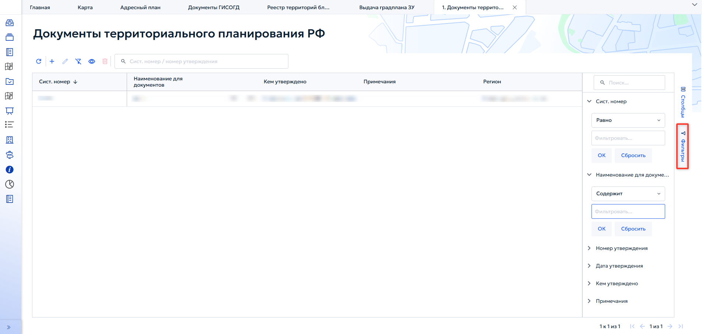

*Рисунок 10 — Настройка фильтрации записей.*

Для быстрой фильтрации данных по любому столбцу таблицы нажать кнопку «Фильтры» в выпадающем меню заголовка столбца. Если столбец содержит числовые значения или даты, в меню фильтрации отображаются поля для указания различного диапазона данных.

Если фильтр применяется к строковым данным, меню фильтрации содержит поле для ввода произвольной подстроки поиска, а также выпадающий список быстрого выбора значений, встречающихся в ячейках столбца.

В выпадающем списке отметить одно или несколько значений. После применения фильтра в таблице останутся только записи, соответствующие выбранным условиям.

## 4.5 Работа с карточкой записи

Большая часть данных, отображаемая в табличных формах, редактируется через карточку записи. Добавление новой записи выполняется с помощью карточки (рисунок 11).

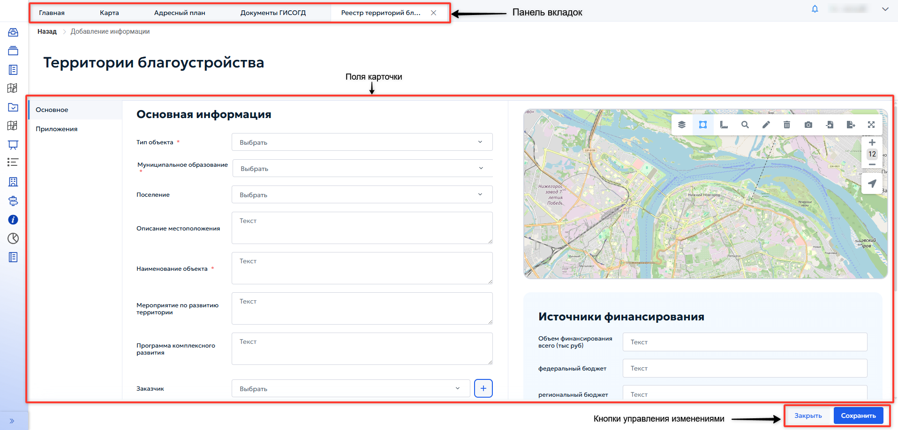

*Рисунок 11 — Основные элементы карточки.*

«Поля формы» — раздел для отображения и редактирования данных выбранной записи. Элементы управления для разных типов полей могут отличаться. Строковые и текстовые поля позволяют вводить произвольные символы; числовые поля допускают ввод только цифровых значений; логические поля — значения «да» или «нет»; поля с типом «дата» — выпадающий элемент управления «Календарь» или ручной ввод дат в формате «ДД.ММ.ГГГГ».

Существует несколько видов полей для ввода данных:

- «Строка/текст» — позволяет вносить произвольный текст (рисунок 12);

*Рисунок 12 — Строка/Текст.*

- «Дата» — выбрать дату документа с помощью календаря (рисунок 13);

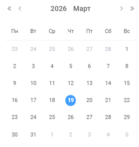

*Рисунок 13 — Дата.*

- «Целое» — позволяет вносить только целое числовое значение;

- «Дробное» — позволяет вносить дробное числовое значение;

- «Одиночный выбор из списка» (рисунок 14) — значение выбирается из выпадающего списка . Для поиска необходимого значения ввести часть текста и нажать клавишу Enter. Для удаления выбранного значения нажать клавишу  в правой части поля;

*Рисунок 14 — Одиночный выбор из списка.*

- «Множественный выбор из списка» (рисунок 15) — работает аналогично одиночному выбору, поддерживает поиск. Для удаления одного значения нажать кнопку  рядом с ним, для удаления всех значений — кнопку  в правой части поля;

*Рисунок 15 — Множественный выбор из списка.*

- «Флажок» — позволяет установить или снять отметку для учета определенного параметра. Для изменения состояния флажка нажать левой кнопкой мыши в поле флажка.

Связанные реестры (рисунок 16) отображают записи из других реестров, имеющие связь с текущей записью. Управление записями в связанных реестрах выполняется аналогично действиям, описанным в разделе 4.3.

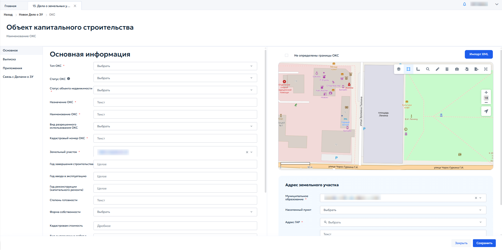

*Рисунок 16 — Связанные реестры.*

В карточках записи используются следующие условные обозначения:

- \* — поле обязательно для заполнения;

- серый цвет поля — поле недоступно для редактирования.

Для полей ссылочного типа (простая ссылка, множественная ссылка) используются следующие элементы управления:

-  очистка значения поля;

-  открытие выпадающего списка значений из связанной таблицы. Для поиска необходимого значения достаточно ввести произвольную подстроку в поле ввода — список автоматически предложит все подходящие варианты.

В нижней части карточки доступны следующие кнопки:

- кнопка для сохранения внесенных данных или внесенных изменений данных карточки;

- кнопка для выхода без сохранения внесенных данных или внесенных изменений данных карточки.

### 4.5.1 Вкладка «Приложенные файлы»

Вкладка «Приложенные файлы» является типовой и содержит следующие элементы (рисунок 17):

- список прикрепленных файлов, расположенный в левой части рабочей области вкладки;

- поле предварительного просмотра файлов (если возможность предпросмотра предусмотрена, при выборе файла или списка в этом поле отображается его содержимое);

- кнопка «Выберите файлы», предназначенная для добавления файлов во вкладку «Приложенные файлы».

*Рисунок 17 — Вкладка «Приложенные файлы».*

Система поддерживает загрузку файлов различных форматов. Просмотр в окне документа доступен для файлов форматов PDF, JPG, PNG и других, поддерживаемых системой. Текстовые файлы в формате Word выгружаются и просматриваются вне системы.

### 4.5.2 Работа с картой

В верхней части рабочей области карты находится панель инструментов со следующими элементами:

На рисунке 18 показаны инструменты работы с картой.

*Рисунок 18 — Панель инструментов карты.*

#### 4.5.2.1 Работа со слоями карты

Кнопка «Слои» — при нажатии открывается панель управления слоями. Слои могут группироваться по определенным характеристикам в выпадающие списки. Видимость слоя настраивается с помощью флажка, расположенного слева от наименования слоя (рисунок 19).

*Рисунок 19 — Панель управления слоями.*

#### 4.5.2.2 Выбор объекта и просмотр информации об объекте

При нажатии кнопки «Выбор объектов» открывается выпадающий список со способами выбора объектов на карте (рисунок 20):

*Рисунок 20 — Кнопка «Выбор объекта».*

- «Точкой» — навести курсор на нужный объект и щелкнуть левой кнопкой мыши (рисунок 21);

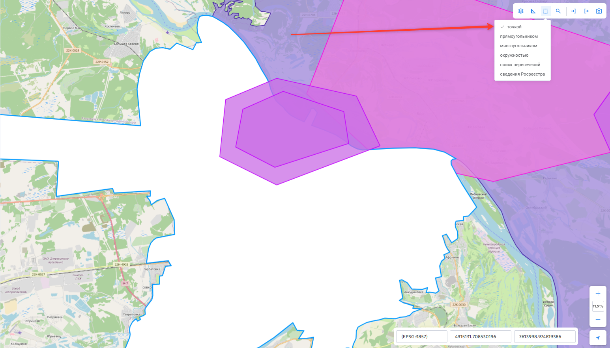

*Рисунок 21 — Объект «Точка».*

- «Прямоугольник» — нажать левую кнопку мыши на карте и, не отпуская ее, переместить курсор, чтобы задать прямоугольную область выбора (рисунок 22);

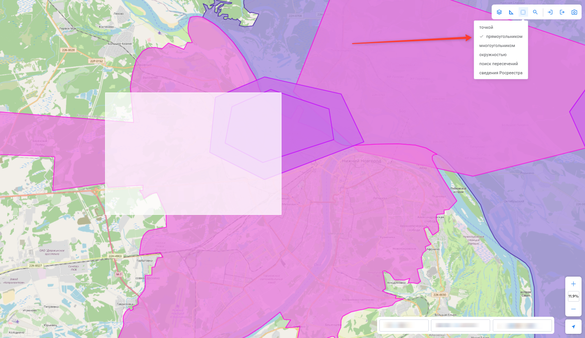

*Рисунок 22 — Объект «Прямоугольник».*

- «Многоугольник» — последовательно нажать левую кнопку мыши в нужных точках, чтобы задать область выбора (рисунок 23);

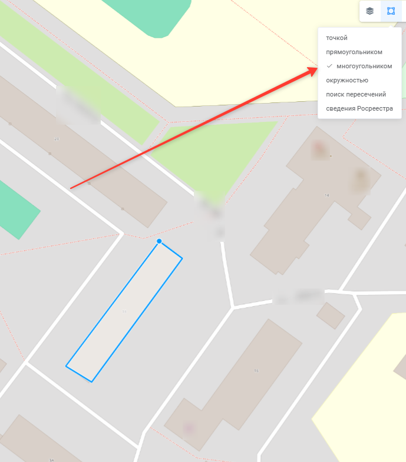

*Рисунок 23 — Объект «Многоугольник».*

- «Окружность» — нажать левую кнопку мыши на карте и, не отпуская ее, переместить курсор, чтобы задать область выбора в форме окружности (рисунок 24);

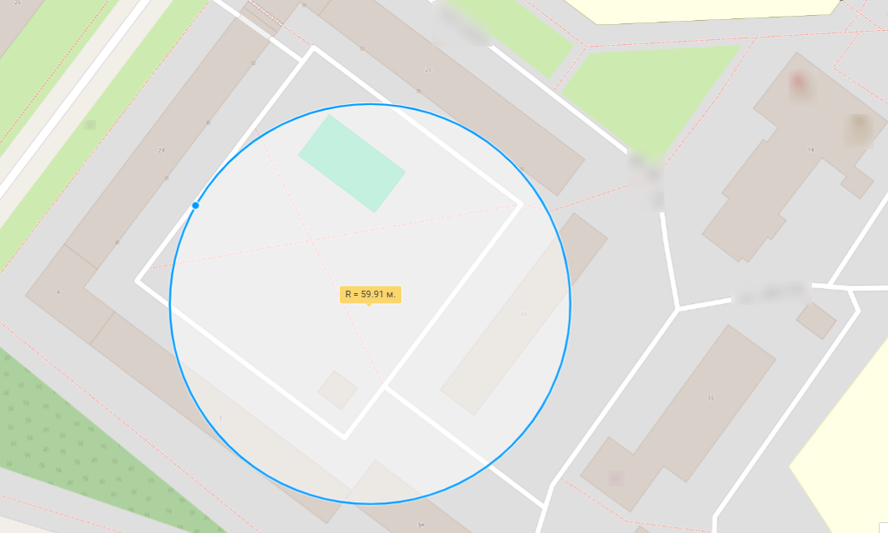

*Рисунок 24 — Объект «Окружность».*

- «Поиск пересечений» — нарисовать многоугольник последовательными щелчками левой кнопки мыши. Система выберет слои, контуры которых пересекают нарисованный многоугольник или находятся внутри него. Список выбранных слоев отобразится в информационном окне (рисунок 25).

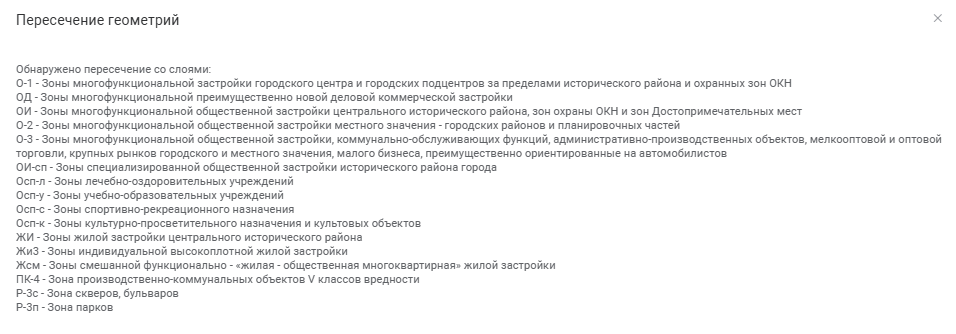

*Рисунок 25 — Поиск пересечений.*

Выбранный объект отображается на карте голубым цветом. Сведения о выбранном объекте отображаются на панели слоев во вкладке «Свойства». Вкладка «Свойства» расположена на той же панели, что и список слоев, и выделена на рисунке 26 красной рамкой. Состав сведений во вкладке зависит от вида выбранного объекта.

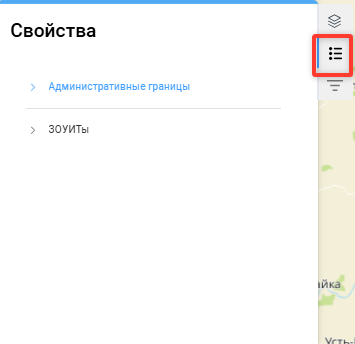

*Рисунок 26 — Отображение свойств выбранного объекта.*

#### 4.5.2.3 Измерение расстояний и площадей

Кнопка «Измерение расстояний и площадей»  при нажатии раскрывает выпадающий список возможных функций:

- «Дистанция» — измерение расстояния;

- «Площадь» — измерение площади;

- «Очистить» — удаление всех ранее выполненных измерений с карты.

#### 4.5.2.4 Измерение расстояния

Для измерения расстояния необходимо выполнить следующие действия:

1. на панели инструментов нажать кнопку «Измерение расстояний и площадей»;

2. в открывшемся списке выбрать пункт «Дистанция»;

3. навести курсор мыши на начало объекта, длину которого необходимо измерить, и щелчком левой кнопки мыши зафиксировать первую точку;

4. если требуется измерить расстояние по ломаной линии, фиксировать щелчком левой кнопки мыши каждый поворот, последовательно перемещая курсор вдоль линии. Измеряемое расстояние будет отображаться синей линией. Если необходимо измерить расстояние по прямой линии, пропустить этот пункт и перейти к следующему (рисунок 27);

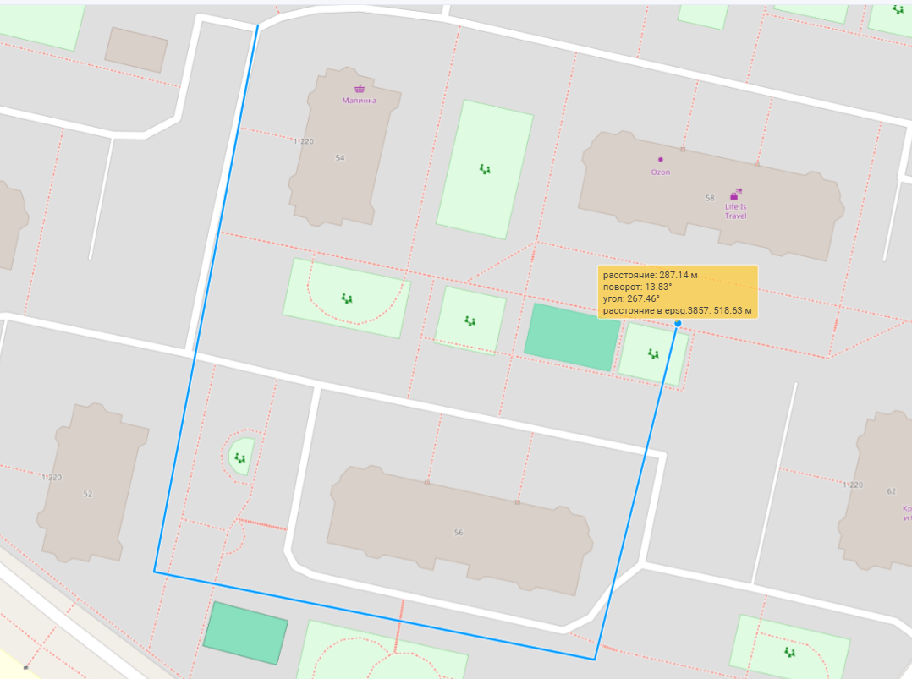

*Рисунок 27 — Измерение расстояния.*

5. зафиксировать конечную точку двойным щелчком левой кнопки мыши. В месте фиксации конечной точки отобразится информационная метка с результатом измерения (рисунок 28).

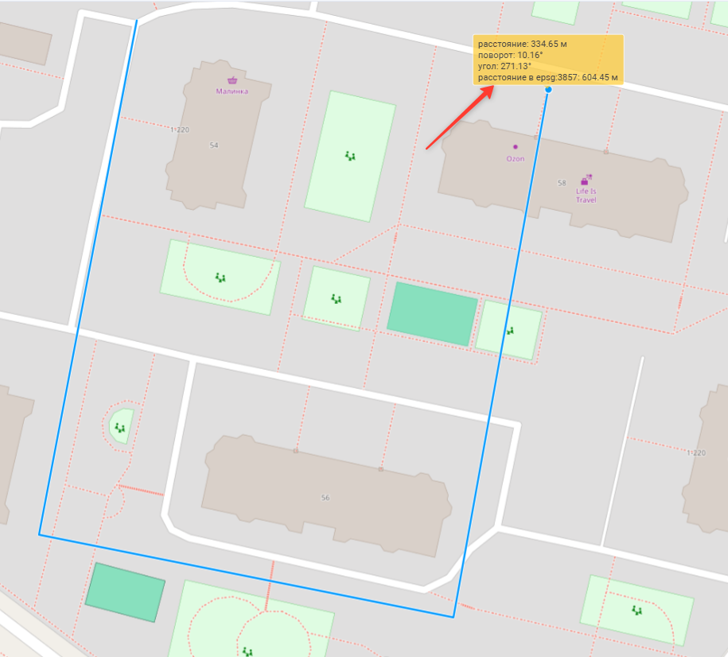

*Рисунок 28 — Измерение расстояния.*

#### 4.5.2.5 Измерение площади

Для измерения площади выполнить следующие действия:

1. на панели инструментов нажать кнопку «Измерение расстояний и площадей»;

2. в открывшемся списке выбрать пункт «Площадь»;

3. навести курсор мыши на один из углов объекта, площадь которого необходимо измерить, и щелчком левой кнопки мыши зафиксировать точку;

4. переместить курсор мыши в следующий угол объекта и зафиксировать точку щелчком левой кнопки мыши. Контур фигуры будет отображаться синей линией;

5. продолжая последовательно перемещать курсор мыши к каждому углу фигуры и фиксируя точки щелчком левой кнопки мыши, обвести весь объект на карте (рисунок 29);

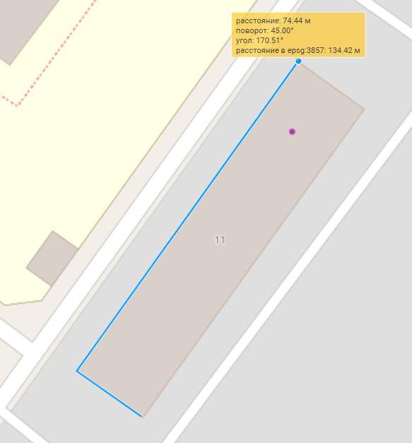

*Рисунок 29 — Измерение площади.*

6. после фиксации всех углов вернуть курсор мыши в первую точку и двойным щелчком левой кнопки мыши завершить построение контура. В центре фигуры появится информационная метка с результатом измерения (рисунок 30).

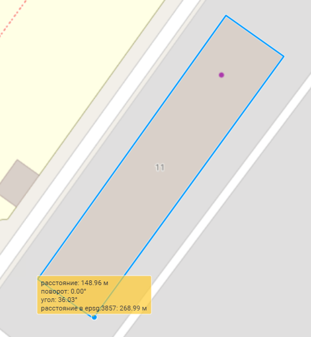

*Рисунок 30 — Измерение площади.*

#### 4.5.2.6 Очистка результатов измерений

Для удаления с карты всех ранее выполненных измерений выполнить следующие действия:

1. на панели инструментов нажать кнопку «Измерение расстояний и площадей»;

2. в открывшемся списке выбрать пункт «Очистить». Все результаты измерений будут удалены с карты.

#### 4.5.2.7 Поиск объектов на карте

Для поиска объекта на карте нажать на панели инструментов кнопку «Поиск» (рисунок 31). Откроется выпадающий список со следующими способами поиска:

- «Координаты» — поиск объекта по координатам;

- «Адрес» — поиск объекта по адресу;

- «Поиск в НСПД» — поиск объекта на портале пространственных данных.

*Рисунок 31 — Кнопка «Поиск».*

#### 4.5.2.8 Поиск по координатам

Для поиска по координатам выбрать пункт «Координаты». В открывшемся окне ввести координаты и нажать кнопку «Перейти» (рисунок 32).

*Рисунок 32 — Поиск объекта по координатам.*

#### 4.5.2.9 Поиск по адресу

Для поиска по адресу выбрать пункт «Адрес». В открывшемся окне ввести адрес и нажать кнопку «Перейти» (рисунок 33).

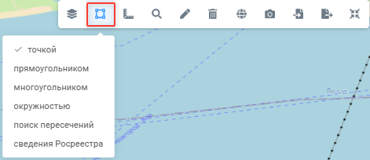

*Рисунок 33 — Поиск объекта по адресу.*

#### 4.5.2.10 Добавление и удаление геометрии

Для добавления геометрии на карте нажать кнопку «Рисование геометрии». В открывшемся выпадающем списке указать подходящий тип геометрии (рисунок 34).

*Рисунок 34 — Рисование геометрии.*

Геометрия типа «Точка», «Прямоугольник», «Многоугольник» рисуется щелчками левой кнопки мыши на карте. Для рисования окружности нажать и удерживать левую кнопку мыши — на экране появится круглая фигура, размер которой изменяется движением курсора. Для сохранения нарисованной геометрии нажать кнопку «Сохранить» в карточке редактирования объекта реестра.

Ввод геометрии по координатам требует указания системы координат (рисунок 35).

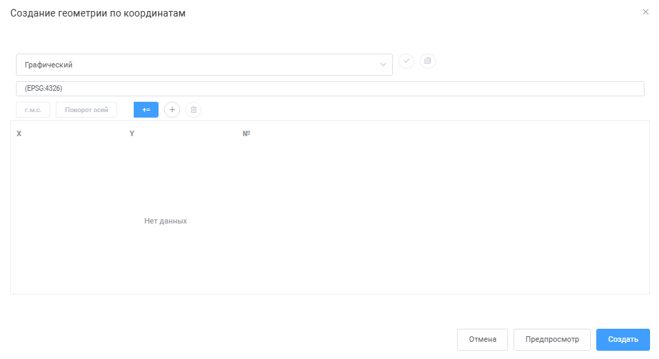

*Рисунок 35 — Выбор системы координат для ввода геометрии по координатам.*

В поле «Система координат» ввести сочетание букв «МСК» (местная система координат), выбрать систему координат и зону региона щелчком мыши в списке. Нажать кнопку «Выбрать систему координат». Сведения Росреестра (например, координаты границ земельных участков) в кадастровых выписках предоставляются в местной системе координат региона. В кадастровой выписке оси системы координат геодезические (первая координата — направление на север, вторая — на восток), поэтому, если координаты вводятся из кадастровой выписки, при вводе их необходимо менять местами.

После выбора системы координат добавить точки с помощью кнопки «+» и ввести координаты точки.

Для удаления нарисованной геометрии выбрать объект, затем нажать кнопку «Удаление геометрии» на панели инструментов.

#### 4.5.2.11 Печать карты

При нажатии кнопки «Печать карты» открывается окно предварительного просмотра и печати текущего вида карты (рисунок 36).

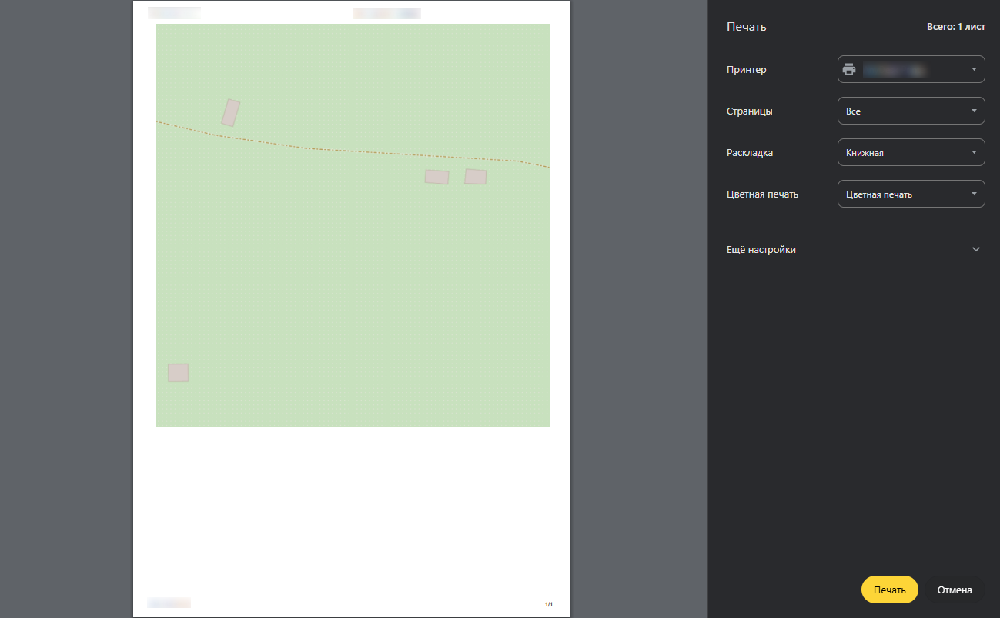

*Рисунок 36 — Печать карты.*

#### 4.5.2.12 Импорт геометрии

Для импорта геометрии из файла нажать кнопку «Импорт», затем в открывшемся окне выбрать пункт «Файл» (рисунок 37). Импорт возможен из текстового формата WKT, а также из графических файлов формата MIF, DXF, TAB.

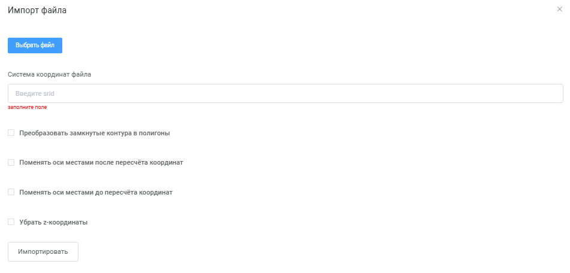

*Рисунок 37 — Импорт геометрии из файла.*

В окне импорта выбрать файл с координатами. Обычно используются текстовые файлы формата MIF. В поле «Система координат» ввести сочетание букв «МСК» и нажать клавишу Enter — система предложит доступные варианты. Если координата X начинается с 1 млн, выбрать первую зону соответствующей МСК.

Для импорта нажать кнопку «Импортировать». После загрузки координат на карте отобразится граница загруженных объектов.

Для импорта из формата WKT необходимо выбрать «Импорт → WKT». При импорте из WKT необходимо ввести тип геометрии и координаты в текстовой строке. Также необходимо выбрать систему координат (рисунок 38).

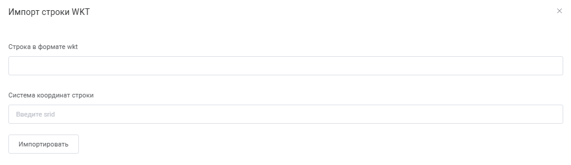

*Рисунок 38 — Импорт из текстового формата WKT.*

Пример формата WKT для полигона: POLYGON ((X1 Y1, X2 Y2, …, Xn Yn)).

#### 4.5.2.13 Экспорт геометрии

Кнопка «Экспорт» позволяет выгрузить выбранную геометрию или весь слой в заданный формат файла. Копия карты также сохраняется в файл PNG.

#### 4.5.2.14 Изменение размера карты

Кнопка «Развернуть»  при нажатии разворачивает карту на всю рабочую область. Кнопка «Свернуть»  сворачивает карту обратно.

# 5 Состав ГИСОГД

## 5.1 Разделы и документы ГИСОГД

Для систематизации сведений, документов и материалов, предусмотренных статьей 56 Градостроительного кодекса Российской Федерации, в соответствии с постановлением Правительства Российской Федерации от 13.03.2020 № 279 «Об информационном обеспечении градостроительной деятельности» в ГИСОГД формируются 18 разделов:

1. документы территориального планирования Российской Федерации — документы территориального планирования Российской Федерации, нормативные правовые акты, которыми утверждены документы территориального планирования Российской Федерации, и (или) нормативные правовые акты, которыми внесены изменения в такие документы;

2. документы территориального планирования двух и более субъектов Российской Федерации, документы территориального планирования субъектов Российской Федерации — документы территориального планирования двух и более субъектов Российской Федерации, нормативные правовые акты, которыми утверждены документы территориального планирования двух и более субъектов Российской Федерации, и (или) нормативные правовые акты, которыми внесены изменения в такие документы; документы территориального планирования субъекта Российской Федерации, нормативные правовые акты, которыми утверждены документы территориального планирования субъекта Российской Федерации, и (или) нормативные правовые акты, которыми внесены изменения в такие документы;

3. документы территориального планирования муниципальных образований — документы территориального планирования муниципальных образований, нормативные правовые акты, которыми утверждены документы территориального планирования муниципальных образований, и (или) нормативные правовые акты, которыми внесены изменения в такие документы;

4. нормативы градостроительного проектирования — нормативы градостроительного проектирования, нормативные правовые акты, которыми утверждены нормативы градостроительного проектирования, и (или) нормативные правовые акты, которыми внесены изменения в такие документы;

5. градостроительное зонирование — правила землепользования и застройки территорий, нормативные правовые акты, которыми утверждены правила землепользования и застройки территорий, и (или) нормативные правовые акты, которыми внесены изменения в такие документы;

6. правила благоустройства территории — правила благоустройства территории, нормативные правовые акты, которыми утверждены правила благоустройства территории, и (или) нормативные правовые акты, которыми внесены изменения в такие документы; закон субъекта Российской Федерации, которым утвержден порядок определения границ прилегающих территорий;

7. планировка территории — документация по планировке территории, ненормативные правовые акты, которыми утверждена документация по планировке территории, и (или) ненормативные правовые акты, которыми внесены изменения в такую документацию; нормативные правовые акты, которыми утверждены порядок подготовки документации по планировке территории, порядок принятия решения об утверждении документации по планировке территории, порядок внесения изменений в такую документацию, порядок отмены такой документации или ее отдельных частей, порядок признания отдельных частей такой документации не подлежащими применению;

8. инженерные изыскания — материалы и результаты инженерных изысканий;

9. искусственные земельные участки — сведения, документы, материалы в отношении искусственных земельных участков, в том числе разрешение на создание искусственного земельного участка, разрешение на проведение работ по созданию искусственного земельного участка, разрешение на ввод искусственно созданного земельного участка в эксплуатацию;

10. зоны с особыми условиями использования территории — сведения, документы, материалы о границах зон с особыми условиями использования территорий и об их характеристиках, в том числе сведения об ограничениях использования земельных участков и (или) объектов капитального строительства в границах таких зон, в том числе нормативные правовые акты об установлении, изменении, прекращении существования зон с особыми условиями использования территории; иные сведения, документы, материалы;

11. план наземных и подземных коммуникаций — сведения, документы, материалы, содержащие информацию о местоположении существующих и проектируемых сетей инженерно-технического обеспечения, электрических сетей, сетей связи, в том числе на основании данных, содержащихся в Едином государственном реестре недвижимости, едином государственном реестре заключений;

12. резервирование земель и изъятие земельных участков — решения о резервировании земель или решения об изъятии земельных участков для государственных и муниципальных нужд;

13. дела о застроенных или подлежащих застройке земельных участках — сведения, документы, материалы дел о застроенных и (или) подлежащих застройке земельных участках; разрешение на использование земель; нормативные правовые акты о присвоении, изменении и аннулировании адресов объектов недвижимости;

14. программы реализации документов территориального планирования — программы, которыми предусмотрены мероприятия по реализации документов территориального планирования, нормативные правовые акты, которыми утверждены такие программы, и (или) нормативные правовые акты, которыми внесены изменения в такие программы; инвестиционные программы субъектов естественных монополий; инвестиционные программы организаций коммунального комплекса; программы комплексного развития транспортной инфраструктуры; программы комплексного развития социальной инфраструктуры; программы комплексного развития систем коммунальной инфраструктуры;

15. особо охраняемые природные территории — сведения, документы, материалы об особо охраняемых природных территориях, положения об особо охраняемых природных территориях, нормативные правовые акты, которыми утверждены положения об особо охраняемых природных территориях, и (или) нормативные правовые акты, которыми внесены изменения в такие положения;

16. лесничества — сведения, документы, материалы в отношении лесничеств, в том числе лесохозяйственные регламенты, проекты освоения лесов, проектная документация лесных участков;

17. информационные модели объектов капитального строительства — информационные модели объектов капитального строительства;

18. иные сведения, документы, материалы — сведения, документы, материалы, не размещенные в иных разделах информационной системы.

Сведения и документы ГИСОГД содержат текстовые и графические компоненты.

Порядок внесения и предоставления документов ГИСОГД регламентируется постановлением Правительства Российской Федерации от 13.03.2020 № 279.

Органы власти, издавшие документы, предоставляют их для размещения в ГИСОГД оператору ГИСОГД или органы власти могут быть подключены к ГИСОГД и могут заносить свои документы самостоятельно. Обычно муниципалитеты подключены к ГИСОГД и заносят свои документы сами (градостроительные планы, постановления об утверждении документации по планировке территории, разрешения на строительство и т. д.).

Предоставление документов ГИСОГД осуществляется бесплатно и на платной основе.

Часть документов ГИСОГД должна предоставляться бесплатно через соответствующий региональный градостроительный портал. Перечень бесплатно предоставляемых документов регламентируется постановлением Правительства № 279.

Предоставление сведений и документов из ГИСОГД осуществляется ОМСУ по запросам через СМЭВ, МФЦ, портал госуслуг, по письменным запросам в ОМСУ. Сведения и документы могут предоставляться в электронном или бумажном виде.

## 5.2 Регистрация заявок

Все входящие документы регистрируются в реестре «Поступившие заявки». Реестр содержит загруженные документы ГИСОГД и заявки, поступившие в систему.

В реестре обрабатываются заявки на размещение и предоставление документов ГИСОГД, а также заявления на оказание государственной услуги по выдаче документа, поданные в электронной форме.

Журнал поступивших заявок открывается одним из следующих способов:

1. через левое боковое меню: развернуть «Журнал заявлений» и выбрать необходимый раздел (рисунок 39);

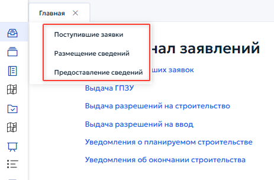

*Рисунок 39 — Меню «Поступившие заявки».*

2. через главную страницу ГИСОГД: в блоке «Журнал заявлений» выбрать пункт «Журнал поступивших заявок» (рисунок 40).

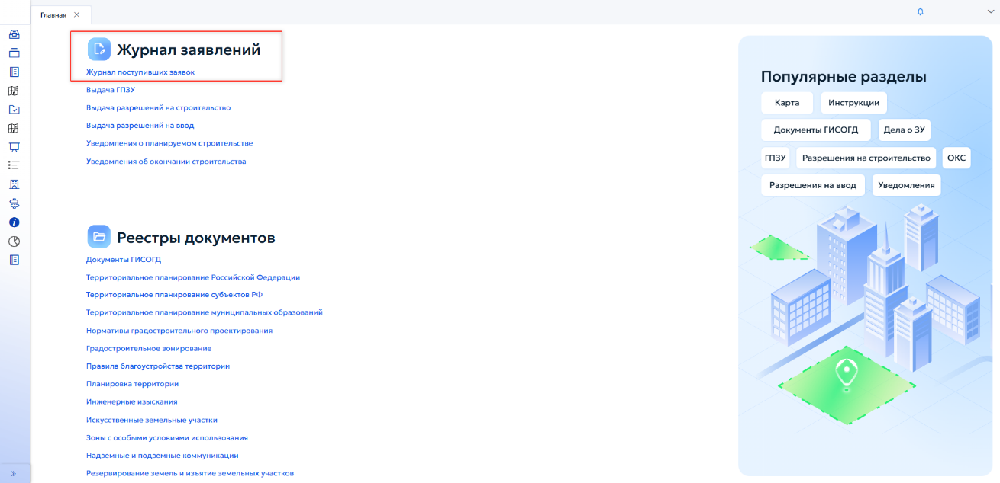

*Рисунок 40 — Открытие журнала поступивших заявок через главную страницу ГИСОГД.*

В журнале поступивших заявок (рисунок 41) доступна фильтрация записей, в том числе по статусу просмотра («Все», «Новое», «Зарегистрировано», «В работе», «Исполнено», «Отказано») и по статусу отправителя («Все», «Лично», «Почтовое отделение», «Электронная почта», «МФЦ», «ЕСМЭВ», «ПГУ», «Иные»). Подробнее фильтрация записей описана в разделе 4.4.

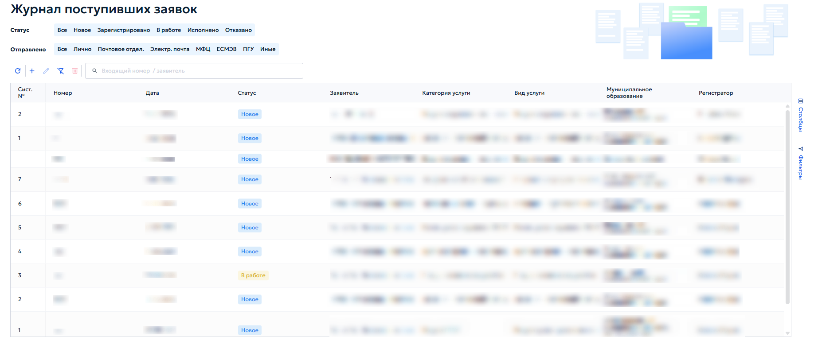

*Рисунок 41 — Журнал поступивших заявок.*

Для создания новой заявки в журнале поступивших заявок нажать кнопку «Добавить».

Для открытия поступившей заявки в режиме редактирования дважды нажать левой кнопкой мыши на нужную карточку (рисунок 42).

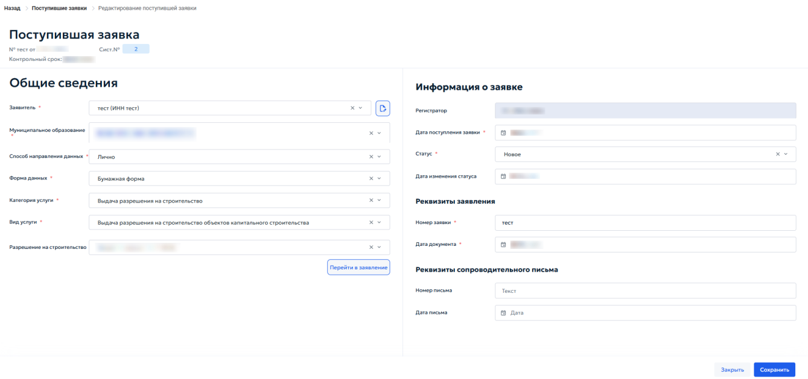

*Рисунок 42 — Сведения о поступившей заявке.*

При нажатии кнопки «Перейти в заявление» открывается редактор заявления «Выдача разрешения на строительство», предназначенный для регистрации и обработки заявок на получение разрешения на строительство (рисунок 43).

Заявление состоит из вкладок «Общие сведения», «Связь с делами о земельных участках» и «Приложение».

### 5.2.1 Выдача разрешения на строительство

В заявление «Выдача разрешения на строительство» входят вкладки «Общие сведения», «Связь с делами о земельных участках» и «Приложение».

Во вкладке «Общие сведения» находятся информационные блоки «Сведения об объекте и ЗУ», «Ход рассмотрения» и «Реквизиты заявки».

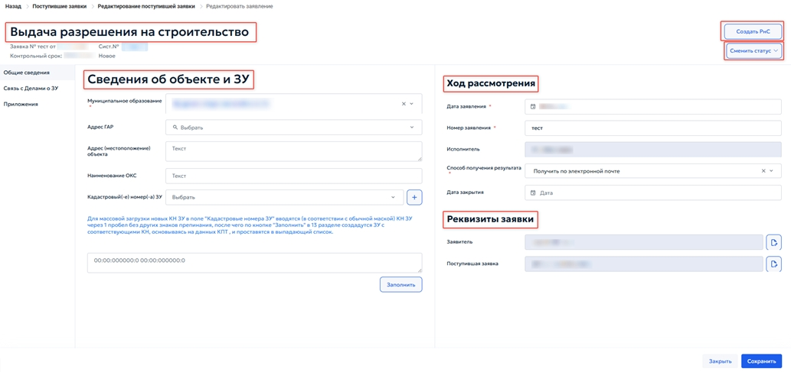

*Рисунок 43 — Карточка «Выдача разрешения на строительство».*

При нажатии кнопки «Создать РнС» открывается окно «Новое разрешение на строительство» (рисунок 44).

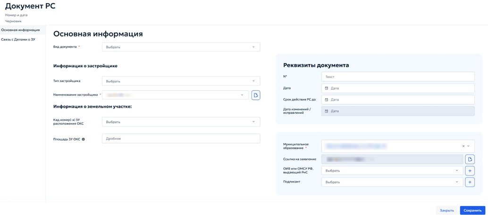

*Рисунок 44 — Новое разрешение на строительство.*

При нажатии кнопки «Сменить статус» открывается выпадающий список, в котором выбирается статус заявки: «Новое», «Зарегистрировано», «В работе», «Черновик», «Отправлено в ведомство», «Услуга оказана», «Отказ» (рисунок 45).

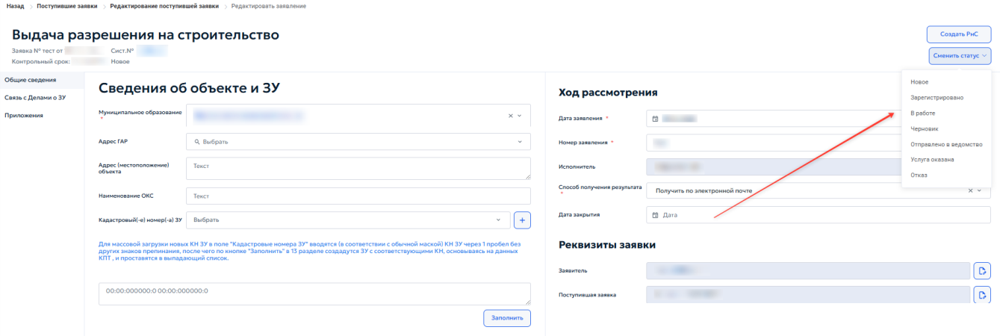

*Рисунок 45 — Указание статуса нового заявления.*

В блоке «Сведения об объекте и ЗУ» указываются данные о земельном участке и объекте капитального строительства. Для начала регистрации заявления необходимо указать следующие данные: муниципальное образование, адрес согласно государственному адресному реестру (ГАР), фактическое местоположение объекта, наименование объекта капитального строительства (ОКС), а также кадастровый номер земельного участка.

В блоке «Ход рассмотрения» заполняются сведения о процессе обработки заявки:

- «Дата заявления» — указать дату подачи заявления;

- «Номер заявления» — ввести регистрационный номер заявления;

- «Исполнитель» — выбрать сотрудника, ответственного за рассмотрение заявки;

- «Способ получения результата» — выбрать способ получения результата услуги: через портал государственных услуг, по электронной почте, через веб-сайт, при личном обращении в уполномоченный орган или через МФЦ.

В блоке «Реквизиты заявки» отображаются сведения о заявителе и поступившей заявке. Справа от поля «Заявитель» нажать кнопку «Открыть». Откроется окно «Реквизиты», предназначенное для просмотра и редактирования данных заявителя (рисунок 46).

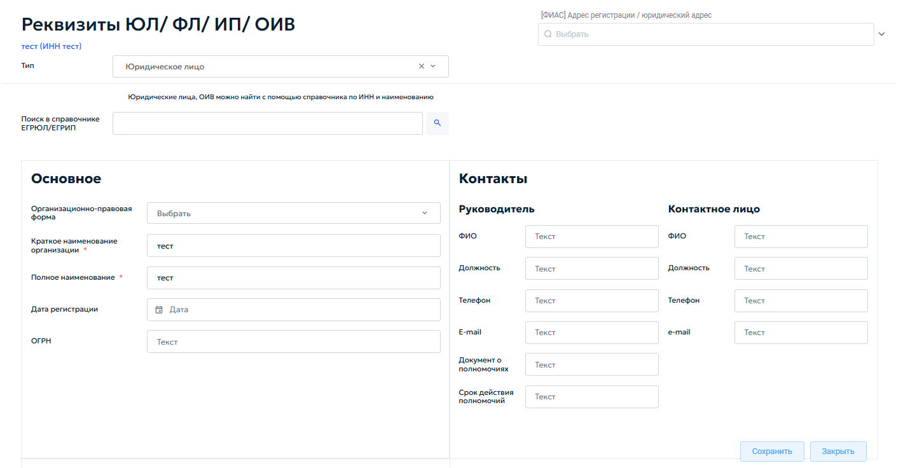

*Рисунок 46 — Реквизиты заявки.*

Окно «Реквизиты» содержит следующие разделы:

1. «Основное» — заполнить организационно-правовую форму, краткое и полное наименование организации, дату регистрации, ОГРН;

2. «Контакты» — указать данные руководителя (ФИО, должность, телефон, e-mail, документ о полномочиях, срок их действия) и контактного лица (ФИО, должность, телефон, e-mail);

3. «Данные юридического лица» — заполнить КПП, ИНН, ОКПО, ОКВЭД, юридический адрес с почтовым индексом, фактический адрес с почтовым индексом (рисунок 47).

*Рисунок 47 — Данные юридического лица.*

После внесения изменений нажать кнопку «Сохранить». Для выхода без сохранения нажать кнопку «Закрыть». После закрытия окна пользователь возвращается в карточку заявки.

В блоке «Реквизиты заявки» справа от поля «Поступившая заявка» нажать кнопку «Открыть» (рисунок 46). Откроется окно редактирования поступившей заявки. В этом окне доступны просмотр и изменение номера, даты, контрольного срока, сведений о заявителе, муниципального образования, способа и формы направления данных, категории и вида услуги, а также реквизитов заявления и сопроводительного письма. Здесь же изменяются статус заявки и дата поступления. После сохранения изменения автоматически обновляются в основной карточке заявки.

### 5.2.2 Связь с делами о земельных участках

Во вкладке «Связь с делами о земельных участках» отображаются земельные участки, связанные с заявкой на получение разрешения на строительство. Для перехода к этим сведениям в карточке «Выдача разрешения на строительство» открыть вкладку «Связь с делами о земельных участках» (рисунок 48).

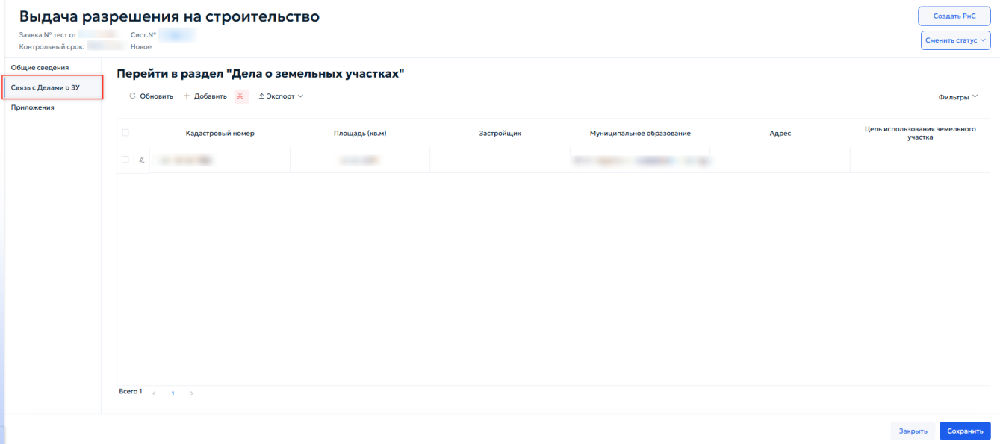

*Рисунок 48 — Вкладка «Связь с делами о земельных участках».*

В разделе «Дела о земельном участке» отображается перечень земельных участков, на которых планируется строительство объекта капитального строительства. Раздел позволяет привязать к заявке уже существующие дела о земельных участках.

Панель инструментов раздела содержит следующие кнопки (рисунок 49):

1. «Обновить» — обновляет список земельных участков;

2. «Добавить» — открывает окно создания нового дела о земельном участке;

3. кнопка «Ножницы» — удаляет записи о земельном участке;

4. «Экспорт» — выгружает перечень земельных участков в выбранном формате.

    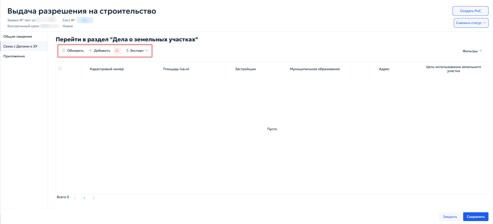

*Рисунок 49 — Инструменты вкладки «Дела о земельных участках».*

Таблица земельных участков содержит следующие сведения по каждому участку: кадастровый номер, площадь (кв. м), застройщик, муниципальное образование, адрес, цель использования земельного участка (рисунок 50).

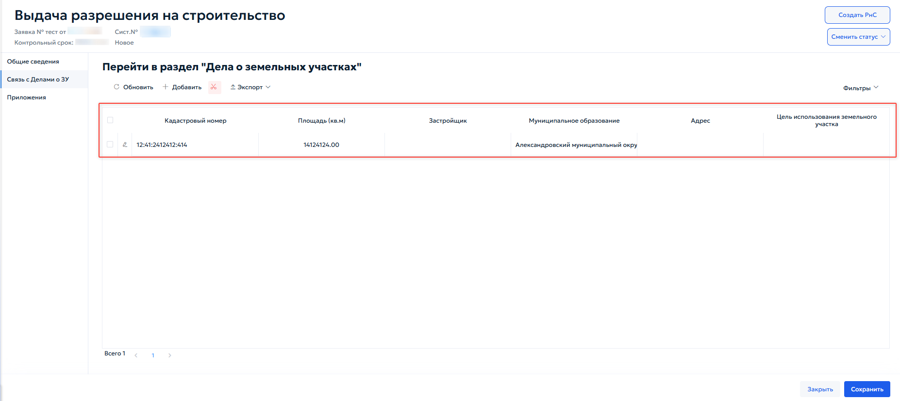

*Рисунок 50 — Таблица земельных участков.*

### 5.2.3 Приложения

Вкладка «Приложение» предназначена для загрузки и предварительного просмотра файлов, прилагаемых к заявке на получение разрешения на строительство. Для перехода к работе с файлами в карточке «Выдача разрешения на строительство» открыть вкладку «Приложение» (рисунок 51).

*Рисунок 51 — Вкладка «Приложение».*

Для загрузки файла в окно предпросмотра необходимо выполнить следующие действия:

1. нажать кнопку  — откроется проводник вашей операционной системы;

2. выбрать один или несколько файлов;

3. после выбора файла система отобразит его содержимое в области предпросмотра (рисунок 52).

*Рисунок 52 — Предпросмотр файла в системе.*

## 5.3 Размещение документа в ГИСОГД

Документы ГИСОГД хранятся в одноимённом реестре, который включает документы всех разделов и типов. Для каждого раздела Системы предусмотрен отдельный реестр со своим набором атрибутов. Внесение документа выполняется через карточку записи соответствующего реестра. Для открытия реестра нужного раздела выбрать соответствующий пункт меню (рисунок 53).

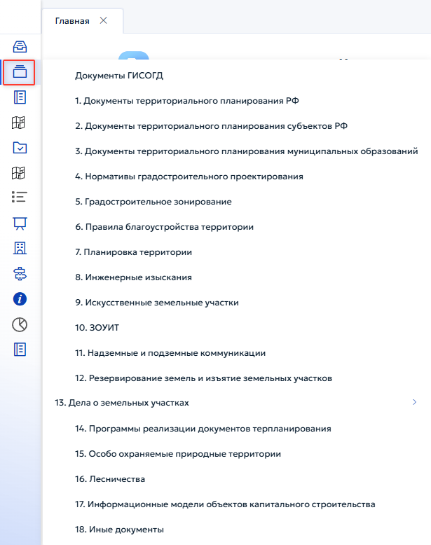

*Рисунок 53 — Меню для открытия реестров по разделам ГИСОГД.*

### 5.3.1 Создание записи в реестре раздела

Для всех разделов алгоритм действий по добавлению записи в реестр и внесению документа ГИСОГД в раздел одинаковый:

1. добавить в реестр новую запись, заполнив все необходимые поля в карточке. Сохранить данные;

2. во вкладке «Документы ГИСОГД» в карточке реестра добавить документ ГИСОГД, заполнив все необходимые поля и приложив файлы документа.

После сохранения документа ГИСОГД он появится в списке документов в карточке реестра соответствующего раздела (рисунок 54).

*Рисунок 54 — Список документов ГИСОГД в записи реестра «Дела о земельных участках».*

Подробный порядок внесения информации в записи реестров по разделам описан в разделе 5.4.

### 5.3.2 Размещение документа во вкладке «Документы ГИСОГД»

Карточка «Документы ГИСОГД» открывается при добавлении или редактировании документа в любом разделе системы. Она содержит следующие вкладки: «Основное», «Приложенные файлы», «Электронная подпись», «Связанные объекты». Вид карточки одинаков для всех разделов.

Во вкладке «Основное» расположены три информационных блока: «Основная информация», «Регистрация в ГИСОГД» и «Территория действия документа» (рисунок 55).

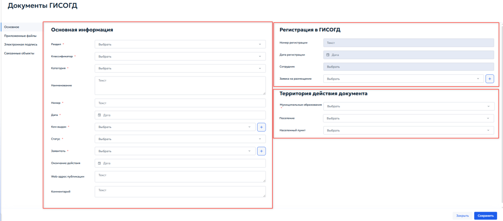

*Рисунок 55 — Раздел «Основное» в карточке «Документы ГИСОГД».*

Блок «Основная информация» включает следующие поля:

- «Раздел» — выбрать из выпадающего списка раздел ГИСОГД, к которому относится документ;

- «Классификатор» — выбрать тип документа из справочника;

- «Категория» — указать категорию документа;

- «Наименование» — ввести наименование документа;

- «Номер» — указать номер документа;

- «Дата» — выбрать дату документа с помощью календаря;

- «Кем выдан» — выбрать организацию или орган власти, издавший документ;

- «Статус» — выбрать текущий статус документа;

- «Заявитель» — выбрать заявителя из справочников;

- «Окончание действия» — при необходимости указать дату окончания срока действия документа;

- «Web-адрес публикации» — ввести ссылку на публикацию документа в интернете, если она имеется.

В блоке «Регистрация в ГИСОГД» поля «Номер регистрации», «Дата регистрации» и «Сотрудник» заполняются автоматически при сохранении документа. Для связывания документа с заявкой на размещение в поле «Заявка на размещение» выбрать нужную заявку из выпадающего списка.

В блоке «Территория действия документа» указать территорию, на которую распространяется действие документа:

- «Муниципальные образования» — выбрать одно или несколько муниципальных образований из списка;

- «Поселение» — при необходимости выбрать поселение;

- «Населенный пункт» — при необходимости выбрать населенный пункт.

Регистрационный номер документа ГИСОГД формируется согласно требованиям приказа Минстроя от 6 августа 2020 г. № 433/пр и состоит из кода ОКТМО муниципалитета, номера раздела ГИСОГД, года внесения документа и порядкового номера документа в году.

Вкладка «Приложенные файлы» предназначена для загрузки файлов, прилагаемых к документу (рисунок 56).

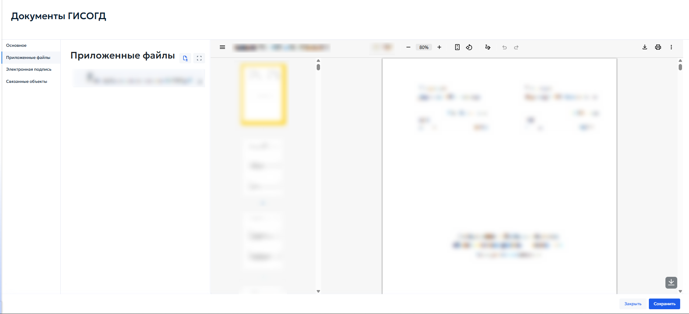

*Рисунок 56 — Вкладка «Приложенные файлы».*

Работа с вкладкой аналогична типовой вкладке «Приложенные файлы», описанной в пункте 4.5.1 настоящего Руководства.

Во вкладке «Электронная подпись» отображаются сведения об усиленной квалифицированной электронной подписи, которой подписан документ. Поля заполняются автоматически при загрузке подписанного файла (рисунок 57).

*Рисунок 57 — Вкладка «Электронная подпись».*

В блоке «Архив ЭП» отображаются архивные записи об электронных подписях (рисунок 57).

Во вкладке «Связанные объекты» устанавливаются связи документа с другими объектами системы:

- дела о земельных участках;

- проекты планировки территории;

- инженерные изыскания;

- программы реализации документов территориального планирования.

### 5.3.3 Связывание документа ГИСОГД с заявкой на размещение

Если в журнале заявок зарегистрирована заявка на размещение документа ГИСОГД, после создания записи в соответствующем разделе и добавления документа связать его с заявкой. Для этого после сохранения документа в карточке выбрать заявку по номеру и дате из выпадающего списка, затем сохранить карточку документа (рисунок 58).

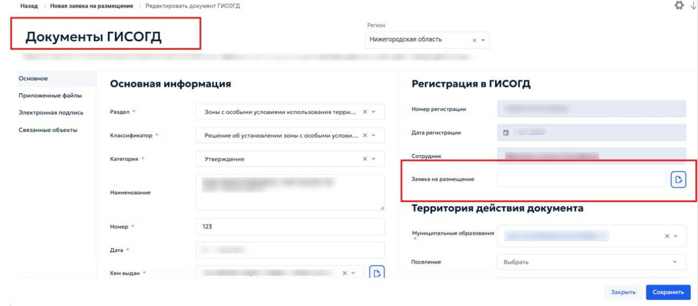

*Рисунок 58 — Местоположение заявки на размещение в карточке «Документы ГИСОГД».*

После создания документа ГИСОГД в заявке на размещение доступен выбор созданного документа (рисунок 59).

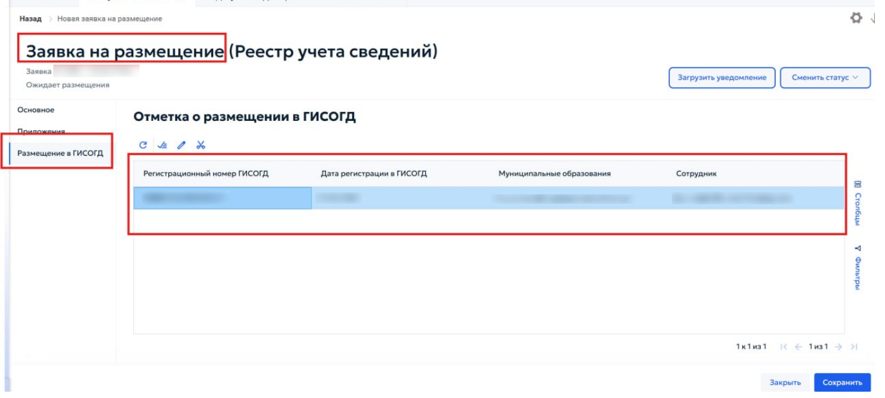

*Рисунок 59 — Заявка на размещение в ГИСОГД.*

Для просмотра заявки в отдельном окне нажать ссылку «Посмотреть заявку».

Все связанные объекты добавляются в карточку «Документы ГИСОГД» на вкладку «Связанные объекты», описанную в разделе 5.4.7.3.

## 5.4 Реестры документов

Разделы ГИСОГД, перечисленные в разделе 5.1, ведутся в отдельных реестрах. В каждом реестре создаются записи об объектах соответствующего вида, а к записям прикрепляются документы ГИСОГД. Поэтому заполнение сведений по разделам выполняется через карточки записей соответствующих реестров.

### 5.4.1 Документы территориального планирования Российской Федерации

В раздел «Документы территориального планирования Российской Федерации» вносятся документы федерального уровня, относящиеся к территории региона. Например, схема территориального планирования Российской Федерации (СТП РФ) в области энергетики, СТП РФ в области федерального транспорта и автомобильных дорог.

### 5.4.2 Документы территориального планирования двух и более субъектов Российской Федерации, документы территориального планирования субъектов Российской Федерации

В раздел вносятся сведения о схеме территориального планирования региона, документы СТП, а также документы об утверждении или внесении изменений в СТП.

Схема территориального планирования субъекта Российской Федерации содержит положения о территориальном планировании и карты планируемого размещения объектов регионального значения в следующих сферах: транспорт, предупреждение чрезвычайных ситуаций, образование, спорт, здравоохранение, энергетика.

### 5.4.3 Документы территориального планирования муниципальных образований

В раздел «Документы территориального планирования муниципальных образований» вносятся генеральные планы городских и муниципальных округов, а также схемы территориального планирования муниципальных районов (рисунок 60).

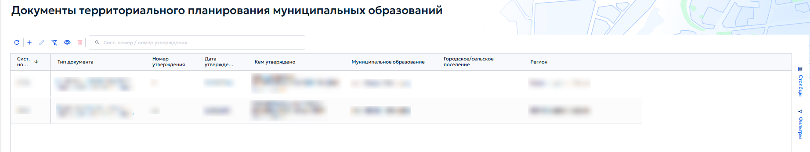

*Рисунок 60 — Раздел 3. Реестр «Документы территориального планирования муниципальных образований».*

Документы территориального планирования федерального, межрегионального, регионального и муниципального уровней включают в себя текстовую и графическую часть и определяют направления развития территории соответствующего уровня. Например, региональная схема территориального планирования (РСТП) показывает расположение объектов регионального значения, дорожной и инженерной инфраструктуры, их характеристики. Планируемые объекты наносятся на карту, а сами документы заносятся в реестр ГИСОГД.

Ниже приведен порядок внесения документа территориального планирования на примере генерального плана городского округа.

#### 5.4.3.1 Создание записи

Для создания записи выполнить следующие действия:

1. на панели инструментов реестра нажать кнопку «Добавить»;

2. в открывшейся карточке заполнить атрибуты (рисунок 61).

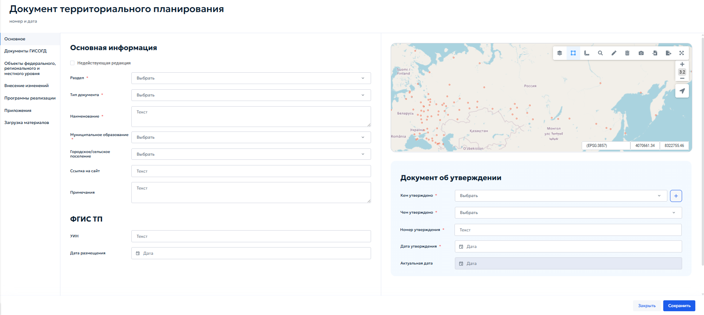

*Рисунок 61 — Заполнение сведений по документу территориального планирования.*

#### 5.4.3.2 Заполнение вкладки «Основное»

Во вкладке «Основное» в блоке «Основная информация» выбрать следующие данные:

1. «Раздел» — выбрать значение «Документы территориального планирования муниципальных образований»;

2. «Тип документа» — выбрать «Генеральный план городского округа, муниципального округа»;

3. «Наименование» — ввести полное наименование в соответствии с утвержденным документом;

4. «Муниципальное образование» — выбрать из списка нужный городской округ или муниципальный район;

5. «Городское/сельское поселение» — при необходимости выбрать поселение;

6. «Ссылка на сайт» — указать адрес страницы муниципалитета, на которой размещен документ;

7. «Примечания» — внести дополнительные сведения, например об изменениях документа.

В блоке «Документ об утверждении» указать:

1. «Кем утверждено» — выбрать из выпадающего списка орган или должностное лицо, утвердившее документ;

2. «Чем утверждено» — выбрать вид нормативного правового акта: «Указ», «Распоряжение», «Решение», «Постановление» или «Приказ»;

3. «Номер утверждения» — ввести номер документа;

4. «Дату утверждения» — указать дату акта с помощью календаря;

5. «Актуальная дата» — поле заполняется автоматически на основании даты последнего документа ГИСОГД о внесении изменений. Ручное редактирование не требуется.

Нанесение границ выполняется вручную средствами рисования геометрии на карте или путем импорта геометрии из файла. Порядок рисования геометрии описан в разделе 4.5.2.10. Общий вид карточки документа территориального планирования приведен на рисунке 62.

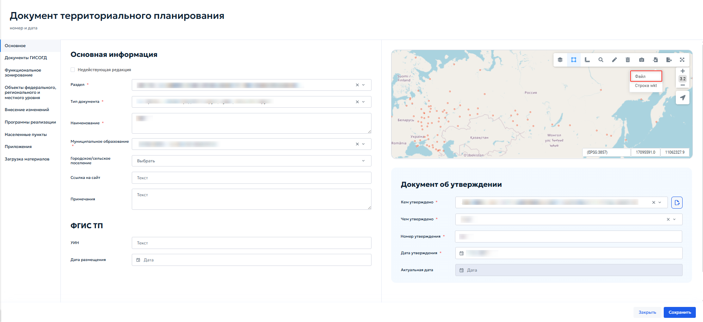

*Рисунок 62 — Документ территориального планирования.*

На карте нажать кнопку «Импорт» и выбрать пункт меню «Файл» (рисунок 63).

*Рисунок 63 — Импорт геометрии из файла.*

В окне импорта выбрать файл с координатами — обычно используется формат MIF. В поле «Система координат» ввести «МСК». Система предложит доступные варианты местных систем координат (рисунок 64).

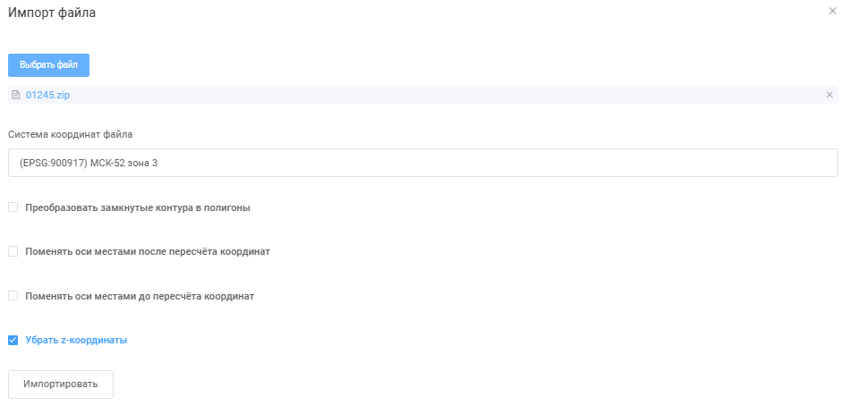

*Рисунок 64 — Выбор зоны МСК.*

По координатам из файла определить нужную зону: если координата X начинается с 1 миллиона, это первая зона (МСК-1, МСК-2 и т. д.). Выбрать соответствующую систему координат (рисунок 65).

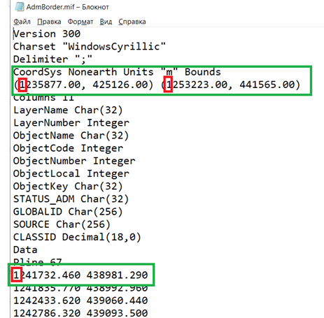

*Рисунок 65 — Определение зоны.*

Для загрузки координат и границ загруженных объектов нажать кнопку «Импортировать».

#### 5.4.3.3 Добавление документов ГИСОГД

Во вкладке «Документы ГИСОГД» внести материалы генерального плана или схемы территориального планирования, а также правовые документы об утверждении или внесении изменений (рисунок 66).

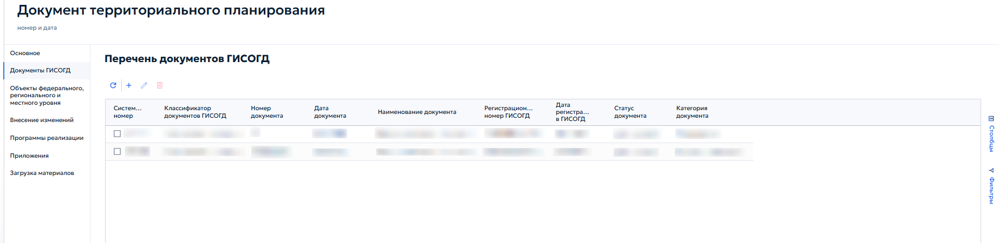

*Рисунок 66 — Перечень документов ГИСОГД для документа территориального планирования.*

Для добавления документа ГИСОГД нажать кнопку  на панели инструментов. В карточке необходимо заполнить реквизиты документа ГИСОГД и приложить файлы для документа.

Во вкладке «Приложенные файлы» в генеральном плане прикрепляются текстовая часть генерального плана, схемы и правовой документ об утверждении или о внесении изменений в генеральный план (рисунок 67). При наличии документов о публичных слушаниях они также прикрепляются во вкладке «Приложенные файлы».

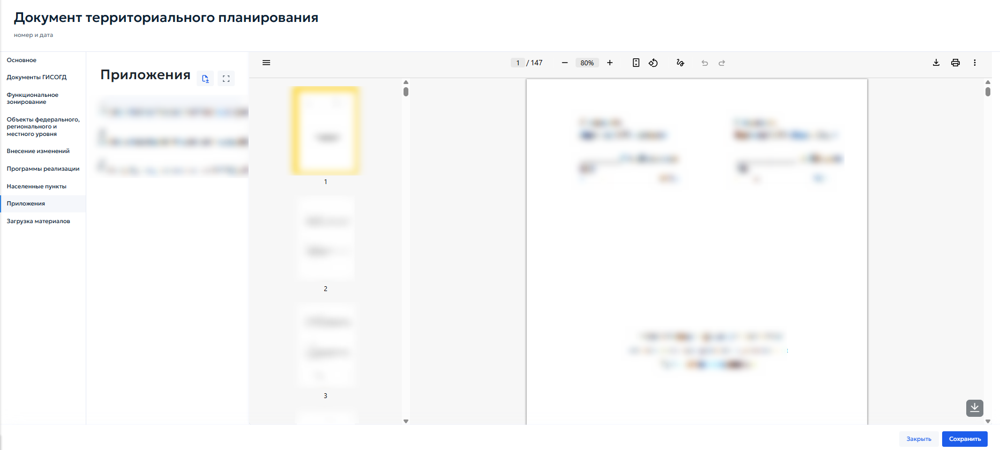

*Рисунок 67 — Приложенные к документу ГИСОГД «Генеральный план» файлы.*

Вкладка «Функциональное зонирование» в карточке генерального плана позволяет внести перечень функциональных зон, включенных в схему функционального зонирования генерального плана (рисунок 68).

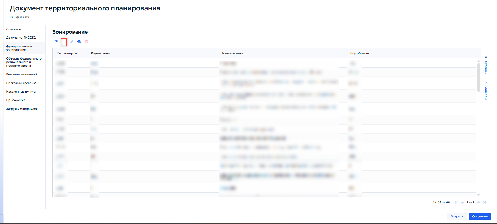

*Рисунок 68 — Список функциональных зон в генплане.*

Открывшаяся карточка функциональной зоны включает в себя информационный блок «Информация об объекте», в составе которого находятся следующие поля:

1. «Код объекта» — уникальный код контура; допускается совпадение с кодом функциональной зоны;

2. «Индекс зоны» — указать краткое буквенно-цифровое обозначение зоны;

3. «Название зоны» — ввести полное наименование функциональной зоны в соответствии с генеральным планом;

4. «Название по CLASSID» — при необходимости указать текстовую характеристику зоны.

Если зона является архивной, установить флажок «Архивная зона» в начале блока.

Карточка «Функциональная зона» показана на рисунке 69.

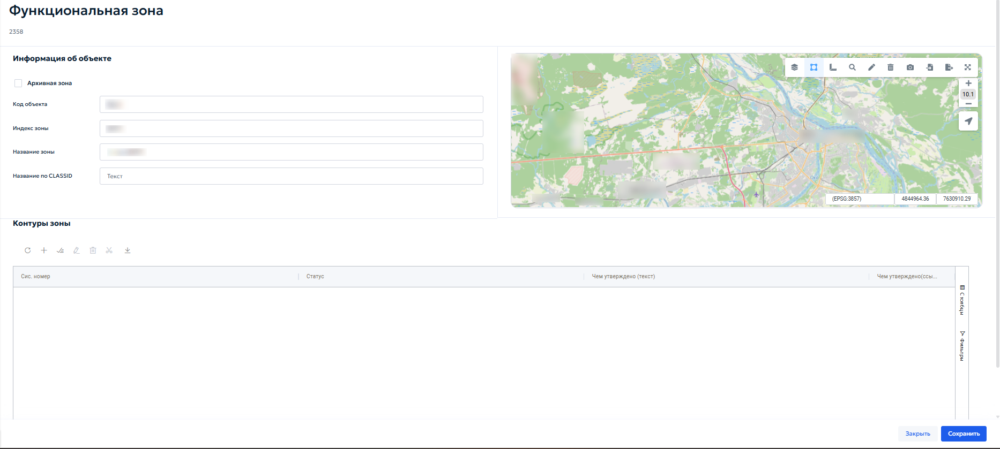

*Рисунок 69 — Карточка добавления типа зоны генерального плана.*

Блок «Контуры зоны» содержит таблицу, в которой перечислены все пространственные контуры данной функциональной зоны (рисунок 70). Таблица включает следующие столбцы:

1. «Системный номер» — системный номер контура;

2. «Статус» — состояние контура;

3. «Чем утверждено (текст)» — краткое описание документа-основания;

4. «Чем утверждено (ссылка)» — ссылка на документ ГИСОГД, которым утвержден контур (рисунок 70).

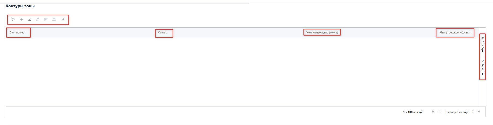

*Рисунок 70 — Контуры зоны.*

Панель инструментов блока позволяет редактировать, загружать и удалить действующий контур. При нажатии на кнопку  открывается карточка «Контуры функциональных зон». Она предназначена для добавления или редактирования пространственного контура. Общий вид карточки приведен на рисунке 71.

*Рисунок 71 — Контуры функциональных зон.*

Внутри карточки находится информационный блок «Информация об объекте», который состоит из следующих элементов:

1. «Архивное» — флажок, который устанавливается, если контур утратил актуальность;

2. «Статус» — выбрать значение из выпадающего списка: «существующий» — действующий контур или «планируемый» — контур, который планируется к установке в будущем;

3. «ОКТМО» — код муниципального образования;

4. «Код объекта» — уникальный код контура;

5. «Чем утверждено (ссылка)» — выбрать из выпадающего списка документ ГИСОГД, которым утвержден данный контур. В списке отображаются реквизиты документов — номер, дата, дата регистрации, извещающая организация. Для выбора щелкнуть левой кнопкой мыши по нужной строке;

6. «Чем утверждено» — указать, каким документом утверждена новая функциональная зона;

7. «Муниципальный/городской округ» — выбрать из списка муниципальное образование, на территории которого расположен контур;

8. «Сельское/городское поселение» — при необходимости выбрать поселение из списка.

Код объекта для функциональной зоны генплана введен Приказом Министерства экономического развития РФ от 9 января 2018 г. № 10 «Об утверждении Требований к описанию и отображению в документах территориального планирования объектов федерального значения, объектов регионального значения, объектов местного значения и о признании утратившим силу приказа Минэкономразвития России от 7 декабря 2016 г. № 793». Генеральные планы, разработанные до даты приказа, кодов объекта не имеют.

#### 5.4.3.4 Загрузка материалов

Загрузка материалов выполняется во вкладке «Загрузка материалов» карточки документа территориального планирования. Вкладка содержит блок «Загрузка пространственных данных».

Вкладка предназначена для импорта векторных данных функциональных зон и объектов территориального планирования из файлов (рисунок 72).

*Рисунок 72 — Блок «Загрузка пространственных материалов».*

При нажатии кнопки «Загрузить функциональные зоны» система открывает окно «Импорт» с кнопкой «Выбрать». При нажатии кнопки «Выбрать» открывается проводник операционной системы. После выбора архива система автоматически обрабатывает файлы и добавляет функциональные зоны в соответствующий реестр (рисунок 73). Данный функционал работает аналогично при нажатии других кнопок в блоке «Загрузка пространственных данных».

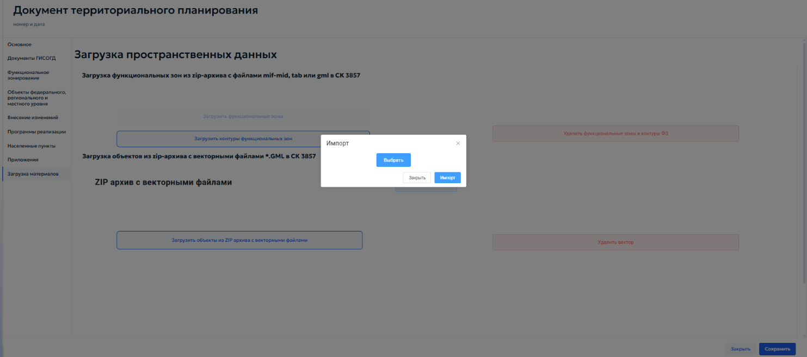

*Рисунок 73 — Окно «Импорт».*

Кнопка «Загрузить контуры функциональных зон» предназначена для импорта геометрии контуров функциональных зон из ZIP-архива с векторными файлами формата GML в системе координат EPSG:3857.

Кнопка «Загрузить объекты из ZIP-архива с векторными файлами» предназначена для импорта архива, содержащего векторные файлы формата GML.

Кнопка «Выберите файлы» — открывает стандартное окно операционной системы для выбора файлов на локальном компьютере.

Кнопка «Удалить вектор» — удаляет все загруженные ранее векторные данные текущего документа.

### 5.4.4 Нормативы градостроительного проектирования

Нормативы градостроительного проектирования устанавливают обязательные требования при строительстве и реконструкции объектов капитального строительства на территории муниципального образования. Они определяют расчётные параметры, которые необходимо учитывать при разработке документации по планировке территории: максимальные значения коэффициента плотности застройки, жилищную обеспеченность, размеры земельных участков для размещения многоквартирных жилых домов и т. п.

В раздел «Нормативы градостроительного проектирования» вносятся документы ГИСОГД — нормативы градостроительного проектирования и правовые акты об их утверждении или о внесении изменений. Для каждого муниципалитета в реестре создаётся одна запись, к которой прикрепляются соответствующие документы ГИСОГД.

Документы этого раздела не содержат картографических данных, поэтому в карточке записи отсутствует окно карты (рисунок 74).

*Рисунок 74 — Раздел 4. Реестр «Нормативы градостроительного проектирования».*

При добавлении или редактировании записи открывается карточка «Нормативы градпроектирования» (рисунок 75). В верхней части карточки отображаются дата создания и системный номер записи.

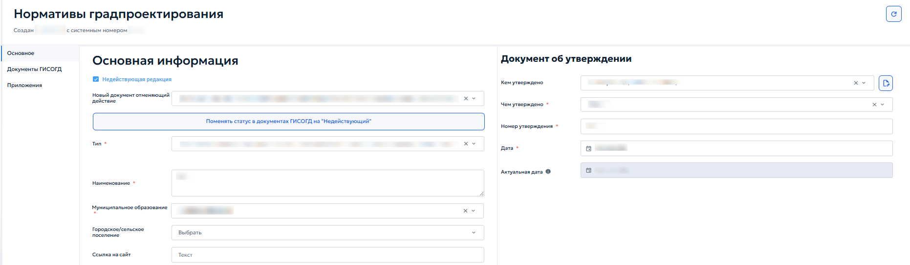

*Рисунок 75 — Карточка «Нормативы градпроектирования».*

Вкладка «Основное» содержит два информационных блока: «Основная информация» и «Документ об утверждении».

В состав блока «Основная информация» входят следующие информационные поля и флажки:

1. «Недействующая редакция» — если норматив утратил силу, здесь отображается ссылка на документ, которым он отменен. Кнопка «Поменять статус в документах ГИСОГД на „Недействующий“» позволяет перевести связанные документы ГИСОГД в статус недействующих;

2. «Тип» — выбрать тип норматива из выпадающего списка;

3. «Наименование» — ввести полное наименование норматива;

4. «Муниципальное образование» — выбрать муниципальное образование из списка;

5. «Городское/сельское поселение» — при необходимости выбрать поселение;

6. «Ссылка на сайт» — указать адрес страницы, где опубликован документ.

В состав блока «Документ об утверждении» входят следующие поля:

1. «Кем утверждено» — выбрать орган или должностное лицо, утвердившее норматив;

2. «Чем утверждено» — выбрать вид нормативного правового акта из выпадающего списка;

3. «Номер утверждения» — ввести номер документа;

4. «Дата» — указать дату утверждения с помощью календаря;

5. «Актуальная дата» — поле заполняется автоматически по дате документа ГИСОГД о внесении изменений.

### 5.4.5 Градостроительное зонирование

В раздел «Градостроительное зонирование» вносятся правила землепользования и застройки территорий (далее — ПЗЗ), нормативные правовые акты об утверждении или внесении изменений в ПЗЗ, а также материалы публичных слушаний (рисунок 76). Для каждого муниципального образования в реестре создаётся одна запись, к которой прикрепляются документы ГИСОГД. В карточке записи ведётся реестр территориальных зон в соответствии с ПЗЗ.

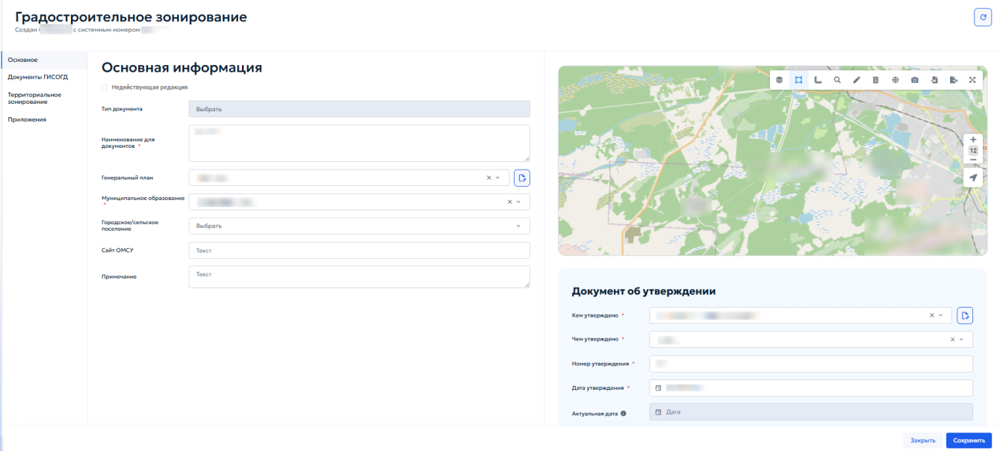

*Рисунок 76 — Раздел 5. Реестр «Градостроительное зонирование».*

При добавлении или редактировании записи открывается карточка «Градостроительное зонирование» (рисунок 77). Карточка содержит следующие вкладки: «Основное», «Документы ГИСОГД», «Территориальное зонирование», «Приложения».

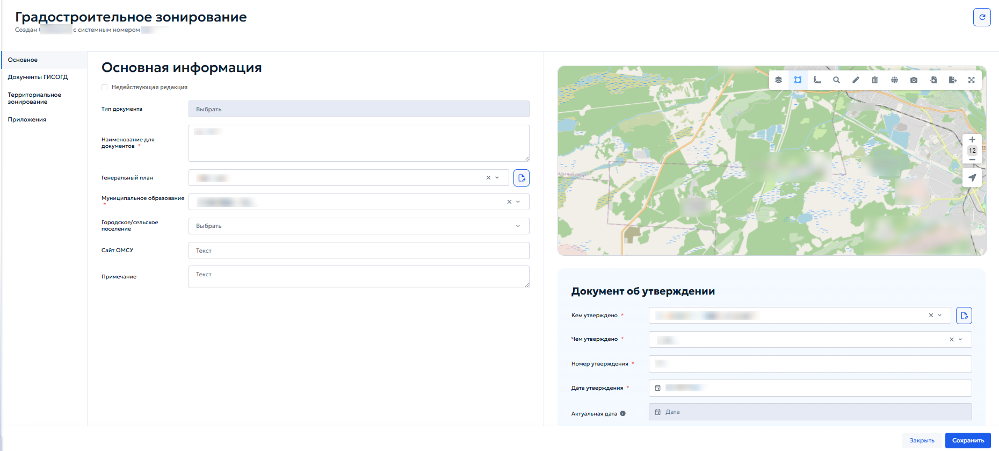

*Рисунок 77 — Карточка «Градостроительное зонирование».*

Порядок заполнения блоков «Основная информация» и «Документ об утверждении» аналогичен порядку создания записи, описанному в пункте 5.4.3.1 настоящего Руководства.

В поле «Генеральный план» указать соответствующий генеральный план муниципального образования.

Во вкладке «Документы ГИСОГД» прикрепить файлы ПЗЗ и правовые акты об утверждении или внесении изменений. Порядок добавления документа ГИСОГД описан в пункте 5.4.3.3.

#### 5.4.5.1 Вкладка «Территориальное зонирование»

Вкладка предназначена для ведения списка территориальных зон, установленных ПЗЗ (рисунок 78).

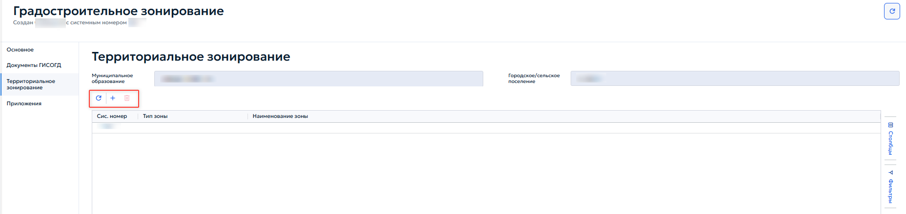

*Рисунок 78 — Территориальное зонирование.*

Добавление, редактирование и удаление зон выполняется с помощью кнопок панели инструментов. При создании или редактировании зоны открывается карточка «Территориальная зона» (рисунок 79).

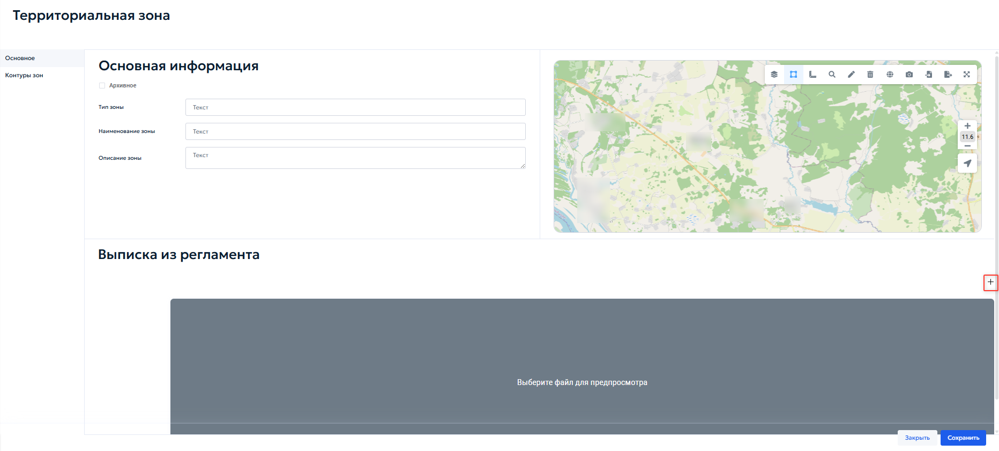

*Рисунок 79 — Территориальная зона.*

Во вкладке «Основное» в блоке «Основная информация» указываются следующие поля:

1. «Тип зоны» — ввести наименование типа территориальной зоны;

2. «Наименование зоны» — ввести наименование в соответствии с ПЗЗ;

3. «Описание зоны» — поле для текстового описания (при необходимости).

Если зона утратила актуальность и является архивной, установить флажок «Архивное» в начале блока.

В блоке «Выписка из регламента» для прикрепления файла с градостроительным регламентом нажать кнопку «Выберите файлы».

Вкладка «Градостроительные регламенты» предназначена для ведения перечня видов разрешённого использования (ВРИ) земельных участков и объектов капитального строительства в пределах территориальной зоны. Для каждого ВРИ указываются тип и наименование из справочника (рисунок 80).

*Рисунок 80 — Градостроительные регламенты.*

Добавление, редактирование и удаление записей выполняются с помощью кнопок панели инструментов таблицы.

Для настройки параметров, установленных градостроительным регламентом для конкретного вида разрешенного использования, нажать кнопку «Добавить». Откроется карточка «Предельные величины» (рисунок 81).

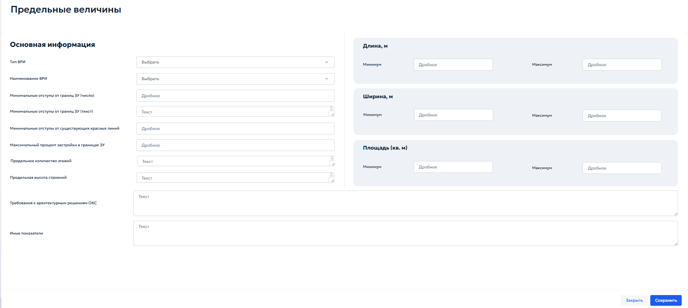

*Рисунок 81 — «Предельные величины».*

В блоке «Основная информация» указать следующие параметры:

1. «Тип ВРИ» — выбрать из выпадающего списка необходимый вариант;

2. «Наименование ВРИ» — выбрать вид разрешенного использования из справочника;

3. «Минимальные отступы от границ ЗУ (число)» — ввести числовое значение отступа в метрах;

4. «Минимальные отступы от границ ЗУ (текст)» — при необходимости указать текстовое описание отступов;

5. «Минимальные отступы от существующих красных линий» — ввести значение отступа в метрах (дробное число);

6. «Максимальный процент застройки в границах ЗУ» — указать максимально допустимый процент застройки земельного участка;

7. «Предельное количество этажей» — указать максимальное количество этажей (текст или число);

8. «Предельная высота строений» — указать максимальную высоту зданий (текст);

9. «Требования к архитектурным решениям ОКС» — ввести текстовые требования (при наличии);

10. «Иные показатели» — при необходимости указать дополнительные параметры.

В параметрах длины, ширины и площади указать:

1. «Длина, м» — указать дробное значение «Минимума» и «Максимума» необходимой длины объекта;

2. «Ширина, м» — указать дробное значение «Минимума» и «Максимума» необходимой ширины объекта;

3. «Площадь (кв. м)» — указать дробное значение «Минимума» и «Максимума» площади земельного участка или объекта капитального строительства в квадратных метрах.

После заполнения карточки и сохранения данных вернуться в реестр «Территориальная зона» и перейти во вкладку «Контуры зоны» (рисунок 82).

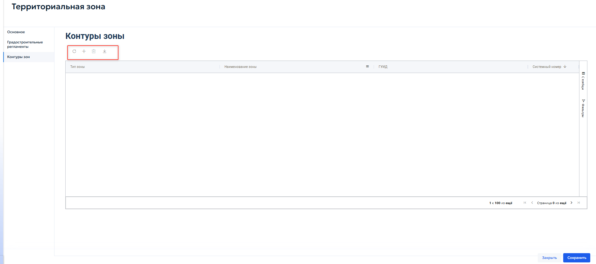

*Рисунок 82 — Вкладка «Контуры зоны».*

Вкладка предназначена для отображения и управления пространственными границами — контурами территориальной зоны. Контуры представляют собой полигоны, нанесенные на карту, и определяют местоположение зоны на местности.

Добавление, редактирование и удаление записей выполняются с помощью кнопок панели инструментов, расположенной над таблицей.

При нажатии кнопки «Добавить» откроется карточка «Контуры зон» (рисунок 83).

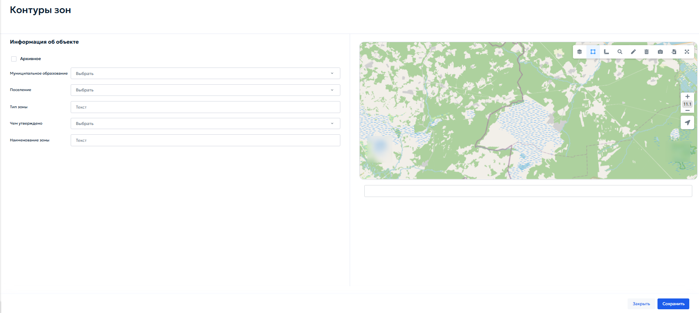

*Рисунок 83 — Карточка «Контуры зон».*

Карточка предназначена для указания параметров пространственного контура и загрузки его геометрии.

В блоке «Информация об объекте» заполнить следующие поля:

1. «Муниципальное образование» — выбрать из выпадающего списка муниципальное образование, на территории которого расположен контур;

2. «Поселение» — при необходимости выбрать городское или сельское поселение;

3. «Тип зоны» — отображается автоматически (наследуется из карточки территориальной зоны). Поле доступно только для просмотра;

4. «Чем утверждено» — выбрать из выпадающего списка документ ГИСОГД, которым утверждён данный контур (например, правовой акт об утверждении ПЗЗ или о внесении изменений);

5. «Наименование зоны» — отображается автоматически (наследуется из карточки территориальной зоны). Поле доступно только для просмотра.

Если контур является архивным, установить флажок «Архивное» в начале блока.

### 5.4.6 Правила благоустройства территории

В раздел «Правила благоустройства территории» вносятся документы, регулирующие вопросы благоустройства на муниципальном уровне. К таким документам относятся:

- правила благоустройства территории муниципального образования;

- нормативные правовые акты, которыми утверждены правила благоустройства территории или внесены изменения в них;

- закон субъекта Российской Федерации, которым утвержден порядок определения границ прилегающих территорий.

Раздел «Правила благоустройства территории» показан на рисунке 84.

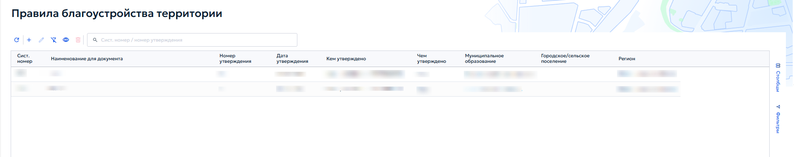

*Рисунок 84 — Раздел 6. Реестр «Правила благоустройства территории».*

При добавлении или редактировании записи открывается одноименная с реестром карточка (рисунок 85).

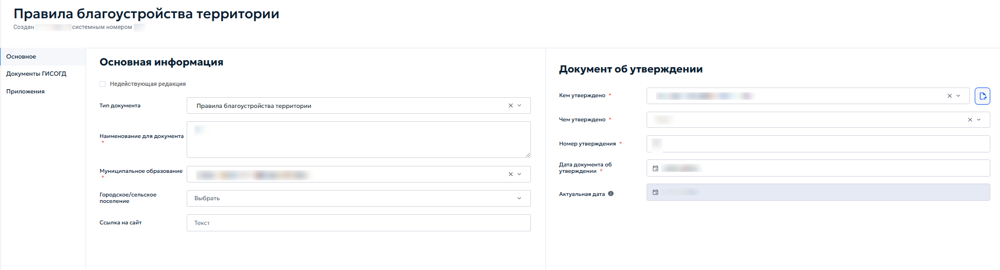

*Рисунок 85 — Карточка «Правила благоустройства территории».*

Во вкладке «Основное» в блоке «Основная информация» указать следующие данные:

1. «Тип документа» — поле заполняется автоматически значением «Правила благоустройства территории»;

2. «Наименование для документа» — ввести полное наименование документа в соответствии с утвержденным актом;

3. «Муниципальное образование» — выбрать из выпадающего списка муниципальное образование, для которого разработаны правила;

4. «Городское/сельское поселение» — при необходимости выбрать поселение;

5. «Ссылка на сайт» — указать адрес страницы, где опубликован документ.

Если редакция является недействующей, установить флажок «Недействующая редакция» и выбрать в появившемся выпадающем списке необходимый вариант.

В блоке «Документ об утверждении» указать следующие данные:

1. «Кем утверждено» — выбрать орган или должностное лицо в выпадающем списке, утвердившее правила благоустройства;

2. «Чем утверждено» — выбрать вид нормативного правового акта из выпадающего списка;

3. «Номер утверждения» — ввести номер документа;

4. «Дата документа об утверждении» — указать дату утверждения с помощью календаря;

5. «Актуальная дата» — поле заполняется автоматически по дате последнего документа ГИСОГД о внесении изменений.

### 5.4.7 Планировка территории

В раздел «Планировка территории» вносится документация по планировке территории, а также правовые акты о её утверждении или внесении изменений. Кроме того, здесь хранятся нормативные правовые акты, устанавливающие порядок подготовки, утверждения, изменения и отмены такой документации либо признания её отдельных частей недействующими.

Документация по планировке территории включает в себя проекты планировки и проекты межевания. Иногда эти два документа объединены в один — проект планировки и межевания одновременно.

Процесс разработки и утверждения проекта планировки и межевания состоит из нескольких этапов:

1. застройщик обращается в орган власти — муниципальный или региональный — за разрешением на подготовку проекта. Орган местного самоуправления уточняет границу, в пределах которой будет разрабатываться проект планировки, а также определяет границу участка для проведения инженерных изысканий. Формируется задание на проектирование, и издается постановление или приказ о подготовке проекта планировки и межевания. В этом документе указываются предельные сроки разработки проекта и срок его предоставления на утверждение;

2. застройщик поручает проектировщику разработку проекта планировки. Проектировщик проводит необходимые инженерные изыскания и готовит проект;

3. застройщик передает готовый проект в тот орган власти, который выдал задание на проектирование. В ГИСОГД вносится запись о новой версии проекта, которая привязывается к ранее созданной записи на проектирование;

4. специалисты рассматривают проект, формируют замечания и возвращают его на доработку. Все замечания прикрепляются к версии проекта в ГИСОГД. Процесс повторяется до устранения всех замечаний;

5. после устранения всех замечаний документация по планировке территории утверждается правовым актом. Утвержденный проект заносится в реестр как документ ГИСОГД.

Материалы инженерных изысканий, выполненных при разработке проекта планировки и межевания, вносятся в раздел 5.4.8 «Инженерные изыскания».

Для выдачи задания на проектирование в реестре «Планировка территории» необходимо создать новую запись о проекте в таблице, нажав кнопку «Добавить» (рисунок 86). Работа с реестром выполняется в соответствии с общими принципами, описанными в разделе 4.2 настоящего Руководства.

*Рисунок 86 — Раздел 7. Реестр «Планировка территории».*

При добавлении или редактировании записи открывается карточка «Проект планировки и межевания территории» (рисунок 87).

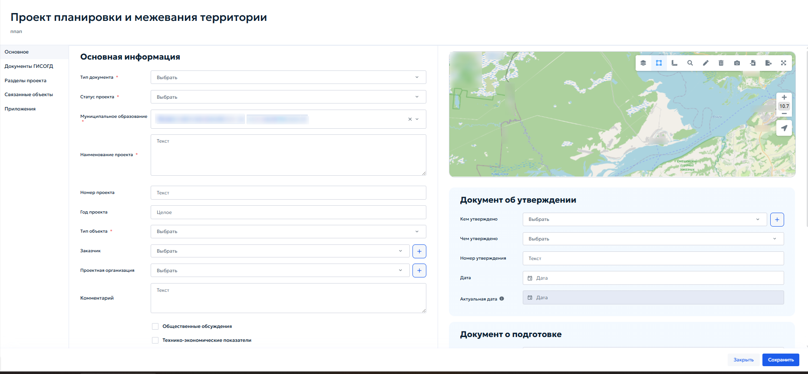

*Рисунок 87 — Карточка «Проект планировки и межевания территории».*

Во вкладке «Основное» в блоке «Основная информация» указать следующие данные:

1. «Тип документа» — выбрать тип документа из выпадающего списка;

2. «Статус проекта» — выбрать текущий статус из выпадающего списка:

    1. при выборе статуса «Аннулировано» в карточке появляется поле «Основания для отмены» — выпадающий список, содержащий ссылки на документы ГИСОГД, на основании которых проект аннулируется. Выбрать нужный документ из списка (рисунок 88);

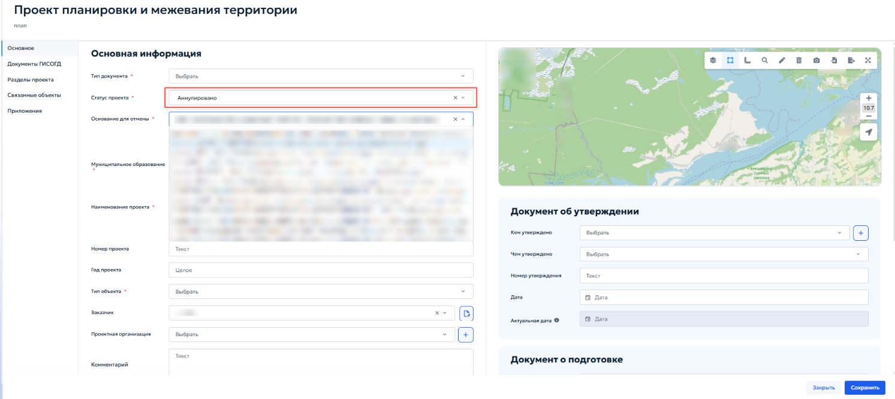

*Рисунок 88 — Статус «Аннулировано» с выбором документа-основания для отмены.*

    2. при выборе статуса «Аннулировано» появляется кнопка «Поменять статус в документах ГИСОГД на „Недействующий“» (рисунок 89). После нажатия все связанные с проектом документы ГИСОГД перейдут в статус недействующих.

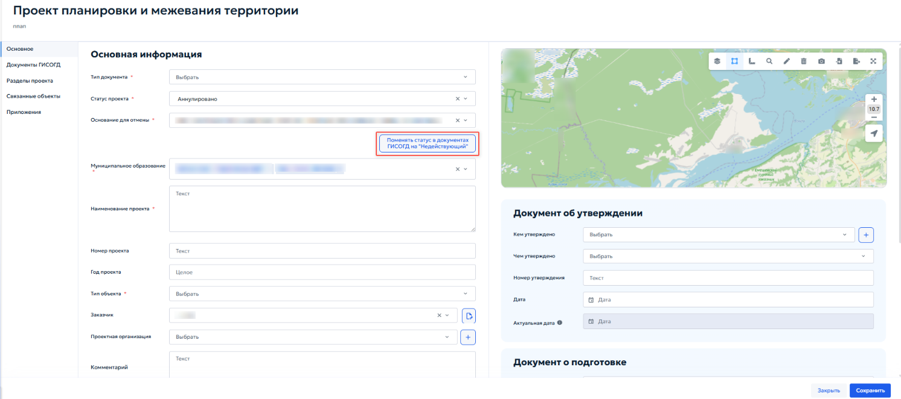

*Рисунок 89 — Кнопка «Поменять статус в документах ГИСОГД».*

3. «Муниципальное образование» — выбрать муниципальное образование, на территории которого планируется разработка проекта;

4. «Наименование проекта» — ввести полное наименование проекта в соответствии с документацией;

5. «Номер проекта» — указать присвоенный органом власти учетный номер проекта;

6. «Год проекта» — указать год разработки или утверждения проекта;

7. «Тип объекта» — выбрать тип объекта из справочника;

8. «Заказчик» — выбрать организацию-заказчика из справочника;

9. «Проектная организация» — выбрать организацию-разработчика проекта из справочника;

10. «Комментарии» — при необходимости ввести текстовые примечания.

При установке флажка «Общественные обсуждения» в левой навигационной панели карточки появляется дополнительная одноименная вкладка.

Заполнение блока «Документ об утверждении» выполняется в порядке, описанном в пункте 5.4.3.2.

В блоке «Документ о подготовке» содержатся сведения о разрешении на подготовку проекта.

Указать следующие данные о разрешении на подготовку проекта:

1. «Номер заявки» — указать регистрационный номер обращения застройщика;

2. «Дата заявки» — указать дату подачи заявки;

3. «Кем утверждено» — указать орган, выдавший разрешение на подготовку;

4. «Чем утверждено» — выбрать вид акта;

5. «Номер утверждения» — указать номер акта;

6. «Дата утверждения» — указать дату выдачи разрешения;

7. «Номер градзадания» — номер градостроительного задания на проектирование;

8. «Срок разработки» — плановая дата завершения разработки проекта;

9. «Дата выдачи ИРД» — при наличии указать дату выдачи исходно-разрешительной документации.

#### 5.4.7.1 Вкладка «Общественные обсуждения»

Вкладка «Общественные обсуждения» в карточке «Проект планировки и межевания территории» (рисунок 90) предназначена для учёта сведений об общественных обсуждениях, проведённых по проекту планировки и межевания территории.

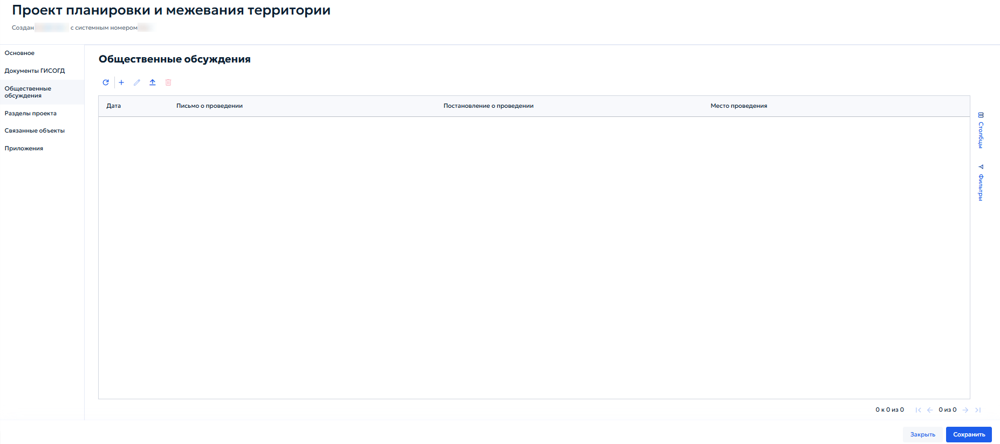

*Рисунок 90 — Вкладка «Общественные обсуждения».*

Для добавления записи об общественных обсуждениях нажать кнопку «Добавить»  на панели инструментов вкладки. Откроется карточка (рисунок 91), в которой необходимо указать следующие данные:

*Рисунок 91 — Карточка «Общественные обсуждения».*

1. «Постановление о проведении» — указать реквизиты правового акта, которым назначены общественные обсуждения;

2. «Дата» — выбрать дату проведения обсуждений с помощью календаря;

3. «Место проведения» — ввести адрес или наименование места, где проводились обсуждения;

4. «Письмо о проведении» — указать реквизиты исходящего письма, направленного для организации обсуждений;

5. «Письмо о результатах» — указать реквизиты документа, фиксирующего итоги обсуждений.

#### 5.4.7.2 Вкладка «Разделы проекта»

Вкладка «Разделы проекта» (рисунок 92) предназначена для создания и управления структурой цифровой модели проекта планировки и межевания территории. Здесь определяются смысловые разделы проекта, загружаются векторные данные и проверяются пересечения земельных участков с кадастровым планом территории.

*Рисунок 92 — Вкладка «Разделы проекта».*

В верхней части вкладки расположен блок «Цифровая модель» для загрузки векторных данных.

Кнопка «Выберите файлы» открывает проводник операционной системы. Импорт поддерживается из векторных форматов файлов, которые должны быть упакованы в ZIP-архив.

После выбора необходимого архива система выполнит аналитику содержимого и отобразит список доступных векторных слоев. Для импорта выполнить следующие действия:

1. в списке отметить флажками слои, которые необходимо загрузить в проект (рисунок 93);

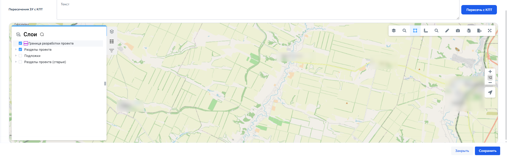

*Рисунок 93 — Слои проекта.*

2. нажать кнопку «Импортировать слои» — система выгрузит выбранные слои и автоматически распределит их по соответствующим разделам проекта.

Если после импорта требуется добавить дополнительные данные, повторить процедуру, отметить новые слои и нажать кнопку «Импортировать слои». Загруженные ранее слои не удаляются.

Таблица разделов проекта содержит все добавленные разделы. Для каждого раздела указываются системный номер записи и тип раздела (рисунок 94).

*Рисунок 94 — Таблица разделов проекта.*

При добавлении или редактировании записи раздела открывается окно «Выберите раздел проекта» с выпадающим списком (рисунок 95).

*Рисунок 95 — Окно выбора раздела проекта.*

После выбора типа раздела и нажатия кнопки «Далее» открывается карточка «Раздел проекта» (рисунок 96).

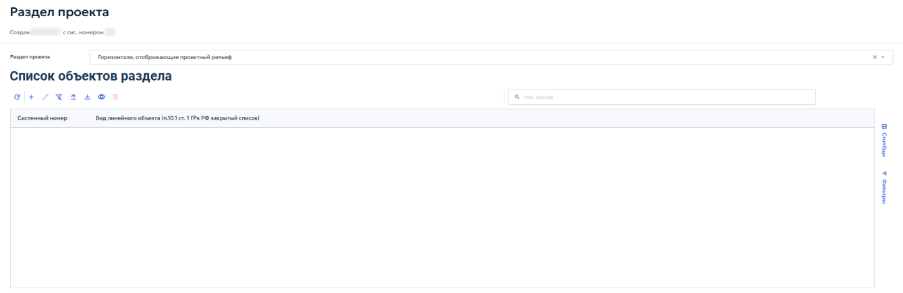

*Рисунок 96 — Карточка «Раздел проекта».*

В блоке «Список объектов раздела» представлена таблица, содержащая перечень всех пространственных объектов, входящих в данный раздел. В таблице указывается системный номер записи и вид линейного объекта в соответствии с Градостроительным кодексом РФ.

При нажатии кнопки «Добавить» откроется карточка «Горизонтали, отображающие проектный рельеф» (рисунок 97).

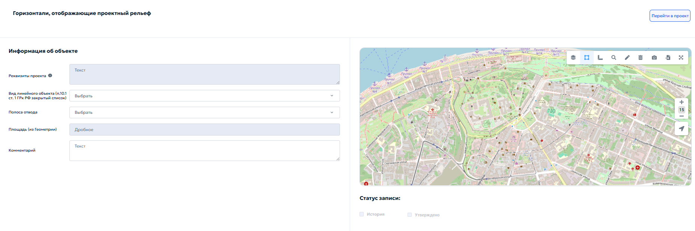

*Рисунок 97 — Карточка «Объект раздела».*

Карточка предназначена для загрузки геометрии конкретного объекта и заполнения его атрибутов.

В блоке «Информация об объекте» указать следующие данные:

1. «Реквизиты проекта» — указать реквизиты документации, на основании которой создается объект;

2. «Примечание» — при необходимости ввести дополнительные сведения об объекте.

В статусе записи указать необходимый флажок:

1. «История» — установить флажок, если объект относится к архивным;

2. «Утверждено» — установить флажок, если объект утвержден в составе документации по планировке территории.

При нажатии кнопки «Перейти в проект» система закрывает карточку объекта раздела и открывает карточку родительского проекта планировки и межевания территории.

#### 5.4.7.3 Вкладка «Связанные объекты»

Вкладка «Связанные объекты» в карточке «Проект планировки и межевания территории» предназначена для установления и визуализации логических связей между документацией по планировке территории и смежными объектами учета, размещенными в других разделах ГИСОГД.

1. «Дела о земельных участках» (Дела о ЗУ) — отображение земельных участков, входящих в границы проекта планировки;

2. «Инженерные изыскания» — отображение материалов изысканий, выполненных для данной территории;

3. «Надземные и подземные коммуникации» — отображение существующих и проектируемых сетей;

4. «Зоны с особыми условиями использования территории» (ЗОУИТ) — отображение зон с особыми условиями использования территории.

Для каждого из перечисленных подразделов интерфейс предоставляет стандартные элементы управления табличными формами, позволяющие как создавать новые объекты, так и устанавливать ссылки на уже существующие записи в соответствующих реестрах.

Детальное описание состава атрибутов, порядка заполнения карточек и правил работы с объектами приведено в соответствующих разделах настоящего Руководства:

1. порядок работы с «Делами о ЗУ», включая формирование ГПЗУ, разрешений на строительство, СРЗУ и ведение истории участка, приведен в разделе 5.4.13;

2. порядок работы с «Инженерными изысканиями» приведен в разделе 5.4.8;

3. порядок работы с «Надземными и подземными коммуникациями» — см. раздел 5.4.11;

4. порядок работы с ЗОУИТ приведен в разделе 5.4.10 настоящего Руководства.

Операции по установлению связей через кнопку «Связать» выполняются по общим правилам работы со связанными реестрами, описанными в пункте 4.3 настоящего Руководства.

### 5.4.8 Инженерные изыскания

Раздел «Инженерные изыскания» предназначен для сбора, учета, хранения и систематизации сведений о материалах и результатах инженерных изысканий, выполненных на территории региона. Ведение раздела осуществляется в соответствии с пунктом 10 части 4 статьи 56 Градостроительного кодекса Российской Федерации и постановлением Правительства Российской Федерации от 13.03.2020 № 279 «Об информационном обеспечении градостроительной деятельности».

В реестр включаются сведения о следующих видах работ:

1. инженерные изыскания для подготовки проектной документации объектов капитального строительства;

2. инженерные изыскания для подготовки документации по планировке территории;

3. исполнительная съемка, выполняемая в процессе строительства, реконструкции объектов капитального строительства, а также по их окончании;

4. инвентаризация существующих инженерных сетей и сооружений, выполняемая для целей кадастрового учета и установления границ зон с особыми условиями использования территории.

Реестр обеспечивает возможность установления связей между записью об инженерных изысканиях и объектами других разделов ГИСОГД:

1. с проектом планировки и межевания территории — если изыскания выполнялись в рамках разработки документации по планировке территории;

2. с делом о застроенном или подлежащем застройке земельном участке — если изыскания выполнялись в отношении конкретного земельного участка.

При открытии раздела «Инженерные изыскания» отображается табличная форма, содержащая перечень записей реестра. Работа с реестром осуществляется в соответствии с общими принципами, описанными в разделе 4.2 настоящего Руководства.

Добавление новой записи или редактирование существующей выполняется в карточке «Инженерные изыскания». Карточка содержит вкладки «Основное», «Документы ГИСОГД» и «Приложения» (рисунок 98).

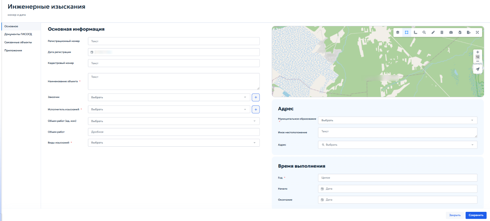

*Рисунок 98 — Карточка «Инженерные изыскания».*

Вкладка «Основное» в карточке предназначена для ввода характеристик выполненных инженерных изысканий.

В блоке «Основная информация» указать следующие данные:

1. «Регистрационный номер» — ввести учетный номер материалов изысканий;

2. «Дата регистрации» — в поле автоматически указывается текущая дата при сохранении записи;

3. «Кадастровый номер» — указать номер земельного участка;

4. «Наименование объекта» — ввести имя объекта, в отношении которого выполнены изыскания;

5. «Заказчик» — выбрать из выпадающего списка необходимую организацию. Кнопка  позволяет добавить новую организацию в справочник;

6. «Исполнитель изысканий» — выбрать из выпадающего списка исполнителя, который будет выполнять изыскания по земельному участку. Кнопка  позволяет добавить новую организацию в справочник;

7. «Объем работ (ед. изм.)» — выбрать единицы измерения объема выполненных работ из выпадающего списка;

8. «Виды изысканий» — выбрать одно или несколько значений из выпадающего списка видов изысканий.

В блоке «Адрес» указать следующие сведения о местоположении участка выполнения работ:

1. «Муниципальное образование» — выбрать городской округ или муниципальный район, к которому относятся инженерные изыскания;

2. «Иное местоположение» — указать дополнительные сведения о местоположении объекта, если они отличаются от текущего местоположения;

3. «Адрес» — указать местоположение объекта. Для корректного заполнения нажать кнопку «Выбрать». Откроется окно для заполнения элементов адреса (рисунок 99).

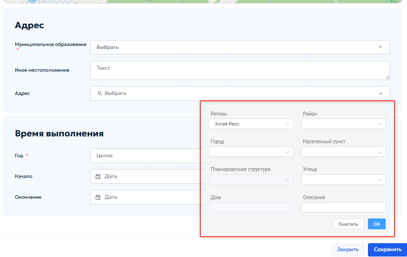

*Рисунок 99 — Окно выбора адреса.*

В блоке «Время выполнения» указываются:

1. «Год» — год завершения работ (указывается целым числом);

2. «Начало» — дата начала выполнения работ;

3. «Окончание» — дата завершения работ.

Во вкладках «Документы ГИСОГД», «Приложения» и «Связанные объекты» выполняются действия, описанные в пунктах 5.2.3, 5.3.2, 5.3.3 и 5.4.7.3.

### 5.4.9 Искусственные земельные участки

Раздел «Искусственные земельные участки» предназначен для ведения реестра сведений, документов и материалов в отношении искусственных земельных участков, созданных на водных объектах или иных территориях в соответствии с законодательством Российской Федерации. Ведение раздела осуществляется в соответствии с пунктом 11 части 4 статьи 56 Градостроительного кодекса Российской Федерации и постановлением Правительства Российской Федерации от 13.03.2020 № 279.

В реестр включаются следующие типы документов:

1. разрешение на создание искусственного земельного участка;

2. разрешение на проведение работ по созданию искусственного земельного участка;

3. разрешение на ввод искусственно созданного земельного участка в эксплуатацию.

Для каждого искусственного земельного участка в реестре создается отдельная запись, к которой прикрепляются соответствующие документы ГИСОГД. На карте отображаются границы искусственного земельного участка.

При открытии раздела отображается табличная форма со списком записей. Работа с реестром выполняется в соответствии с общими принципами, описанными в разделе 4.2 настоящего Руководства.

Добавление и редактирование записей выполняются в карточке «Искусственный земельный участок». Карточка содержит вкладки «Основное», «Документы ГИСОГД» и «Приложения» (рисунок 100).

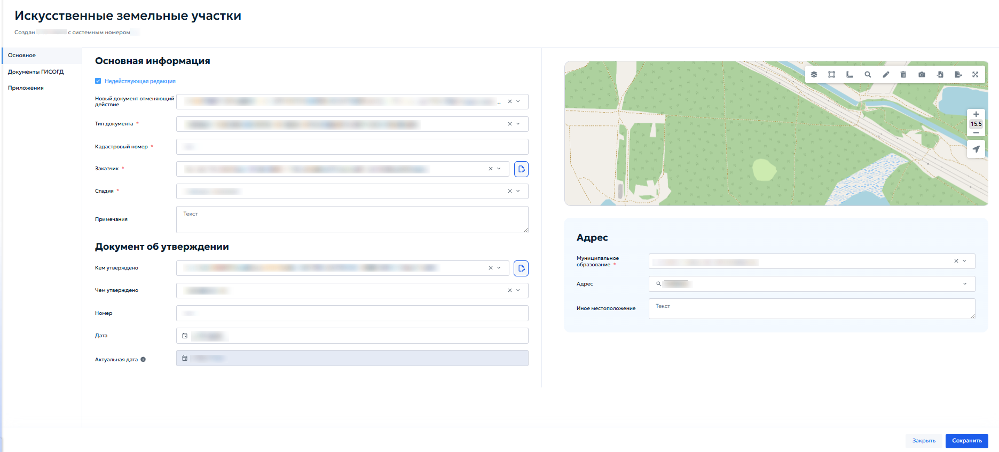

*Рисунок 100 — Карточка «Искусственный земельный участок».*

Вкладка «Основное» предназначена для ввода основных сведений об искусственном земельном участке и документе, на основании которого внесены данные.

В блоке «Основная информация» указать следующие данные:

1. «Недействующая редакция» — установить флажок, если запись или документ утратили силу. После установки флажка отображается поле «Новый документ, отменяющий действие» (рисунок 101). Выбрать в нём соответствующий документ ГИСОГД;

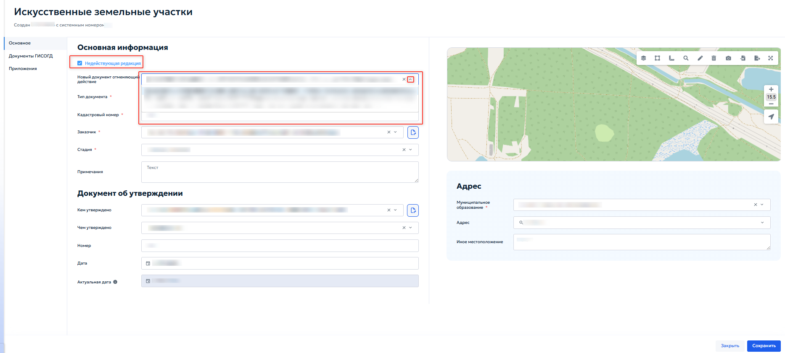

*Рисунок 101 — Флажок «Недействующая редакция» и поле «Новый документ, отменяющий действие».*

2. «Тип документа» — выбрать из выпадающего списка тип документа ГИСОГД;

3. «Кадастровый номер» — ввести кадастровый номер искусственного земельного участка;

4. «Заказчик» — выбрать из выпадающего списка организацию или физическое лицо, выполняющее роль заказчика. Кнопка  позволяет добавить новую запись в справочник;

5. «Стадия» — выбрать из выпадающего списка текущую стадию участка;

6. «Примечания» — при необходимости ввести примечание по объекту.

В блоке «Документ об утверждении» указать следующие данные:

1. «Кем утверждено» — выбрать орган или лицо, утвердившее документ;

2. «Чем утверждено» — выбрать вид документа, которым утверждено создание искусственного земельного участка;

3. «Номер» — указать номер документа об утверждении;

4. «Дата» — указать дату документа об утверждении;

5. «Актуальная дата» — поле заполняется автоматически при внесении изменений документом ГИСОГД.

В блоке «Адрес» указать следующие данные:

1. «Муниципальное образование» — выбрать из списка нужный городской округ или муниципальный район;

2. «Адрес» — указать местоположение объекта. Нажать кнопку «Выбрать» и заполнить адрес в открывшемся окне по таким же принципам, как указано в пункте 5.4.8 настоящего Руководства;

3. «Иное местоположение» — указать дополнительные сведения о местоположении объекта, если они отличаются от выбранного адреса.

На вкладках «Документы ГИСОГД» и «Приложения» выполняются действия, описываемые в пунктах 5.2.3 и 5.3.2 настоящего Руководства.

### 5.4.10 ЗОУИТ

Раздел предназначен для учета сведений об установлении, изменении и прекращении существования зон с особыми условиями использования территории (ЗОУИТ). В раздел вносятся документы, на основании которых такие зоны создаются или ликвидируются, и информация об их характеристиках.

Зоны с особыми условиями использования территории устанавливаются для защиты:

1. «объектов природного происхождения» — леса, водные объекты, источники питьевого водоснабжения;

2. «искусственных объектов» — промышленные предприятия, линии электропередачи, трубопроводы, объекты культурного наследия.

В зависимости от назначения зоны подразделяются на:

1. «охранные» — зоны вокруг линий электропередачи, магистральных трубопроводов, железных дорог и т. п.;

2. «санитарно-защитные» — отделяющие жилую застройку от производственных объектов;

3. «водоохранные и рыбоохранные» — примыкающие к водным объектам;

4. зоны охраны объектов культурного наследия;

5. иные виды, предусмотренные статьей 105 Земельного кодекса РФ и классификатором, утвержденным приказом Минстроя России от 06.08.2020 № 443.

Каждая зона утверждается решением, постановлением, приказом или иным документом уполномоченного органа власти. Ограничения использования земельных участков в границах зоны определяются отраслевыми нормативными актами.

При открытии раздела отображается табличная форма со списком записей. Работа с реестром выполняется в соответствии с общими принципами, описанными в разделе 4.2 настоящего Руководства (рисунок 102).

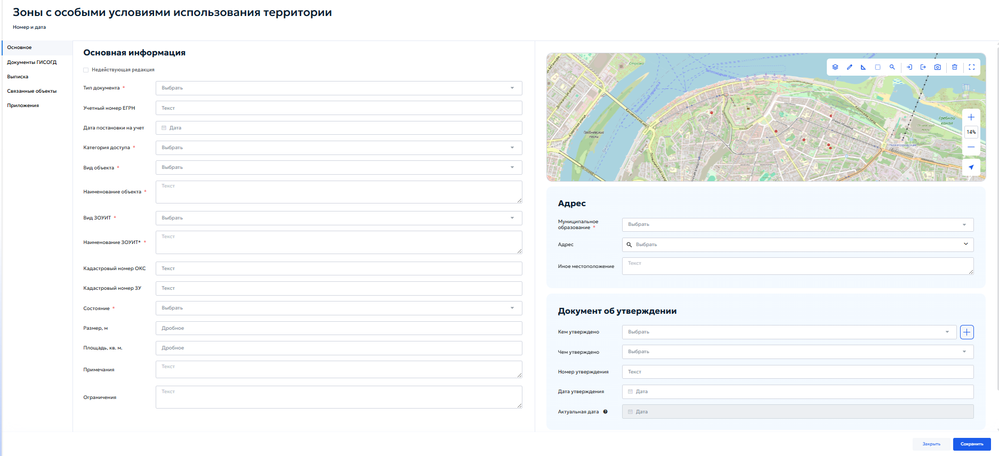

*Рисунок 102 — Раздел 10. Реестр «Зоны с особыми условиями использования территории».*

Добавление новой записи или редактирование существующей осуществляется в карточке, содержащей вкладки: «Основное», «Документы ГИСОГД», «Выписка», «Связанные объекты», «Приложения».

В блоке «Основная информация» указать следующие данные:

1. «Недействующая редакция» — установить флажок, если документ или зона утратили силу. Порядок работы с недействующей редакцией приведён в пункте 5.4.9;

2. «Тип документа» — выбрать из выпадающего списка тип документа ГИСОГД;

3. «Учетный номер ЕГРН» — ввести учетный номер зоны в Едином государственном реестре недвижимости;

4. «Дата постановки на учет» — указать с помощью календаря дату внесения сведений о зоне в ЕГРН;

5. «Категория доступа» — выбрать из выпадающего списка категорию доступа;

6. «Вид объекта» — выбрать из выпадающего списка вид объекта, образующего зону;

7. «Наименование объекта» — указать наименование объекта, в отношении которого установлена зона;

8. «Вид ЗОУИТ» — выбрать из выпадающего списка классификатор вида зон с условиями использования территории;

9. «Наименование ЗОУИТ» — указать полное наименование зоны;

10. «Кадастровый номер ОКС» — указать кадастровый номер объекта капитального строительства;

11. «Кадастровый номер ЗУ» — указать кадастровый номер земельного участка;

12. «Состояние» — выбрать из выпадающего списка состояние зоны;

13. «Размер, м» — указать размер зоны в метрах;

14. «Площадь, кв. м» — указать площадь зоны в квадратных метрах;

15. «Примечания» — при необходимости ввести примечание по объекту;

16. «Ограничения» — при необходимости указать ограничения использования земельного участка и объектов капитального строительства в границах зоны.

В блоке «Адрес» указать следующие данные:

1. «Муниципальное образование» — выбрать из списка нужный городской округ или муниципальный район, к которому относится ЗОУИТ;

2. «Адрес» — нажать кнопку «Выбрать». В открывшемся окне указать адрес зоны. Порядок работы с окном приведён в пункте 5.4.8 настоящего Руководства;

3. «Иное использование» — описать местоположение зоны и ориентиры, связанные с ней.

В блоке «Документ об утверждении» содержатся реквизиты правового акта или иного документа, на основании которого внесена запись:

1. «Кем утверждено» — выбрать из выпадающего списка орган власти или организацию, принявшую документ. При нажатии кнопки  откроется окно с реквизитами лиц;

2. «Чем утверждено» — выбрать из выпадающего списка документ, которым утверждена зона.

Границы зоны отображаются на карте в правой части карточки. Для загрузки координат из файла использовать кнопку «Импорт» на панели инструментов карты; порядок импорта описан в пункте 4.5.2.12. При наличии кадастровой выписки учитывать порядок осей в системе координат. После заполнения всех полей нажать кнопку «Сохранить».

Во вкладке «Документы ГИСОГД» приложить документы к записи о зоне. Порядок работы с вкладкой приведён в пункте 5.3.2.

Во вкладке «Связанные объекты» установить связи между записью ЗОУИТ и объектами других разделов ГИСОГД. Общие правила работы со связанными реестрами описаны в пункте 4.3, порядок установления связей — в пункте 5.4.7.3.

Во вкладке «Приложения» при необходимости приложить дополнительные файлы для ЗОУИТ.

#### 5.4.10.1 Вкладка «Выписка»

Вкладка предназначена для учёта и хранения выписок из реестра ЗОУИТ. Здесь отображается список созданных выписок (рисунок 103).

*Рисунок 103 — Вкладка «Выписка».*

Кнопки панели инструментов позволяют добавить или отредактировать запись о выписке. Кнопка «Импорт» загружает выписку в формате XML.

### 5.4.11 Надземные и подземные коммуникации

Раздел предназначен для ведения реестра сведений, документов и материалов, содержащих информацию о местоположении и характеристиках существующих и проектируемых сетей инженерно-технического обеспечения, электрических сетей и сетей связи. Ведение раздела осуществляется в соответствии с пунктом 14 части 4 статьи 56 Градостроительного кодекса Российской Федерации и постановлением Правительства Российской Федерации от 13.03.2020 № 279.

Для записей раздела предусмотрено установление связей с объектами других разделов ГИСОГД:

1. делами о земельных участках;

2. документацией по планировке территории;

3. инженерными изысканиями;

4. зонами с особыми условиями использования территории.

При открытии раздела отображается табличная форма, работа с которой описана в пункте 4.2. Карточка содержит вкладки «Основное», «Документы ГИСОГД», «Характеристики сети», «Связанные объекты» и «Приложения» (рисунок 104).

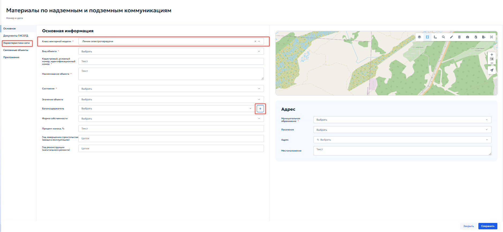

*Рисунок 104 — Карточка «Материалы по надземным и подземным коммуникациям».*

Вкладка «Основное» предназначена для ввода общей информации о коммуникации. В блоке «Основная информация» указать следующие данные:

1. «Класс векторной модели» — выбрать из выпадающего списка доступные значения, соответствующие типам инженерных сетей. После выбора значения в левой части карточки появляется вкладка «Характеристики сети»;

2. «Вид объекта» — выбрать из справочника вид линейного объекта;

3. «Кадастровый, условный номер, идентификационный номер» — указать номер объекта недвижимости;

4. «Наименование объекта» — указать наименование коммуникации;

5. «Состояние» — выбрать из выпадающего списка текущую стадию существования сети;

6. «Значение объекта» — выбрать категорию значения объекта из выпадающего списка;

7. «Балансодержатель» — выбрать из справочника организацию, ответственную за баланс коммуникации. Кнопка  позволяет добавить новую организацию. Подробнее добавление новой организации описано в пункте 5.2.1 настоящего Руководства;

8. «Форма собственности» — выбрать форму собственности из выпадающего списка;

9. «Процент износа, %» — указать процент износа сети;

10. «Год завершения строительства (ввода в эксплуатацию)» — указать год завершения строительства и ввода в эксплуатацию проекта;

11. «Год реконструкции (капитального ремонта)» — указать год последней реконструкции или капитального ремонта.

В блоке «Адрес» указать следующие данные:

1. «Муниципальное образование» — выбрать из справочника нужный городской округ или муниципальный район, где находится коммуникация;

2. «Поселение» — выбрать из справочника поселение, где находится коммуникация;

3. «Адрес» — указать с помощью кнопки «Выбрать» адрес местоположения коммуникации. Выбор адреса описан в пункте 5.4.8 настоящего Руководства;

4. «Местоположение» — ввести дополнительное описание местоположения коммуникации.

Границы коммуникации отображаются на карте в правой части карточки. Для загрузки точных координат из файла использовать кнопку «Импорт» на панели инструментов карты. Порядок импорта описан в пункте 4.5.2.12.

Во вкладке «Документы ГИСОГД» приложить документы о коммуникации. Порядок работы с вкладкой приведён в пунктах 5.3.2 и 5.3.3.

Во вкладке «Связанные объекты» установить связи между записью о коммуникации и объектами других разделов ГИСОГД. Работа со связанными реестрами осуществляется в соответствии с пунктом 4.3. Порядок установления связей описан в разделе 5.4.7.3.

Во вкладке «Приложения» приложить файлы, не отнесенные к категории документов ГИСОГД. Порядок работы с вкладкой приведён в пункте 4.5.1.

#### 5.4.11.1 Вкладка «Характеристики сети»

Вкладка предназначена для ввода технических параметров выбранного типа инженерной сети. Данные используются при формировании выписок, аналитической обработке, определении границ охранных зон и расчёте нагрузок (рисунок 105).

*Рисунок 105 — Вкладка «Характеристики сети».*

Состав полей динамически изменяется в зависимости от выбранного класса. Для класса «Линии электропередачи» отображаются следующие поля:

1. «Напряжение, кВ» — выбрать номинальное напряжение линии из выпадающего списка;

2. «Протяженность сооружения, км» — указать дробное число для указания общей длины сети в километрах;

3. «Размер санитарно-защитной зоны, м» — указать дробное число для указания размера санитарно-защитной зоны в метрах.

Для других классов перечень полей будет отличаться в соответствии с нормативными требованиями к описанию объектов соответствующего типа.

### 5.4.12 Резервирование земель и изъятие земельных участков

Раздел предназначен для ведения реестра решений о резервировании земель и решений об изъятии участков для государственных или муниципальных нужд. Ведение раздела осуществляется в соответствии с пунктом 15 части 4 статьи 56 Градостроительного кодекса Российской Федерации и постановлением Правительства Российской Федерации от 13.03.2020 № 279.

В реестр включаются правовые акты, на основании которых:

1. определенные территории резервируются для будущего строительства объектов государственного или муниципального значения — дороги, инженерные сети, социальные объекты;

2. земельные участки изымаются у правообладателей для реализации таких проектов.

Каждая запись реестра содержит сведения о виде документа, реквизиты утвердившего акта, при наличии кадастровый номер, сведения о территории, а также графическую информацию о границах резервируемого или изымаемого участка на карте.

Для записей раздела предусмотрено установление связей с делами о земельных участках для ведения истории каждого участка.

При открытии раздела отображается табличная форма, работа с которой описана в пункте 4.2. Карточка содержит вкладки «Основное», «Документы ГИСОГД», «Связанные объекты» и «Приложения» (рисунок 106).

*Рисунок 106 — Карточка «Резервирование земель и изъятие земельных участков».*

Вкладка «Основное» предназначена для ввода общих сведений о документе и характеристиках земельного участка. В блоке «Основная информация» указываются следующие данные:

1. «Тип документа» — выбрать из выпадающего списка соответствующее решение о земельном участке;

2. «Наименование документа» — указать наименование документа;

3. «Кадастровый номер» — указать кадастровый номер земельного участка;

4. «Срок резервирования земель» — указать срок окончания резервирования земель с помощью календаря;

5. «Распространяется на участки» — выбрать из выпадающего списка способ образования или распределения на участке. При нажатии кнопки  открывается окно выбора записей из реестра «Дела о земельных участках». Выбранные участки будут отображаться в списке, а сам документ окажется связанным с их историей;

6. «Ссылка на сайт» — указать ссылку на страницу публикации документа в сети Интернет.

В блоке «Документ об утверждении» указываются реквизиты правового акта: кем и чем утверждено, номер и дата издания документа, по аналогии с другими пунктами (см. пункт 5.4.3.2). При нажатии кнопки  открывается окно для ввода реквизитов лица. Подробное описание работы с формой добавления реквизитов приведено в пункте 5.2.1 настоящего Руководства.

Блок «Адрес» заполняется аналогично пунктам 5.4.8 и 5.4.10.

Границы резервируемого или изымаемого земельного участка отображаются и редактируются на карте. Для точного ввода координат использовать кнопку «Импорт» на панели инструментов карты; порядок импорта приведён в пункте 4.5.2.12. Ручная отрисовка не рекомендуется, если в дальнейшем потребуются официальные координаты.

Во вкладке «Документы ГИСОГД» прикрепляются документы о резервировании или изъятии земельного участка, графические материалы и сопроводительные документы. Порядок работы с вкладкой приведён в пунктах 5.3.2 и 5.3.3.

Во вкладке «Связанные объекты» устанавливаются связи записи о резервировании или изъятии земельного участка с объектами других разделов ГИСОГД. Работа со связанными реестрами осуществляется в соответствии с общими правилами, описанными в пункте 4.3. Порядок установления связей аналогичен описанному в разделе 5.4.7.3.

Вкладка «Приложения» предназначена для хранения дополнительных файлов, не относящихся к документам ГИСОГД: сопроводительной переписки, копий уведомлений и обзорных схем. Порядок работы с вкладкой приведён в пункте 4.5.1.

### 5.4.13 Дела о застроенных или подлежащих застройке земельных участках

Раздел предназначен для ведения полного жизненного цикла земельного участка — от начального этапа формирования земельного участка до получения разрешения на ввод объекта капитального строительства в эксплуатацию. Ведение раздела осуществляется в соответствии с пунктом 16 части 4 и частями 5–6 статьи 56 Градостроительного кодекса Российской Федерации, а также иными нормативными правовыми актами, регламентирующими предоставление государственных и муниципальных услуг в сфере градостроительства.

Раздел объединяет все документы и сведения, относящиеся к конкретному земельному участку:

- первичные сведения об участке: кадастровый номер, площадь, категория земель, вид разрешенного использования;

- схемы расположения земельного участка;

- кадастровые выписки;

- градостроительные планы земельного участка;

- сведения об объектах капитального строительства, расположенных или планируемых на участках;

- разрешения на строительство, на ввод в эксплуатацию, на отклонение от предельных параметров;

- уведомление о планируемом строительстве или об окончании строительства;

- публичные сервитуты;

- технические условия;

- дополнительные файлы и связанные объекты из других разделов ГИСОГД.

Кроме того, в состав дела при наличии соответствующих оснований и в случаях, предусмотренных законодательством, включаются:

- результаты инженерных изысканий с установлением связи с реестром «Инженерные изыскания»;

- сведения о площади, высоте и этажности объекта капитального строительства, а также об инженерно-технических сетях;

- архитектурные решения и заключения, предусмотренные для объектов, расположенных в границах исторических поселений;

- заключения государственной историко-культурной экспертизы и государственной экологической экспертизы;

- сведения из единого государственного реестра заключений;

- решения о прекращении действия или изменении разрешения на строительство;

- разрешения на условно разрешенный вид использования земельного участка или объекта капитального строительства;

- заключения органа государственного строительного надзора, учитываемые перед вводом объекта в эксплуатацию в предусмотренных законодательством случаях;

- технические планы объектов капитального строительства;

- схемы расположения построенных или реконструированных объектов и сетей инженерно-технического обеспечения;

- документы и материалы по сносу объектов капитального строительства;

- исполнительная документация;

- документы по комплексному развитию территории;

- иные сведения, документы и материалы, предусмотренные законодательством.

Все сведения, заполняемые на вкладках дела о земельном участке, автоматически сохраняются в соответствующих отдельных реестрах ГИСОГД. Эти реестры доступны через главное меню и содержат документы определенного типа по всем земельным участкам. Например:

1. пункт «СРЗУ» открывает реестр всех схем расположения земельных участков, зарегистрированных в системе;

2. пункт «ГПЗУ» — реестр всех градостроительных планов;

3. пункт «Разрешения на строительство» — реестр всех разрешений на строительство.

При работе в карточке «Дело о земельном участке» отображаются только документы, относящиеся к выбранному участку.

При открытии раздела отображается табличная форма со списком записей. Работа с реестром выполняется в соответствии с разделом 4.2 настоящего Руководства.

Добавление новой записи или редактирование существующей осуществляется в карточке дела о земельном участке (рисунок 107).

*Рисунок 107 — Карточка «Дело о земельном участке».*

Карточка содержит разветвленную систему вкладок, каждая из которых соответствует определенному этапу или типу документов:

- вкладка «Основное»;

- вкладка «Документы ГИСОГД»;

- вкладка «Схема расположения земельного участка на кадастровом плане территории» (СРЗУ);

- вкладка «Кадастровая выписка о земельном участке» (КВЗУ);

- вкладка «Градостроительный план земельного участка» (ГПЗУ);

- вкладка «Объекты капитального строительства»;

- вкладка «Разрешение на строительство»;

- вкладка «Разрешение на ввод объекта в эксплуатацию»;

- вкладка «Разрешение на отклонение от предельных параметров»;

- вкладка «Уведомление»;

- вкладка «Публичные сервитуты»;

- вкладка «Технические условия»;

- вкладка «Приложения»;

- вкладка «Связанные объекты».

Работа с вкладкой «Приложения» выполняется в соответствии с типовым порядком, описанным в пункте 5.2.3 настоящего Руководства. Работа с вкладкой «Связанные объекты» выполняется в соответствии с общим порядком установления связей, описанным в пункте 5.4.7.3 настоящего Руководства.

#### 5.4.13.1 Вкладка «Основное»

Вкладка «Основное» содержит блок «Основная информация». В блоке указать следующие данные:

1. «Нет кадастрового номера» — флажок устанавливается, если земельный участок не поставлен на кадастровый учет и не имеет присвоенного номера. Если участок имеет кадастровый номер, флажок должен быть снят. При нажатии откроется дополнительное поле «Условное обозначение ЗУ» (рисунок 108);

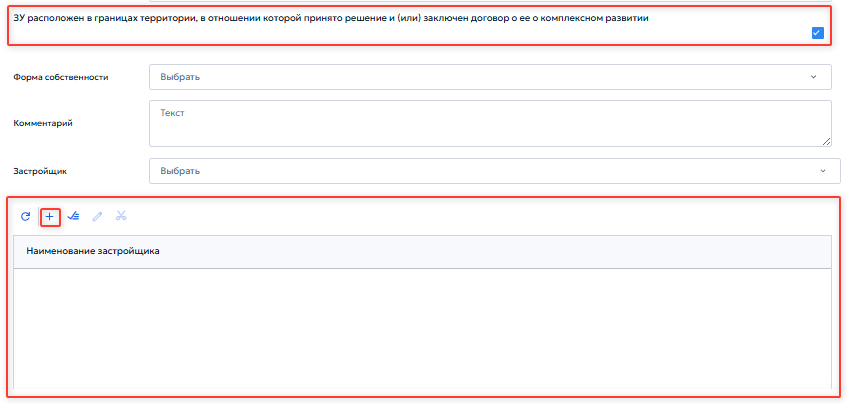

*Рисунок 108 — Отсутствие кадастрового номера земельного участка.*

После установки флажка в левом меню становятся недоступными вкладки «Объекты капитального строительства», «Разрешение на строительство», «Разрешение на ввод объекта в эксплуатацию», «Разрешение на отклонение от предельных параметров» и «Уведомления».

2. «Кадастровый номер» — ввести кадастровый номер земельного участка в соответствии с выпиской из ЕГРН;

3. «Кадастровый квартал» — указать номер кадастрового квартала, в котором расположен участок;

4. «Статус объекта» — указать текущий статус объекта;

5. «Площадь кв. м» — указать площадь земельного участка в квадратных метрах;

6. «Категория объекта» — выбрать категорию объекта из выпадающего списка;

7. «Цель использования ЗУ» — указать цели использования участка;

8. «Категория земель» — выбрать из выпадающего списка категорию земли;

9. «ВРИ по классификатору» — выбрать вид разрешенного использования в соответствии с классификатором;

10. «ЗУ расположен в границах территории, в отношении которой принято решение и (или) заключен договор о его комплексном развитии» — флажок устанавливается, если участок находится в границах комплексного развития территории (КРТ) (рисунок 109);

*Рисунок 109 — Флажок «ЗУ расположен в границах территории, в отношении которой принято решение и (или) заключён договор о её комплексном развитии».*

11. «Форма собственности» — выбрать форму собственности земельного участка из выпадающего списка;

12. «Комментарий» — указать дополнительные сведения о земельном участке;

13. «Застройщик» — выбрать из справочника организацию или лицо, являющееся застройщиком. При необходимости добавить нового застройщика в отдельном окне.

При нажатии кнопки добавления в поле «Застройщик» открывается окно с регистрацией реквизитов. Окно предназначено для выбора застройщика из централизованного справочника или добавления нового лица (рисунок 110).

*Рисунок 110 — Добавление реквизитов лица.*

В поле «Тип» необходимо указать категорию лица:

1. юридическое лицо;

2. физическое лицо;

3. индивидуальный предприниматель;

4. орган исполнительной власти.

После выбора типа лица поиск в справочнике выполняется по ИНН или наименованию организации. Для этого ввести соответствующие данные в поле «Поиск в справочнике ЕГРЮЛ/ЕГРИП» и нажать кнопку поиска. Система отобразит список подходящих записей. Выбрать нужную запись, после чего она будет внесена в поле «Застройщик» дела о земельном участке.

Если необходимое лицо отсутствует в справочнике, его добавление выполняется вручную средствами администрирования справочников. Более подробное описание работы с реквизитами юридических и физических лиц, включая заполнение контактных данных и реквизитов документа, приведено в пункте 5.2.1 настоящего Руководства.

Блок «Адрес земельного участка» заполняется в порядке, описанном в пункте 5.4.8.

Границы земельного участка отображаются и редактируются на карте. Для обеспечения точности координат рекомендуется использовать импорт координат из файла кадастровой выписки с помощью кнопки «Импорт» на панели инструментов карты (см. пункт 4.5.2.12). Ручная отрисовка контура не гарантирует точности и не рекомендуется для участков, по которым в дальнейшем потребуются официальные координаты.

Вкладка «Документы ГИСОГД» предназначена для регистрации и хранения документов дела о земельном участке. Порядок работы приведён в пунктах 5.3.2 и 5.3.3.

#### 5.4.13.2 Вкладка «СРЗУ»

Вкладка «Схема расположения земельного участка» (СРЗУ) связана с общесистемным реестром СРЗУ и позволяет создавать, редактировать и просматривать схемы, относящиеся к текущему делу. Записи, созданные во вкладке, доступны в общем реестре, и наоборот.

Во вкладке отображается перечень подготовленных схем. Для добавления схемы нажать кнопку «Добавить». Откроется карточка «Схема расположения земельного участка» (рисунок 111). В карточке заполнить следующие поля:

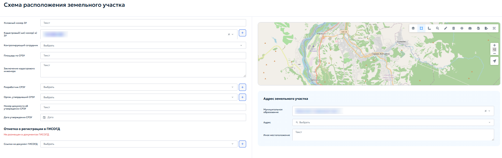

*Рисунок 111 — Карточка «Схема расположения земельного участка».*

1. «Условный номер ЗУ» — ввести номер, присвоенный земельному участку на этапе подготовки схемы;

2. «Кадастровый номер» — указать кадастровый номер участка, для которого разработана схема;

3. «Контролирующий сотрудник» — выбрать из выпадающего списка сотрудника из справочника;

4. «Площадь по СРЗУ» — указать площадь участка, указанную в схеме;

5. «Заключение кадастрового инженера» — ввести текст заключения по земельному участку;

6. «Разработчик СРЗУ» — выбрать организацию-разработчика схемы из справочника;

7. «Орган утвердивший СРЗУ» — выбрать из выпадающего списка орган власти, утвердивший схему;

В обоих полях «Разработчик СРЗУ» и «Орган, утвердивший СРЗУ» при нажатии кнопки  открывается окно «Реквизиты ЮЛ/ФЛ/ИП/ОИВ». Подробное описание работы с реквизитами лиц приведено в пункте 5.2.1.

8. «Номер документа об утверждении СРЗУ» — указать номер правового акта;

9. «Дата утверждения СРЗУ» — выбрать дату утверждения с помощью календаря;

10. «Отметка о регистрации в ГИСОГД» — поле автоматически заполняется после регистрации связанного документа ГИСОГД;

11. «Ссылка на документ ГИСОГД» — выбрать из выпадающего списка документ ГИСОГД, которым зарегистрирована утвержденная схема.

Вкладка «Основное» также содержит блок «Отметка о регистрации в ГИСОГД». В нём отображается статус размещения связанного документа в ГИСОГД. Если документ не выбран, отображается статус «Не размещён в документах ГИСОГД». Нажать кнопку «Выбрать», открыть перечень документов и выбрать нужный документ, например утверждённую схему. После выбора статус обновится автоматически, а СРЗУ будет связана с документом. Порядок выбора документа приведён в пункте 5.3.2.

Блок «Адрес земельного участка» заполняется в порядке, описанном в пункте 5.4.8.

#### 5.4.13.3 Вкладка «КВЗУ»

Вкладка «Кадастровая выписка о земельном участке» (КВЗУ) отображает выписки из ЕГРН, поступившие в систему (рисунок 112).

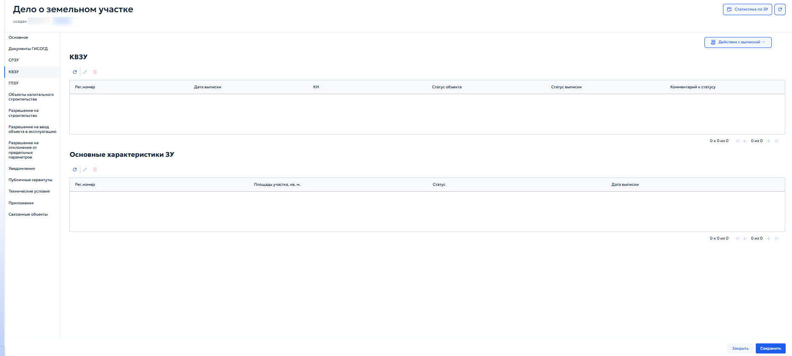

*Рисунок 112 — Вкладка «Кадастровая выписка о земельном участке».*

Вкладка содержит две области:

1. «Таблица выписок» — отображает регистрационный номер, дату выписки, кадастровый номер, статус объекта и комментарий к статусу;

2. «Основные характеристики ЗУ» — отображает ключевые сведения: площадь, статус и дату выписки, принятой за основную.

Панель инструментов позволяет добавить новую выписку вручную или связать существующую запись из реестра КВЗУ.

#### 5.4.13.4 Вкладка «ГПЗУ»

Вкладка «Градостроительный план земельного участка» (ГПЗУ) отображает перечень градостроительных планов, подготовленных для данного участка.

Описание будет доступно после соответствующего обновления в системе.

#### 5.4.13.5 Вкладка «Объекты капитального строительства»

Вкладка содержит перечень объектов капитального строительства (ОКС), расположенных или планируемых на земельном участке. Работа со списком выполняется с помощью кнопок панели инструментов, описанных в пунктах 4.2 и 4.3. При добавлении ОКС открывается карточка «Объект капитального строительства» (рисунок 113).

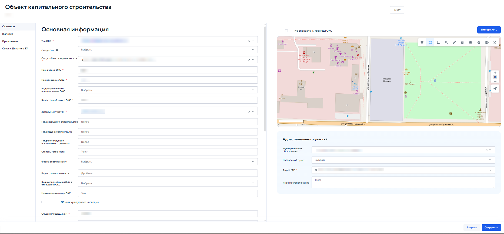

*Рисунок 113 — Карточка «Объект капитального строительства».*

Во вкладке «Основное» в блоке «Основная информация» указать следующие данные:

1. «Тип ОКС» — выбрать тип объекта из выпадающего списка;

2. «Статус ОКС» — выбрать из выпадающего списка статус объекта;

3. «Статус объекта недвижимости» — выбрать из выпадающего списка состояние учета объекта;

4. «Назначение ОКС» — описать назначение объекта;

5. «Наименование ОКС» — указать наименование объекта;

6. «Вид разрешенного использования ОКС» — выбрать из выпадающего списка вид разрешенного использования в соответствии с классификатором;

7. «Кадастровый номер ОКС» — при наличии указать кадастровый номер объекта;

8. «Земельный участок» — текстовое поле заполняется автоматически при сохранении карточки. При необходимости выбрать данные из выпадающего списка;

9. «Год завершения строительства» — указать год окончания строительства;

10. «Год ввода в эксплуатацию» — указать год ввода объекта в эксплуатацию;

11. «Год реконструкции (капитального ремонта)» — при наличии указать год последней реконструкции объекта;

12. «Степень готовности» — описать в текстовом поле текущую готовность объекта;

13. «Форма собственности» — выбрать из выпадающего списка форму собственности ОКС;

14. «Кадастровая стоимость» — указать кадастровую стоимость объекта;

15. «Вид выполнения работ в отношении ОКС» — выбрать из выпадающего списка вид выполнения работ в отношении ОКС;

16. «Наименование вида ОКС» — при необходимости уточнить вид и наименование указанного объекта;

Если объект является объектом культурного наследия, установить соответствующий флажок в карточке. После этого раскроется дополнительный блок полей для ввода сведений об объекте культурного наследия. Если объект не относится к культурному наследию, флажок устанавливать не нужно, и перечисленные поля останутся скрытыми.

17. «Регистрационный номер ОКН» — ввести регистрационный номер объекта культурного наследия;

18. «Дата постановки ОКН на учет» — указать дату постановки на учет с помощью календаря;

19. «ОИВ, принявший решения о включении ОКН в реестр» — выбрать из выпадающего списка орган исполнительной власти, принявший решение;

20. «Общая площадь, кв. м» — указать общую площадь объекта культурного наследия;

21. «Площадь застройки» — указать площадь застройки под объектом;

22. «Высота, м» — указать высоту объекта в метрах;

23. «Этажность» — указать этажность объекта;

24. «Количество подземных этажей» — указать количество подземных этажей;

25. «Количество надземных этажей» — указать количество надземных этажей;

26. «Протяженность» — указать протяженность объекта в метрах;

27. «Материалы стен» — выбрать из выпадающего списка материал стен объекта;

28. «Иные параметры» — при необходимости ввести дополнительные технические характеристики объекта;

29. «Сведения о СИТО» — при необходимости указать сведения об инженерно-техническом обеспечении (СИТО) объекта.

Блок «Адрес земельного участка» заполняется аналогично пункту 5.4.8 настоящего Руководства.

В карточке «Объект капитального строительства» вкладка «Приложения» предназначена для загрузки дополнительных файлов, относящихся к ОКС. Порядок работы приведён в пункте 4.5.1. Вкладка «Связь с делами о ЗУ» устанавливает связь объекта с другими земельными участками; порядок установления связей описан в пункте 5.4.7.3.

##### 5.4.13.5.1 Вкладка «Выписка»

Вкладка предназначена для просмотра, поиска и загрузки кадастровых выписок об объекте капитального строительства (КВОКС), полученных из Единого государственного реестра недвижимости (ЕГРН). При открытии вкладки отображается таблица со списком ранее загруженных выписок, а также панель управления для импорта и поиска записей (рисунок 114).

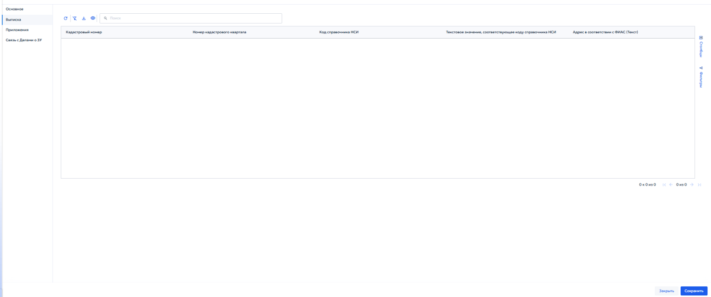

*Рисунок 114 — Вкладка «Выписка».*

Основными элементами окна являются:

1. «Поиск» — позволяет выполнять поиск по атрибутам объекта;

2. «Лог импорта» — предназначен для пакетной загрузки нескольких файлов выписок, полученных из ЕГРН. При выборе «Лог импорта» открывается проводник системы;

3. «КВОКС» — реестр КВОКС агрегирует выписки по всем объектам капитального строительства.

В таблице указываются кадастровый номер объекта, номер кадастрового квартала, код нормативно-справочной информации (НСИ), текстовое значение из справочника НСИ и адрес по ФИАС.

Для добавления новой выписки нажать кнопку  и выбрать необходимый файл в формате XML. После успешной загрузки поля в таблице заполнятся автоматически.

#### 5.4.13.6 Вкладка «Разрешение на строительство»

Вкладка «Разрешение на строительство» в карточке «Дело о земельном участке» предназначена для учета разрешений на строительство, выданных в отношении данного земельного участка. Разрешение на строительство оформляется в соответствии с требованиями Градостроительного кодекса РФ и является одним из ключевых документов, подтверждающих право на осуществление строительства или реконструкции объекта капитального строительства.

Во вкладке отображается перечень ранее зарегистрированных разрешений (рисунок 115).

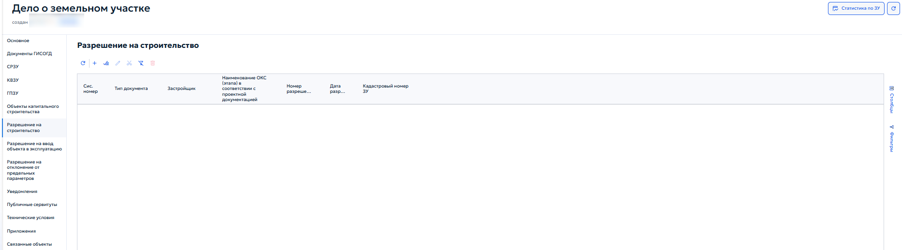

*Рисунок 115 — Вкладка «Разрешение на строительство».*

В перечне указываются: системный номер записи, тип документа, застройщик, наименование объекта капитального строительства в соответствии с проектной документацией, номер и дата выдачи разрешения, а также кадастровый номер земельного участка.

При нажатии кнопки добавления открывается карточка «Документ РС» (рисунок 116).

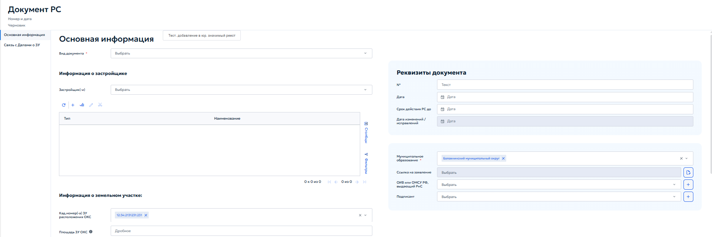

*Рисунок 116 — Карточка «Документ РС».*

В блоке «Основная информация» в поле «Вид документа» необходимо выбрать из выпадающего списка документ, разрешающий строительство.

Блок «Информация о застройщике» предназначен для выбора застройщика, которому выдано разрешение на строительство. Нажать кнопку «Выбрать» рядом с полем «Застройщик» и выбрать организацию или физическое лицо. Порядок выбора застройщика описан в пункте 5.4.13.1. Ниже отображается таблица выбранных застройщиков.

В блоке «Информация о земельном участке» указываются сведения о земельных участках, на которых планируется размещение объекта капитального строительства:

1. «Кад.номер(а) ЗУ расположения ОКС» — выпадающий список, в котором указывается кадастровый номер земельного участка. Если выбрано несколько участков, рядом с основным номером отображается индикатор «+№»;

2. «Площадь ЗУ ОКС» — указать общую площадь земельного участка.

Ниже расположена таблица, в которой автоматически отображаются добавленные земельные участки. Управление записями описано в разделе 4.3 настоящего Руководства.

В блоке «Реквизиты документа» указываются следующие данные:

1. «№» — ввести регистрационный номер разрешения на строительство;

2. «Дата» — указать дату выдачи разрешения с помощью календаря;

3. «Срок действия РС до» — указать дату окончания срока действия разрешения;

4. «Дата изменения/исправления» — поле заполняется автоматически при внесении изменений в документ;

5. «Муниципальное образование» — выбрать из выпадающего списка муниципальное образование, на территории которого планируется строительство;

6. «Ссылка на заявление» — нажать кнопку «Выбрать», чтобы привязать заявку на выдачу разрешения, зарегистрированную в журнале поступивших заявок. При нажатии кнопки перехода  выполняется переход на прикрепленное заявление;

7. «ОИВ или ИМСУ РФ, выдающий РнС» — нажать кнопку «Выбрать», чтобы указать орган исполнительной власти или орган местного самоуправления, выдавший разрешение на строительство. Выбор осуществляется из справочника органов власти;

8. «Подписант» — нажать кнопку «Выбрать», чтобы указать должностное лицо, подписавшее разрешение. Выбор осуществляется из справочника должностных лиц.

Вкладка «Связь с делами о ЗУ» предназначена для установления и просмотра связей между разрешением на строительство и делами о земельных участках, на которых планируется возведение ОКС. Порядок работы с таблицей описан в пункте 5.2.2.

#### 5.4.13.7 Вкладка «Разрешение на ввод объекта в эксплуатацию»

Вкладка «Разрешение на ввод объекта в эксплуатацию» в карточке «Дело о земельном участке» предназначена для учета разрешений на ввод объекта капитального строительства в эксплуатацию, выданных в отношении объектов, расположенных на данном земельном участке. Разрешение на ввод оформляется в соответствии с требованиями Градостроительного кодекса РФ и подтверждает завершение строительства или реконструкции объекта в полном соответствии с проектной документацией.

Во вкладке отображается перечень ранее зарегистрированных разрешений на ввод. Карточка выбранного документа открывается из перечня; пример карточки для вида документа «Отказ в выдаче разрешения» приведён на рисунке 117.

*Рисунок 117 — Карточка «Разрешение на ввод». Вид документа «Отказ в выдаче разрешения».*

В перечне указываются: системный номер записи, тип документа, застройщик, номер и дата выдачи разрешения, наименование объекта капитального строительства, а также кадастровый номер земельного участка.

Панель инструментов перечня позволяет добавлять, редактировать, удалять, обновлять и экспортировать записи. Общие правила работы с табличными формами описаны в пункте 4.3.

При нажатии кнопки «Добавить» открывается карточка «Разрешение на ввод» (рисунок 118).

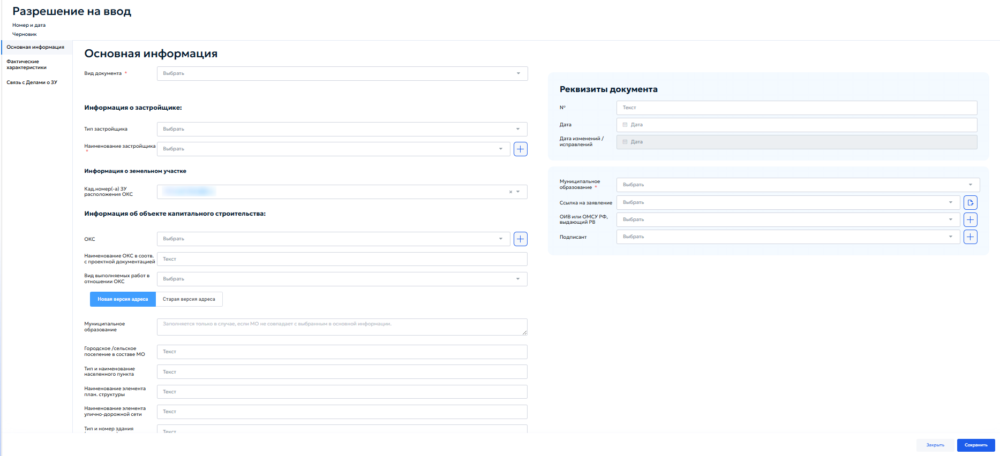

*Рисунок 118 — Карточка «Разрешение на ввод».*

Карточка «Разрешение на ввод объекта в эксплуатацию» содержит вкладки «Основная информация», «Итоговый документ и ЭЦП» и, в зависимости от значения поля «Вид документа», «Документы ГИСОГД».

##### 5.4.13.7.1 Вкладка «Основная информация»

Во вкладке «Основная информация» в зависимости от значения поля «Вид документа» отображаются следующие дополнительные блоки или поля:

1. «Разрешение» — отображается кнопка «Вносится ранее выданный документ», позволяющая выбрать существующее разрешение, на основании которого создаётся новое. В карточке появляется вкладка «Документы ГИСОГД» (рисунок 119);

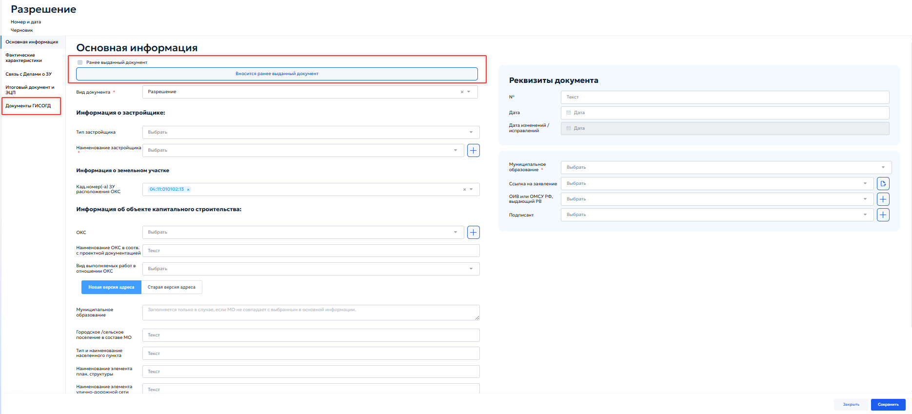

*Рисунок 119 — Карточка «Разрешение на ввод». Вид документа «Разрешение».*

2. «Отказ во внесении исправлений» — отображается блок «Отказ в исправлении опечаток и ошибок» (рисунок 120);

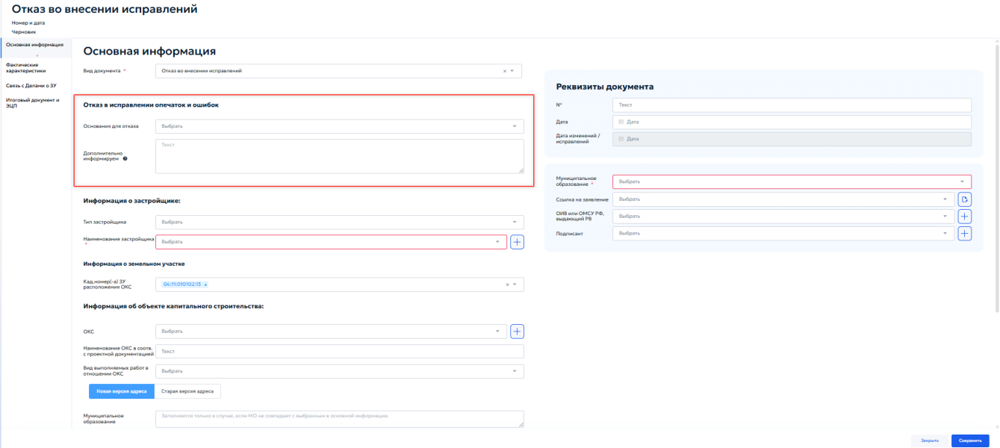

*Рисунок 120 — Карточка «Разрешение на ввод». Вид документа «Отказ во внесении исправлений».*

В блоке указывается следующая информация:

- «Основания для отказа» — выбрать причину для отказа из выпадающего списка;

- «Дополнительно информируем» — написать разъяснение для отказа.

3. «Отказ во внесении изменений» — отображается блок «Причины отказа во внесении изменений в РВ»;

В блоке указывается следующая информация:

- «Отсутствующие в заявлении документы» — выбрать из списка документы, которые не были предоставлены;

- «Несоответствия в представленных документах» — выбрать вид выявленных несоответствий.

4. «Отказ в выдаче разрешения» — отображается блок «Причины отказа в выдаче РВ» (рисунок 121), содержащий следующие поля:

*Рисунок 121 — Вид документа «Отказ в выдаче разрешения».*

- «Отсутствующие в заявлении документы» — выбрать из справочника документы, обязательные для предоставления в соответствии с требованиями Градостроительного кодекса РФ и административного регламента;

- «Несоответствия в представленных документах» — выбрать из справочника виды несоответствий, выявленных в представленных документах;

- «Дополнительно информируем» — указать дополнительные данные, обоснования отказа или иную информацию, которую заявитель должен учесть.

5. «Отказ в выдаче дубликата» — состав вкладки «Основная информация» не изменяется. В меню карточки появляется вкладка «Итоговый документ и ЭЦП» (см. пункт 5.4.13.7.2);

6. «Внесение изменений/исправлений» — отображается блок «Ранее выданный документ» (рисунок 122).

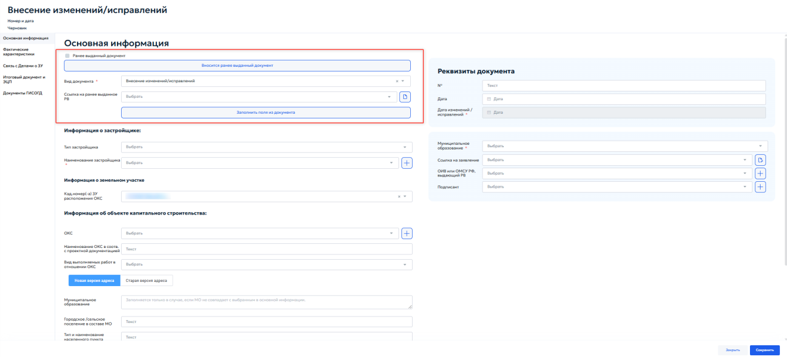

*Рисунок 122 — Вид документа «Внесение изменений/исправлений».*

В блоке указывается следующая информация:

- «Вносится ранее выданный документ» — кнопка выбора ранее выданного разрешения; отображается для вида документа «Разрешение»;

- «Ссылка на ранее выданное РВ» — выбрать из справочника ссылку на ранее выданное разрешение. При необходимости прикрепить ее с помощью кнопки выбора;

- «Заполнить поля из документа» — кнопка, при нажатии на которую система переносит данные из выбранного ранее выданного разрешения в текущую карточку.

В блоке «Информация о земельном участке» в выпадающем списке «Кад.номер(-а) ЗУ расположения ОКС» выбирается кадастровый номер земельного участка, на котором расположен объект. Если выбрано несколько участков, рядом с основным номером отображается индикатор «+№».

Блок «Информация об объекте капитального строительства» включает в себя следующие поля:

- «ОКС» — выбрать в справочнике объект капитального строительства;

- «Наименование ОКС в соотв. с проектной документацией» — указать название объекта капитального строительства;

- «Вид выполняемых работ в отношении ОКС» — выбрать вид выполняемых работ из выпадающего списка.

Для указания местоположения ОКС заполнить адресную форму. В карточке доступны вкладки «Новая версия адреса» и «Старая версия адреса».

Вкладка «Новая версия адреса» содержит следующие поля:

- «Муниципальное образование» — указать, если муниципальное образование не совпадает с указанным в основной информации дела о ЗУ;

- «Городское/сельское поселение в составе МО» — указать наименование поселения, входящего в состав выбранного муниципального образования;

- «Тип и наименование населенного пункта» — указать тип населенного пункта и его наименование;

- «Наименование элемента план. структуры» — указать территорию — микрорайон, квартал, жилой район, промышленная территория и т. д.;

- «Наименование элемента улично-дорожной сети» — указать элемент улично-дорожной сети: проезд, переулок и т. д.;

- «Тип и номер здания (сооружения)» — указать тип и номер здания или сооружения.

Вкладка «Старая версия адреса» содержит следующие поля:

- «Адрес (местоположение) ОКС ГАР» — выбрать адрес из Государственного адресного реестра;

- «Описание адреса» — указать описание местоположения, если адрес отсутствует в ГАР.

В блоке «РС, на основании которого осуществлялось строительство, реконструкция объекта капитального строительства» в реестре выбрать разрешение на строительство, связанное с текущим делом о земельном участке (см. раздел 5.4.13.6).

В блоке «Отметка о регистрации в ГИСОГД» в поле «Ссылка на документ ГИСОГД» выбрать документ, связываемый с объектом.

Блок «Реквизиты документа» содержит регистрационные сведения разрешения на ввод объекта. Порядок заполнения реквизитов документа приведен в пункте 5.3.2 настоящего Руководства.

##### 5.4.13.7.2 Вкладка «Итоговый документ и ЭЦП»

Вкладка «Итоговый документ и ЭЦП» (рисунок 123) предназначена для формирования, подписания и хранения итоговой версии документа, а также для управления электронными подписями. На основании данных карточки Система формирует файл, пригодный для подписания.

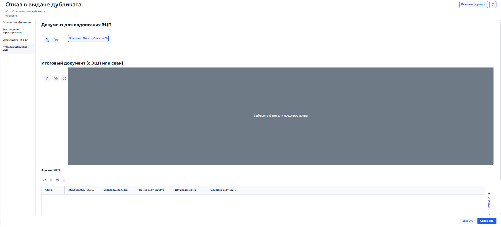

*Рисунок 123 — Вкладка «Итоговый документ и ЭЦП».*

##### 5.4.13.7.3 Вкладка «Документы ГИСОГД»

Вкладка «Документы ГИСОГД» отображается для видов документа, предусматривающих связь с зарегистрированными документами ГИСОГД. Порядок добавления и связывания документов приведен в пунктах 5.3.2 и 5.3.3 настоящего Руководства.

#### 5.4.13.8 Вкладка «Разрешение на отклонение от предельных параметров»

Находится в разработке

#### 5.4.13.9 Вкладка «Уведомление»

Вкладка «Уведомление» в карточке «Дело о земельном участке» предназначена для учёта уведомлений, направляемых застройщиком в уполномоченный орган. В соответствии с Градостроительным кодексом РФ застройщик обязан уведомить орган, выдавший разрешение на строительство, о планируемом начале строительства и о его завершении. В системе также фиксируются иные виды уведомлений, предусмотренные нормативными актами.

Во вкладке отображается перечень ранее зарегистрированных уведомлений (рисунок 124).

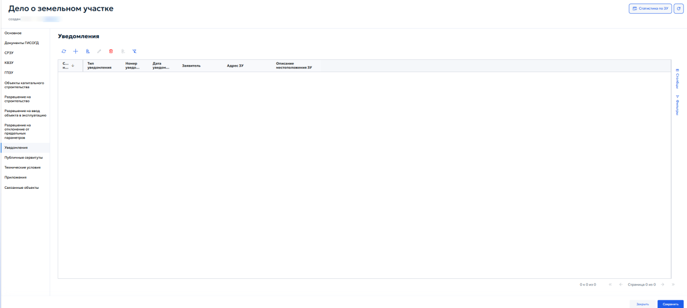

*Рисунок 124 — Таблица зарегистрированных уведомлений.*

Общие правила работы с табличными формами описаны в пункте 4.3.

Для добавления уведомления нажать кнопку добавления на панели инструментов. Откроется карточка создания уведомления (рисунок 125).

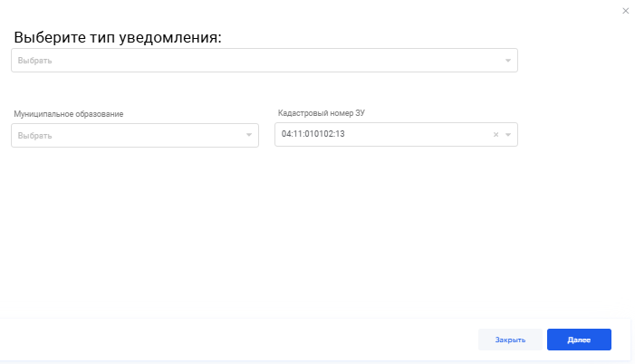

*Рисунок 125 — Карточка создания уведомления.*

В карточке создания уведомления указать следующие данные:

- «Выберите тип уведомления» — справочник видов уведомлений. Выбрать нужное значение;

- «Муниципальное образование» — указать муниципальное образование, на территории которого расположен земельный участок;

- «Кадастровый номер ЗУ» — указать кадастровый номер земельного участка.

##### 5.4.13.9.1 Карточка «Уведомление о несоответствии объекта»

Выбрать тип «Уведомление о несоответствии построенных или реконструированных объектов индивидуального жилищного строительства или садового дома требованиям законодательства о градостроительной деятельности» и нажать кнопку «Далее». Откроется специализированная карточка (рисунок 126).

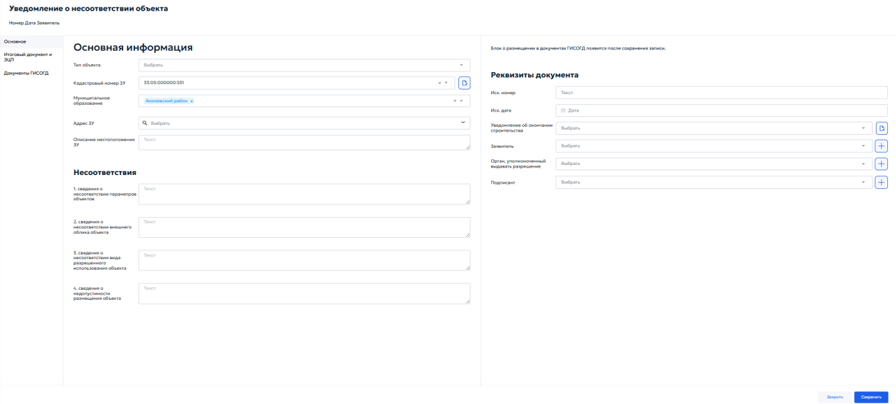

*Рисунок 126 — Карточка создания уведомления. Тип уведомления «Уведомление о несоответствии объекта».*

Карточка «Уведомление о несоответствии объекта» предназначена для фиксации факта выявления органом власти несоответствий параметров построенного или реконструированного объекта капитального строительства требованиям проектной документации, разрешению на строительство или техническим регламентам.

Карточка содержит вкладки «Основное», «Итоговый документ и ЭЦП», «Документы ГИСОГД».

Во вкладке «Основное» в блоке «Основная информация» указать следующие данные:

1. «Тип объекта» — выбрать тип капитального строительства из выпадающего списка;

2. «Кадастровый номер ЗУ» — выбрать кадастровый номер земельного участка, на котором расположен объект, из выпадающего списка. Если номера ЗУ нет в списке — нажать кнопку добавления  и указать его вручную;

3. «Муниципальное образование» — указать из выпадающего списка муниципальное образование, на территории которого расположен объект;

4. «Адрес ЗУ» — указать адрес земельного участка. Порядок заполнения адреса описан в разделе 5.4.8 настоящего Руководства;

5. «Описание местоположения ЗУ» — при необходимости указать дополнительное описание ориентиров и местоположения участка.

Блок «Несоответствия» предназначен для детализации выявленных нарушений.

В блоке указывается следующая информация:

1. «Сведения о несоответствии параметров объекта» — указать, в чем заключается несоответствие параметров объекта проектной документации или разрешению на строительство;

2. «Сведения о несоответствии внешнего объекта» — указать несоответствие внешнего облика объекта утвержденным требованиям;

3. «Сведения о несоответствии вида разрешенного использования объекта» — описать несоответствие фактического использования объекта установленному виду разрешенного использования земельного участка;

4. «Сведения о недопустимости разрешенного объекта» — указать причины, по которым размещение или сохранение объекта на данном участке является недопустимым.

В блоке «Реквизиты документа» указать сведения уведомления:

1. «Иск.номер» — исходящий регистрационный номер уведомления;

2. «Иск.дата» — дата исходящего уведомления;

3. «Уведомление об окончании строительства» — выбрать из выпадающего списка тип уведомления об окончании строительства. При нажатии кнопки выбора будет выполнена загрузка необходимого уведомления;

4. «Заявитель» — выбрать из справочника физическое или юридическое лицо, направившее уведомление об окончании строительства. При нажатии кнопки добавления открывается окно «Реквизиты ЮЛ/ФЛ/ИП/ОИВ». Подробное описание работы с окном приведено в разделе 5.2.1 настоящего Руководства;

5. «Орган, уполномоченный выдавать разрешение» — выбрать из справочника необходимый орган, выдавший разрешение на строительство. При нажатии кнопки добавления откроется окно «Реквизиты ЮЛ/ФЛ/ИП/ОИВ»;

6. «Подписант» — выбрать из справочника должностное лицо, подписавшее уведомление о несоответствии. Для указания дополнительного подписанта при необходимости нажать кнопку добавления. Откроется окно «Реквизиты подписанта» (см. пункт 5.4.13.9.1.1).

Во вкладке «Итоговый документ и ЭЦП» указать итоговую версию уведомления о несоответствии. Порядок работы с вкладкой приведён в пункте 5.4.13.7.2.

Во вкладке «Документы ГИСОГД» указать документы, связанные с уведомлением о несоответствии. Порядок работы с вкладкой описан в пунктах 5.3.2 и 5.3.3 настоящего Руководства.

###### 5.4.13.9.1.1 Окно «Реквизиты подписанта»

Окно «Реквизиты подписанта» (рисунок 127) предназначено для указания должностного лица, уполномоченного подписывать документ.

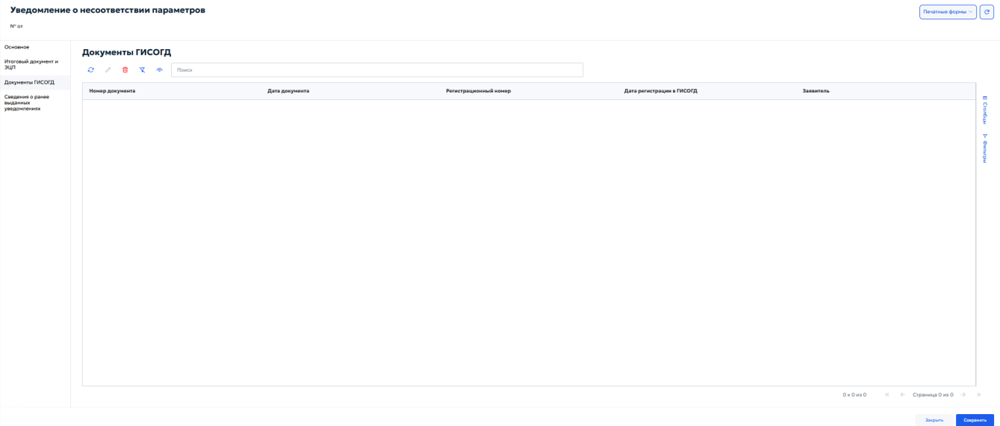

*Рисунок 127 — Окно «Реквизиты подписанта».*

В блоке «Основное» указать данные подписанта: ФИО, дату рождения, должность и муниципальное образование.

В блоке «Контакты» указать контактные данные подписанта: телефон, e-mail, примечание.

##### 5.4.13.9.2 Карточка «Уведомление о соответствии объекта»

Карточка «Уведомление о соответствии объекта» (рисунок 128) открывается при выборе одноимённого типа уведомления.

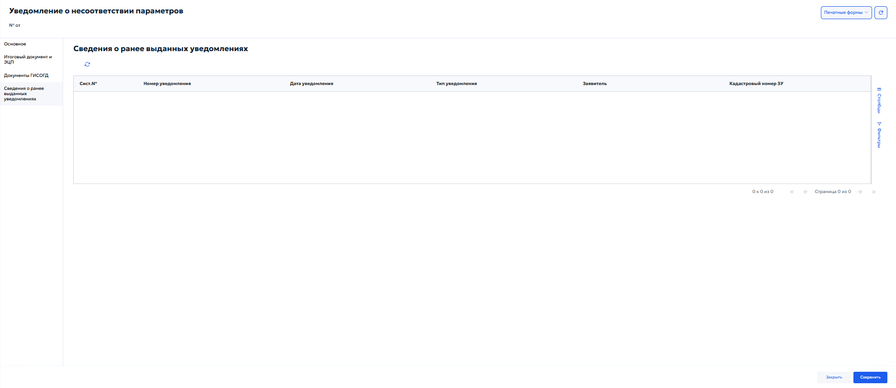

*Рисунок 128 — Карточка «Уведомление о соответствии объекта».*

Данный вид уведомления направляется застройщиком в уполномоченный орган после завершения строительства или реконструкции объекта ИЖС или садового дома для подтверждения соответствия параметров объекта требованиям, установленным разрешением на строительство (при его наличии) или уведомлением о соответствии планируемого строительства. На основании положительного уведомления о соответствии орган власти принимает решение о выдаче уведомления о соответствии построенного объекта.

Карточка содержит вкладки «Основное», «Итоговый документ и ЭЦП», «Документы ГИСОГД».

Во вкладке «Основное» в блоке «Основная информация» указать следующие данные:

1. «Тип объекта» — указать тип объекта из выпадающего списка;

2. «Кадастровый номер ЗУ» — выбрать кадастровый номер земельного участка, на котором расположен объект, из выпадающего списка. Если номера ЗУ нет в списке — нажать кнопку добавления  и указать его вручную;

3. «Муниципальное образование» — выбрать из выпадающего списка муниципальное образование, на территории которого расположен объект;

4. «Адрес ЗУ» — указать адрес земельного участка. Порядок заполнения адреса описан в разделе 5.4.8 настоящего Руководства;

5. «Описание местоположения ЗУ» — при необходимости указать дополнительное описание ориентиров и местоположения участка.

В блоке «Реквизиты документа» указываются следующие данные:

1. «Иск.номер» — ввести исходящий регистрационный номер уведомления;

2. «Исх.дата» — указать дату исходящего уведомления с помощью календаря;

3. «Уведомление об окончании строительства» — выбрать из списка ранее зарегистрированное уведомление об окончании строительства, к которому относится данное уведомление о соответствии. При нажатии кнопки добавления  дополнительное уведомление указывается;

4. «Заявитель» — выбрать из выпадающего списка физическое или юридическое лицо, направившее уведомление. При нажатии кнопки добавления в окне «Реквизиты ЮЛ/ФЛ/ИП/ОИВ» дополнительный заявитель вносится, если его нет в списке. Описание работы с окном приведено в разделе 5.2.1 настоящего Руководства;

5. «Орган, уполномоченный выдавать разрешение» — выбрать из выпадающего списка орган местного самоуправления или исполнительной власти, выдавший разрешение на строительство. При нажатии кнопки добавления в окне «Реквизиты ЮЛ/ФЛ/ИП/ОИВ» дополнительный орган вносится, если его нет в списке. Описание работы с окном приведено в разделе 5.2.1 настоящего Руководства;

6. «Подписант» — выбрать из справочника должностное лицо, подписавшее уведомление о соответствии. Для указания дополнительного подписанта при необходимости нажать кнопку добавления . Откроется окно «Реквизиты подписанта». Описание работы с окном приведено в разделе 5.2.1 настоящего Руководства.

Во вкладке «Итоговый документ и ЭЦП» сформировать итоговую версию уведомления о соответствии. Подробное описание работы с вкладкой приведено в пункте 5.4.13.7.2.

##### 5.4.13.9.3 Карточка «Уведомление о несоответствии параметров»

Карточка «Уведомление о несоответствии параметров» (рисунок 129) открывается при выборе одноименного типа уведомления.

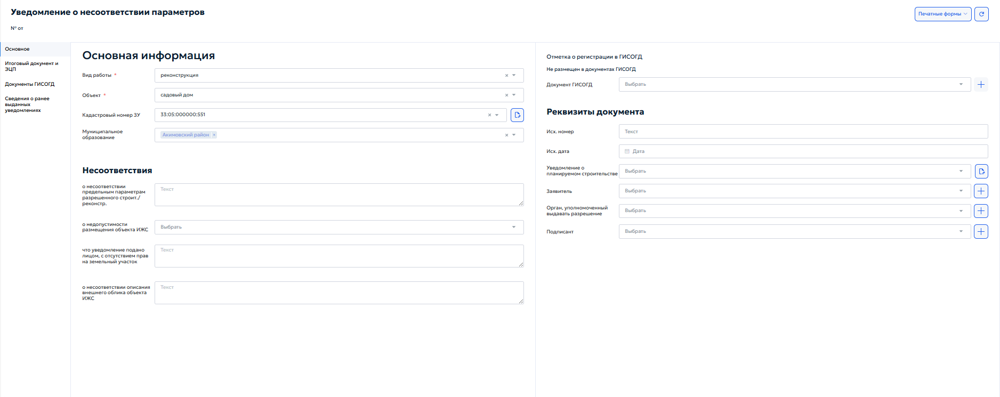

*Рисунок 129 — Карточка «Уведомление о несоответствии параметров». Вкладка «Основное».*

Карточка предназначена для оформления уведомления уполномоченного органа о несоответствии параметров планируемого строительства или реконструкции объекта ИЖС либо садового дома установленным требованиям.

Карточка содержит вкладки «Основное», «Итоговый документ и ЭЦП», «Документы ГИСОГД», «Сведения о ранее выданных уведомлениях».

Во вкладке «Основное» в блоке «Основная информация» указываются следующие данные:

1. «Вид работы» — выбрать вид работ из выпадающего списка;

2. «Объект» — выбрать тип объекта из выпадающего списка;

3. «Кадастровый номер ЗУ» — выбрать кадастровый номер земельного участка, к которому относится уведомление. При необходимости нажать кнопку справа от поля, чтобы открыть связанную карточку;

4. «Муниципальное образование» — указать муниципальное образование, на территории которого расположен земельный участок.

Блок «Несоответствия» предназначен для указания причин подготовки уведомления. В блоке заполняются следующие сведения:

1. «О несоответствии предельным параметрам разрешенного строительства/реконструкции» — указать сведения о несоответствии параметров объекта установленным предельным параметрам;

2. «О недопустимости размещения объекта ИЖС» — выбрать или указать основание, по которому размещение объекта ИЖС на земельном участке недопустимо;

3. «Что уведомление подано лицом, с отсутствием прав на земельный участок» — указать сведения о заявителе и отсутствии прав на земельный участок;

4. «О несоответствии описания внешнего облика объекта ИЖС» — указать сведения о несоответствии описания внешнего облика объекта установленным требованиям.

Во вкладке «Основное» также расположен блок «Отметка о регистрации в ГИСОГД». В нем отображается статус размещения уведомления в документах ГИСОГД. Если документ еще не размещен, в карточке отображается отметка «Не размещен в документах ГИСОГД». В поле «Документ ГИСОГД» выбрать связанный документ ГИСОГД или нажать кнопку добавления справа от поля.

В блоке «Реквизиты документа» указываются следующие данные:

1. «Исх. номер» — ввести исходящий номер уведомления;

2. «Исх. дата» — указать дату исходящего уведомления с помощью календаря;

3. «Уведомление о планируемом строительстве» — выбрать связанное уведомление о планируемом строительстве. При необходимости нажать кнопку справа от поля, чтобы открыть связанную карточку;

4. «Заявитель» — выбрать заявителя из справочника. Если нужного заявителя нет в списке, нажать кнопку добавления справа от поля;

5. «Орган, уполномоченный выдавать разрешение» — выбрать орган местного самоуправления или исполнительной власти, уполномоченный выдавать разрешение;

6. «Подписант» — выбрать должностное лицо, подписывающее уведомление. При необходимости нажать кнопку добавления справа от поля.

Для формирования печатного документа использовать кнопку «Печатные формы». После заполнения карточки нажать «Сохранить». Для выхода без сохранения нажать «Закрыть».

Во вкладке «Итоговый документ и ЭЦП» выполняется подготовка, подписание и загрузка итогового документа уведомления (рисунок 130).

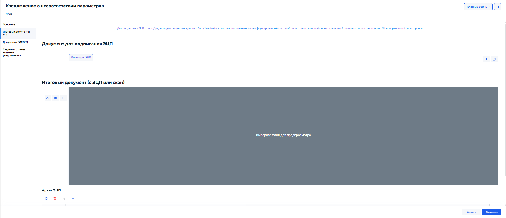

*Рисунок 130 — Вкладка «Итоговый документ и ЭЦП» в карточке «Уведомление о несоответствии параметров».*

В поле «Документ для подписания ЭЦП» должен быть загружен один файл формата DOCX со штампом, автоматически сформированный системой после открытия онлайн, либо файл, сохраненный пользователем из системы на ПК и загруженный после внесения правок. Для подписания документа нажать кнопку «Подписать ЭЦП».

В блоке «Итоговый документ (с ЭЦП или скан)» загрузить подписанный файл или скан итогового документа и проверить его в области предварительного просмотра. В блоке «Архив ЭЦП» отображаются сведения об электронных подписях; доступны обновление, удаление, загрузка файла и просмотр подписи.

Во вкладке «Документы ГИСОГД» отображаются документы ГИСОГД, связанные с уведомлением (рисунок 131).

*Рисунок 131 — Вкладка «Документы ГИСОГД» в карточке «Уведомление о несоответствии параметров».*

Сведения представлены в табличной форме с колонками «Номер документа», «Дата документа», «Регистрационный номер», «Дата регистрации в ГИСОГД», «Заявитель». Для поиска документа использовать поле «Поиск». Порядок добавления и связывания документов ГИСОГД описан в пунктах 5.3.2 и 5.3.3 настоящего Руководства.

Во вкладке «Сведения о ранее выданных уведомлениях» отображаются ранее выданные уведомления, связанные с земельным участком или заявителем (рисунок 132).

*Рисунок 132 — Вкладка «Сведения о ранее выданных уведомлениях» в карточке «Уведомление о несоответствии параметров».*

Данные отображаются в табличной форме с колонками «Сист. №», «Номер уведомления», «Дата уведомления», «Тип уведомления», «Заявитель», «Кадастровый номер ЗУ». Вкладка используется для проверки ранее зарегистрированных уведомлений перед сохранением текущей карточки.

#### 5.4.13.10 Вкладка «Публичные сервитуты»

Вкладка «Публичные сервитуты» предназначена для учёта сведений о публичных сервитутах, установленных в отношении земельного участка. Добавление и редактирование сведений выполняются в карточке «Публичный сервитут» (рисунок 133).

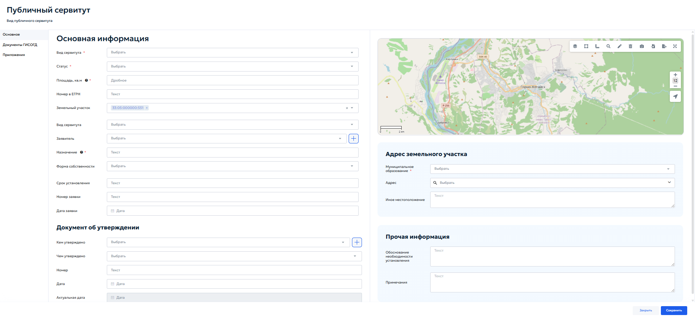

*Рисунок 133 — Карточка «Публичный сервитут». Вкладка «Основное».*

Карточка содержит вкладки «Основное», «Документы ГИСОГД» и «Приложения».

Во вкладке «Основное» в блоке «Основная информация» указываются следующие данные:

1. «Вид сервитута» — выбрать вид публичного сервитута из выпадающего списка;

2. «Статус» — выбрать текущий статус публичного сервитута;

3. «Площадь, кв. м» — указать площадь территории публичного сервитута в квадратных метрах;

4. «Номер в ЕГРН» — ввести номер публичного сервитута в ЕГРН при наличии сведений;

5. «Земельный участок» — выбрать земельный участок, в отношении которого устанавливается публичный сервитут;

6. «Вид сервитута» — уточнить вид сервитута в соответствии со справочником системы;

7. «Заявитель» — выбрать заявителя из справочника. Для добавления записи нажать кнопку «+» справа от поля. Откроется окно «Реквизиты ЮЛ/ФЛ/ИП/ОИВ»;

8. «Назначение» — указать назначение устанавливаемого публичного сервитута;

9. «Форма собственности» — выбрать форму собственности из выпадающего списка;

10. «Срок установления» — указать срок, на который устанавливается публичный сервитут;

11. «Номер заявки» — ввести номер заявки на установление публичного сервитута;

12. «Дата заявки» — указать дату заявки с помощью календаря.

В блоке «Документ об утверждении» заполняются реквизиты документа, которым утверждено установление публичного сервитута:

1. «Кем утверждено» — выбрать орган или лицо, утвердившее документ. Для добавления записи нажать кнопку «+» справа от поля. Откроется окно «Реквизиты ЮЛ/ФЛ/ИП/ОИВ»;

2. «Чем утверждено» — выбрать документ или основание утверждения из справочника;

3. «Номер» — ввести номер утверждающего документа;

4. «Дата» — указать дату утверждающего документа;

5. «Актуальная дата» — указать дату актуальности сведений.

В правой части вкладки отображается карта. Инструменты карты предназначены для просмотра местоположения участка, изменения масштаба и проверки пространственного расположения публичного сервитута.

Блок «Адрес земельного участка» предназначен для указания местоположения участка. В поле «Муниципальное образование» выбрать муниципальное образование из списка, в поле «Адрес» выбрать адрес из справочника, при отсутствии адреса указать сведения в поле «Иное местоположение».

В блоке «Прочая информация» заполнить поле «Обоснование необходимости установления» и при необходимости указать дополнительные сведения в поле «Примечания».

Окно «Реквизиты ЮЛ/ФЛ/ИП/ОИВ» открывается при нажатии кнопки «+» у поля выбора физического лица, юридического лица, индивидуального предпринимателя или органа исполнительной власти (рисунок 134).

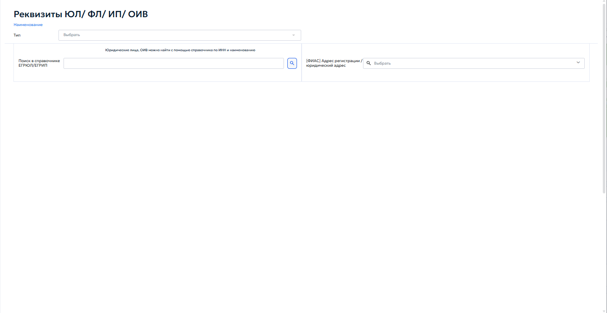

*Рисунок 134 — Окно «Реквизиты ЮЛ/ФЛ/ИП/ОИВ».*

В окне «Реквизиты ЮЛ/ФЛ/ИП/ОИВ» заполнить поле «Наименование» и выбрать значение в поле «Тип». Для юридических лиц и индивидуальных предпринимателей доступен поиск по ЕГРЮЛ/ЕГРИП: ввести ИНН или наименование и нажать кнопку поиска. В поле «\[ФИАС\] Адрес регистрации / юридический адрес» выбрать адрес.

После выбора или заполнения реквизитов закрыть карточку и вернуться к карточке публичного сервитута. Выбранная запись будет подставлена в соответствующее поле.

Во вкладке «Документы ГИСОГД» отображается перечень документов ГИСОГД, связанных с публичным сервитутом (рисунок 135).

*Рисунок 135 — Вкладка «Документы ГИСОГД» в карточке «Публичный сервитут».*

Сведения представлены в табличной форме с колонками «Муниципальные образования», «Дата документа ГИСОГД», «Регистрационный № ГИСОГД», «Раздел ГИСОГД», «Классификатор документов ГИСОГД». Для поиска использовать поле «Поиск», для настройки отображения использовать панели «Столбцы» и «Фильтры». Кнопки панели инструментов обеспечивают обновление списка, добавление, изменение и удаление связи с документом ГИСОГД. Порядок добавления и связывания документов ГИСОГД описан в пунктах 5.3.2 и 5.3.3 настоящего Руководства.

Во вкладке «Приложения» загружаются файлы, относящиеся к публичному сервитуту и не зарегистрированные как самостоятельные документы ГИСОГД (рисунок 136).

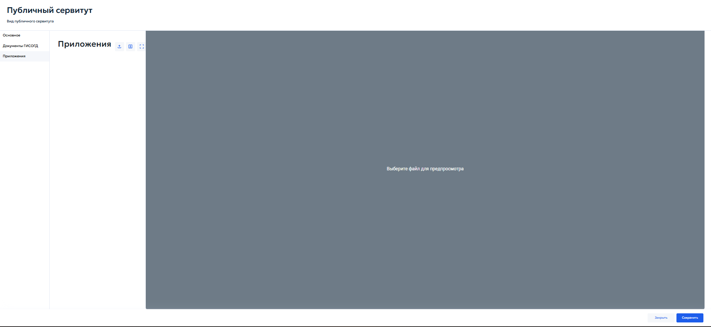

*Рисунок 136 — Вкладка «Приложения» в карточке «Публичный сервитут».*

Для добавления приложения нажать кнопку загрузки файла и выбрать файл на компьютере. После загрузки выбрать файл в списке, чтобы просмотреть его в области предварительного просмотра. Для просмотра файла в отдельном режиме использовать кнопку разворачивания области просмотра.

После заполнения сведений нажать «Сохранить». Для выхода из карточки без сохранения нажать «Закрыть».

#### 5.4.13.11 Вкладка «Технические условия»

Находится в разработке

### 5.4.14 Программы реализации документов территориального планирования

В раздел «Программы реализации документов территориального планирования» вносятся программы, которыми предусмотрены мероприятия по реализации документов территориального планирования, а также документы, связанные с их утверждением или внесением изменений.

К таким документам относятся:

- инвестиционные программы субъектов естественных монополий;

- инвестиционные программы организаций коммунального комплекса;

- программы комплексного развития транспортной инфраструктуры;

- программы комплексного развития социальной инфраструктуры;

- программы комплексного развития систем коммунальной инфраструктуры;

- иные программы, направленные на реализацию документов территориального планирования.

Раздел предназначен для учета программ реализации, связанных с документами территориального планирования, хранения реквизитов программы, сведений о документе об утверждении, адресной привязки, а также связанных документов ГИСОГД и приложений.

Для добавления новой записи в реестр нажать кнопку «Добавить» на панели инструментов. Откроется карточка «Программы реализации документов территориального планирования» во вкладке «Основное» (рисунок 137).

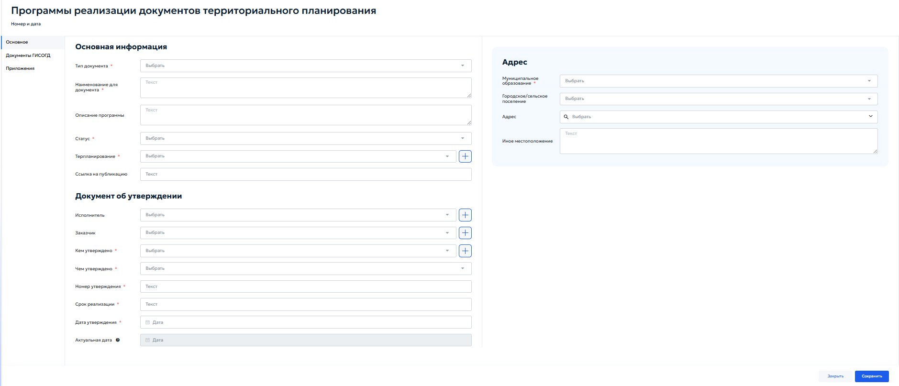

*Рисунок 137 — Карточка «Программы реализации документов территориального планирования». Вкладка «Основное».*

Карточка содержит следующие вкладки:

- «Основное»;

- «Документы ГИСОГД»;

- «Приложения».

Во вкладке «Основное» отображаются блоки:

- «Основная информация»;

- «Документ об утверждении»;

- «Адрес».

В блоке «Основная информация» указываются основные сведения о программе реализации документа территориального планирования (рисунок 138).

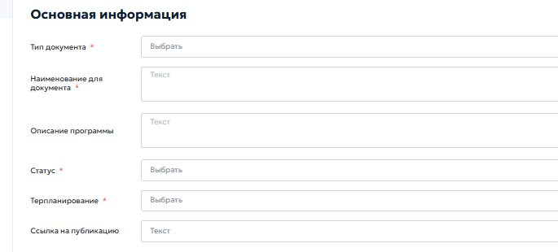

*Рисунок 138 — Блок «Основная информация» в карточке программы реализации документа территориального планирования.*

В состав блока «Основная информация» входят следующие поля:

1. «Тип документа» — выбрать тип программы из выпадающего списка;

2. «Наименование для документа» — ввести полное наименование программы в соответствии с утвержденным документом;

3. «Описание программы» — указать краткое описание программы, ее назначение, сферу реализации или иные сведения, необходимые для идентификации документа;

4. «Статус» — выбрать текущий статус программы из выпадающего списка;

5. «Терпланирование» — выбрать документ территориального планирования, для реализации которого принята программа. Если нужный документ отсутствует в списке, нажать кнопку «+» справа от поля. Откроется карточка «Документ территориального планирования». Описание работы с данной карточкой приведено в пункте 5.4.14.1 настоящего Руководства;

6. «Ссылка на публикацию» — указать ссылку на официальный источник публикации программы или документа, которым она утверждена.

В блоке «Документ об утверждении» указываются сведения о документе, которым утверждена программа реализации документа территориального планирования (рисунок 139).

*Рисунок 139 — Блок «Документ об утверждении» в карточке программы реализации документа территориального планирования.*

В состав блока «Документ об утверждении» входят следующие поля:

1. «Исполнитель» — выбрать из выпадающего списка организацию или лицо, ответственное за исполнение программы. Если нужной записи нет в справочнике, нажать кнопку «+» справа от поля и добавить новую запись;

2. «Заказчик» — выбрать заказчика программы из выпадающего списка. Если нужная запись отсутствует, нажать кнопку «+» справа от поля и заполнить карточку новой записи;

3. «Кем утверждено» — выбрать орган, организацию или должностное лицо, утвердившее программу. Для добавления новой записи нажать кнопку «+» справа от поля;

4. «Чем утверждено» — выбрать вид документа об утверждении из выпадающего списка;

5. «Номер утверждения» — ввести номер документа, которым утверждена программа;

6. «Срок реализации» — указать срок реализации программы. Поле заполняется вручную в соответствии с утвержденным документом;

7. «Дата утверждения» — указать дату утверждения программы с помощью календаря;

8. «Актуальная дата» — поле отображает актуальную дату сведений. Поле недоступно для ручного редактирования и заполняется системой.

Блок «Адрес» предназначен для указания территории или местоположения, к которому относится программа реализации (рисунок 140).

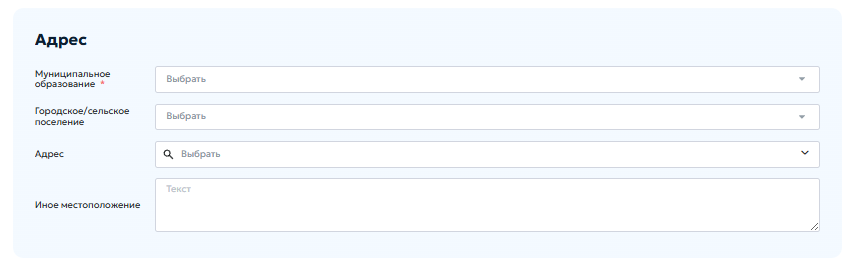

*Рисунок 140 — Блок «Адрес» в карточке программы реализации документа территориального планирования.*

В состав блока «Адрес» входят следующие поля:

1. «Муниципальное образование» — выбрать муниципальное образование из выпадающего списка;

2. «Городское/сельское поселение» — при необходимости выбрать городское или сельское поселение, входящее в состав выбранного муниципального образования;

3. «Адрес» — выбрать адрес из справочника. Для поиска адреса начать вводить значение в поле поиска и выбрать подходящую запись из списка;

4. «Иное местоположение» — указать описание местоположения вручную, если адрес отсутствует в справочнике или требуется уточнить территориальную привязку программы.

После заполнения обязательных полей нажать кнопку «Сохранить». Для выхода из карточки без сохранения нажать кнопку «Закрыть».

Во вкладке «Документы ГИСОГД» отображается перечень документов ГИСОГД, связанных с программой реализации документа территориального планирования. В данной вкладке необходимо добавить программу, документ об утверждении программы и при необходимости документы о внесении изменений. Порядок добавления и связывания документов ГИСОГД описан в пунктах 5.3.2 и 5.3.3 настоящего Руководства.

Во вкладке «Приложения» прикрепляются файлы, относящиеся к программе реализации, но не размещаемые как самостоятельные документы ГИСОГД. Для добавления приложения нажать кнопку загрузки файла, выбрать файл на компьютере и после загрузки проверить его отображение в области предварительного просмотра.

#### 5.4.14.1 Карточка «Документ территориального планирования»

Карточка «Документ территориального планирования» открывается при нажатии кнопки «+» справа от поля «Терпланирование» в карточке программы реализации документа территориального планирования.

Карточка предназначена для добавления или редактирования документа территориального планирования, к которому относится программа реализации (рисунок 141).

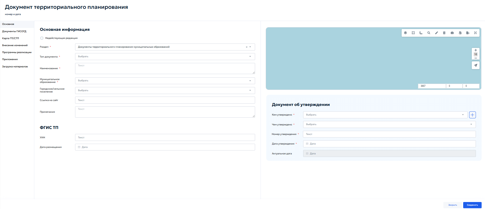

*Рисунок 141 — Карточка «Документ территориального планирования». Вкладка «Основное».*

В левой части карточки расположено меню вкладок:

- «Основное»;

- «Документы ГИСОГД»;

- «Карта ГП/СТП»;

- «Внесение изменений»;

- «Программы реализации»;

- «Приложения»;

- «Загрузка материалов».

Во вкладке «Основное» отображаются блоки:

- «Основная информация»;

- «ФГИС ТП»;

- «Документ об утверждении».

В блоке «Основная информация» указываются сведения о документе территориального планирования.

В состав блока «Основная информация» входят следующие поля и элементы:

1. «Недействующая редакция» — флажок устанавливается, если документ территориального планирования утратил актуальность. При установке флажка под ним отображается дополнительное поле «Новый документ отменяющий действие». В данном поле выбрать из выпадающего списка документ, которым отменяется действие текущего документа (рисунок 142);

*Рисунок 142 — Флажок «Недействующая редакция» и поле «Новый документ отменяющий действие».*

2. «Раздел» — выбрать раздел ГИСОГД, к которому относится документ. Для документов территориального планирования муниципальных образований выбирается значение «Документы территориального планирования муниципальных образований»;

3. «Тип документа» — выбрать тип документа территориального планирования из выпадающего списка;

4. «Наименование» — ввести полное наименование документа в соответствии с утвержденным актом;

5. «Муниципальное образование» — выбрать муниципальное образование из выпадающего списка;

6. «Городское/сельское поселение» — при необходимости выбрать поселение, входящее в состав муниципального образования;

7. «Ссылка на сайт» — указать ссылку на официальный сайт или страницу публикации документа;

8. «Примечания» — внести дополнительные сведения о документе, например информацию об особенностях редакции, изменениях или источнике размещения.

В блоке «ФГИС ТП» указываются сведения о размещении документа в федеральной государственной информационной системе территориального планирования.

В состав блока «ФГИС ТП» входят следующие поля:

1. «УИН» — ввести уникальный идентификационный номер документа в ФГИС ТП;

2. «Дата размещения» — указать дату размещения документа с помощью календаря.

В блоке «Документ об утверждении» указываются реквизиты документа, которым утвержден документ территориального планирования.

В состав блока «Документ об утверждении» входят следующие поля:

1. «Кем утверждено» — выбрать орган, организацию или должностное лицо, утвердившее документ. При необходимости нажать кнопку «+» справа от поля для добавления новой записи;

2. «Чем утверждено» — выбрать вид документа об утверждении из выпадающего списка;

3. «Номер утверждения» — ввести номер документа об утверждении;

4. «Дата утверждения» — указать дату утверждения с помощью календаря;

5. «Актуальная дата» — поле отображает актуальную дату сведений. Поле недоступно для ручного редактирования и заполняется системой.

Во вкладке «Документы ГИСОГД» отображается перечень документов ГИСОГД, связанных с текущим документом территориального планирования. В перечень могут входить текстовая часть документа, графические материалы, документ об утверждении, документы о внесении изменений и иные материалы, подлежащие размещению в ГИСОГД.

Для добавления документа ГИСОГД использовать кнопку «Добавить» на панели инструментов. Порядок заполнения карточки документа ГИСОГД и прикрепления файлов описан в пунктах 5.3.2 и 5.3.3 настоящего Руководства.

Вкладка «Карта ГП/СТП» предназначена для просмотра и работы с пространственными данными документа территориального планирования.

Во вкладке отображаются функциональные зоны и объекты, относящиеся к документу территориального планирования. Работа с картой выполняется с помощью стандартных инструментов карты: управление слоями, выбор объектов, поиск, рисование или редактирование геометрии, импорт и экспорт геометрии. Описание работы с инструментами карты приведено в пункте 4.5.2 настоящего Руководства (рисунок 143).

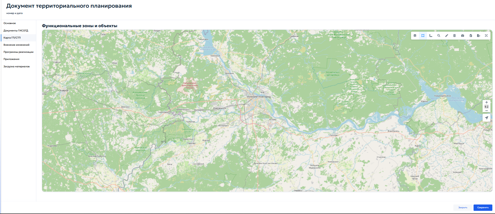

*Рисунок 143 — Вкладка «Карта ГП/СТП». Функциональные зоны и объекты.*

Вкладка «Внесение изменений» содержит раздел «Изменения в ГП/СТП», предназначенный для учёта документов о внесении изменений в документ территориального планирования.

Для добавления новой записи нажать кнопку «+» на панели инструментов. Откроется карточка «Внесение изменений в документ терпланирования».

Карточка «Внесение изменений в документ территориального планирования» содержит блок «Основное», карту и блок «Пересечения» (рисунок 144).

*Рисунок 144 — Карточка «Внесение изменений в документ территориального планирования».*

В блоке «Основное» заполняются следующие поля:

1. «Чем утверждено изменение (Документ ГИСОГД)» — выбрать документ ГИСОГД, которым утверждено внесение изменений. При нажатии кнопки справа от поля открывается карточка «Документы ГИСОГД»;

2. «Описание изменения» — указать описание внесенных изменений;

3. «Комментарий» — при необходимости внести дополнительный комментарий к изменению.

В правой части карточки отображается карта. Карта используется для проверки пространственной привязки изменений, области их действия и пересечений с ранее внесенными контурами.

Блок «Архивирование контуров, в которые вносятся изменения» предназначен для поиска и обработки контуров, пересекающихся с текущей геометрией изменения.

Для работы с блоком выполнить следующие действия:

1. нажать кнопку «Проверить пересечения». После проверки в таблице «Пересечения» отобразится список контуров, пересекающих текущую геометрию;

2. для просмотра контуров на карте включить слой «Пересечения»;

3. для архивирования выбранных контуров выделить записи в таблице и нажать кнопку «Архивировать контуры». Для удаления ненужных записей используется инструмент «Ножницы» в таблице.

В блоке «Пересечения» отображается таблица найденных пересечений. Таблица содержит сведения о системном номере, коде объекта, названии зоны, индексе зоны и признаке архивности (рисунок 145).

*Рисунок 145 — Блок «Пересечения».*

При нажатии кнопки «+» в блоке «Пересечения» открывается карточка «Контуры функциональных зон».

Карточка «Контуры функциональных зон» предназначена для создания или редактирования пространственного контура функциональной зоны.

В карточке «Контуры функциональных зон» в блоке «Информация об объекте» указываются следующие данные:

1. «Статус» — выбрать статус контура из выпадающего списка;

2. «Код объекта» — ввести код объекта;

3. «Название зоны» — ввести наименование функциональной зоны;

4. «Чем утверждено» — выбрать документ, которым утвержден контур. При нажатии кнопки с изображением файла справа от поля открывается карточка «Документы ГИСОГД»;

5. «Муниципальный/городской округ» — выбрать муниципальное образование, в границах которого расположен контур;

6. «Сельское/городское поселение» — при необходимости выбрать поселение;

7. «Площадь, га» — указать площадь контура в гектарах;

8. «Уровень управления в РФ» — выбрать уровень управления из выпадающего списка;

9. «Сведения о планируемых объектах» — внести сведения о планируемых объектах, если они предусмотрены документом территориального планирования;

10. «Коэффициент застройки, %» — указать значение коэффициента застройки при наличии таких сведений;

11. «Иной параметр и его единицы измерения» — указать дополнительный параметр и единицы измерения, если они предусмотрены документом.

В правой части карточки отображается карта. Инструменты карты предназначены для нанесения, просмотра и редактирования контура функциональной зоны. Если контур утратил актуальность, установить флажок «Архив» (рисунок 146).

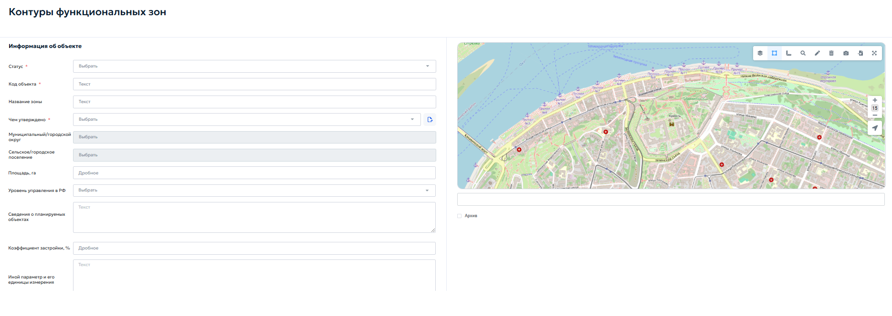

*Рисунок 146 — Карточка «Контуры функциональных зон».*

Во вкладке «Программы реализации» карточки документа территориального планирования отображается перечень программ реализации, связанных с данным документом. Вкладка используется для проверки программ, относящихся к выбранному документу территориального планирования, и перехода к связанной программе реализации.

Во вкладке «Приложения» прикрепляются файлы, относящиеся к документу территориального планирования, но не размещаемые как самостоятельные документы ГИСОГД. Для добавления файла нажать кнопку загрузки, выбрать файл на компьютере и проверить его отображение в области предварительного просмотра.

Во вкладке «Загрузка материалов» выполняется загрузка пространственных данных документа территориального планирования.

Вкладка предназначена для импорта функциональных зон и объектов из ZIP-архива с векторными файлами формата GML.

В блоке «Загрузка пространственных данных» доступны следующие действия:

1. «Загрузить функциональные зоны» — загрузка функциональных зон из ZIP-архива с векторными файлами;

2. «Загрузить контуры функциональных зон» — загрузка контуров функциональных зон из ZIP-архива с векторными файлами формата GML;

3. «Загрузить объекты из ZIP-архива с векторными файлами» — загрузка объектов территориального планирования из ZIP-архива, содержащего векторные файлы формата GML;

4. «Выберите файлы» — открытие стандартного окна операционной системы для выбора файла на локальном компьютере;

5. «Удалить вектор» — удаление ранее загруженных векторных данных текущего документа.

После выбора ZIP-архива система выполняет импорт пространственных данных и добавляет загруженные функциональные зоны или объекты в соответствующие реестры карточки документа территориального планирования.

После заполнения сведений нажать «Сохранить». Для выхода из карточки без сохранения нажать «Закрыть».

### 5.4.15 Особо охраняемые природные территории

Раздел «Особо охраняемые природные территории» предназначен для учета сведений, документов и материалов об особо охраняемых природных территориях, а также нормативных правовых актов, которыми утверждены положения об особо охраняемых природных территориях или внесены изменения в такие положения.

В реестре хранятся основные сведения об особо охраняемой природной территории, реквизиты документа об утверждении, адресная и пространственная привязка, связанные документы ГИСОГД и приложения.

Для добавления новой записи нажать кнопку «Добавить» на панели инструментов реестра. Откроется карточка «Особо охраняемые природные территории» во вкладке «Основное» (рисунок 147).

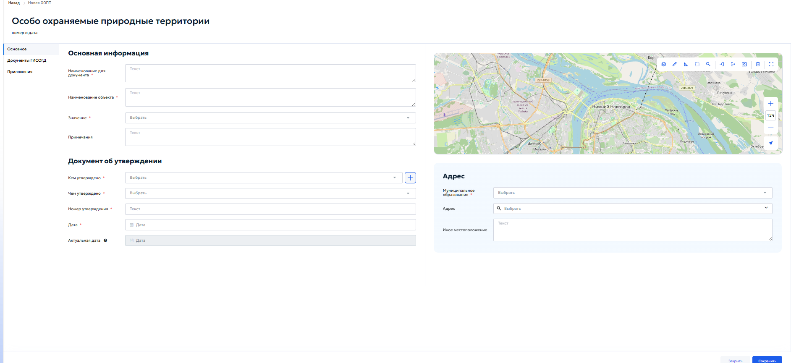

*Рисунок 147 — Карточка «Особо охраняемые природные территории». Вкладка «Основное».*

Карточка содержит следующие вкладки:

- «Основное»;

- «Документы ГИСОГД»;

- «Приложения».

Во вкладке «Основное» отображаются блоки «Основная информация», «Документ об утверждении» и «Адрес», а также карта для пространственной привязки особо охраняемой природной территории.

В блоке «Основная информация» указываются основные сведения об особо охраняемой природной территории.

В состав блока «Основная информация» входят следующие поля:

1. «Наименование для документа» — ввести наименование, которое должно использоваться при формировании и отображении документа. Поле обязательно для заполнения;

2. «Наименование объекта» — ввести полное наименование особо охраняемой природной территории. Поле обязательно для заполнения;

3. «Значение» — выбрать требуемое значение из выпадающего списка в соответствии со сведениями об особо охраняемой природной территории. Поле обязательно для заполнения;

4. «Примечания» — при необходимости внести дополнительные сведения об объекте, особенностях его учета или источнике данных.

В блоке «Документ об утверждении» указываются реквизиты документа, которым утверждена особо охраняемая природная территория или положение о ней.

В состав блока «Документ об утверждении» входят следующие поля:

1. «Кем утверждено» — выбрать орган, организацию, юридическое или физическое лицо, утвердившее документ. Если нужная запись отсутствует, нажать кнопку «+» справа от поля. Откроется окно «Реквизиты ЮЛ/ФЛ/ИП/ОИВ». Порядок работы с ним описан в пункте 5.2.1. Поле обязательно для заполнения;

2. «Чем утверждено» — выбрать вид документа об утверждении из выпадающего списка. Поле обязательно для заполнения;

3. «Номер утверждения» — ввести номер документа об утверждении. Поле обязательно для заполнения;

4. «Дата» — указать дату документа об утверждении с помощью календаря. Поле обязательно для заполнения;

5. «Актуальная дата» — поле отображает актуальную дату сведений. Поле недоступно для ручного редактирования и заполняется системой.

Блок «Адрес» предназначен для указания территориальной и адресной привязки особо охраняемой природной территории.

В состав блока «Адрес» входят следующие поля:

1. «Муниципальное образование» — выбрать муниципальное образование из выпадающего списка. Поле обязательно для заполнения;

2. «Адрес» — выбрать адрес из адресного справочника. Для поиска начать вводить адрес и выбрать подходящую запись из выпадающего списка;

3. «Иное местоположение» — указать местоположение вручную, если адрес отсутствует в справочнике или требуется дополнительное описание территории.

В правой части вкладки «Основное» отображается карта. Инструменты карты предназначены для указания, просмотра и изменения границы особо охраняемой природной территории, а также проверки ее пространственного положения.

Для нанесения границы использовать инструменты рисования геометрии. Порядок добавления и удаления геометрии описан в пункте 4.5.2.10 настоящего Руководства. При наличии файла с координатами граница загружается с помощью импорта геометрии, описанного в пункте 4.5.2.12 настоящего Руководства.

После заполнения обязательных полей и указания пространственной привязки нажать кнопку «Сохранить». Для выхода из карточки без сохранения нажать кнопку «Закрыть».

Во вкладке «Документы ГИСОГД» отображается перечень документов ГИСОГД, связанных с особо охраняемой природной территорией (рисунок 148).

*Рисунок 148 — Вкладка «Документы ГИСОГД» в карточке особо охраняемой природной территории.*

Перечень представлен в табличной форме и содержит следующие столбцы:

1. «Номер документа» — номер связанного документа;

2. «Дата документа» — дата связанного документа;

3. «Регистрационный номер ГИСОГД» — регистрационный номер документа в ГИСОГД;

4. «Наименование документа» — наименование связанного документа;

5. «Категория документа» — категория документа ГИСОГД.

На панели инструментов доступны стандартные действия для обновления перечня, добавления и управления связанными документами. Справа расположены панели «Столбцы» и «Фильтры», предназначенные для настройки отображения и отбора записей.

Порядок создания и заполнения карточки документа ГИСОГД приведен в пункте 5.3.2, а порядок связывания документа с заявкой на размещение — в пункте 5.3.3 настоящего Руководства.

Во вкладке «Приложения» прикрепляются файлы, относящиеся к особо охраняемой природной территории и не размещаемые как самостоятельные документы ГИСОГД (рисунок 149).

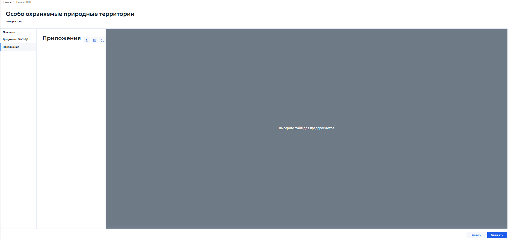

*Рисунок 149 — Вкладка «Приложения» в карточке особо охраняемой природной территории.*

В левой части вкладки отображается список прикрепленных файлов, в правой части — область предварительного просмотра выбранного файла. Для загрузки приложения нажать кнопку загрузки, выбрать файл на компьютере и после загрузки проверить его отображение в области предварительного просмотра.

Подробный порядок работы с файлами приведен в пункте 4.5.1 настоящего Руководства.

После добавления документов и приложений нажать кнопку «Сохранить» для сохранения внесенных изменений.

### 5.4.16 Лесничества

Раздел «Лесничества» предназначен для учета сведений, документов и материалов о лесничествах, в том числе лесохозяйственных регламентов, проектов освоения лесов и проектной документации лесных участков.

В реестре хранятся основные сведения о лесничестве, реквизиты документа об утверждении, адресная и пространственная привязка, связанные документы ГИСОГД и приложения.

Для добавления новой записи нажать кнопку «Добавить» на панели инструментов реестра. Откроется карточка «Лесничества» во вкладке «Основное» (рисунок 150).

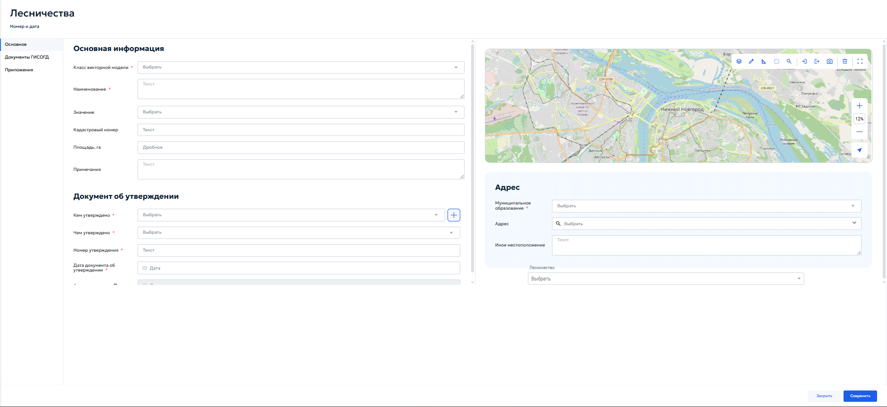

*Рисунок 150 — Карточка «Лесничества». Вкладка «Основное».*

В верхней части карточки отображается строка «Номер и дата» с системными сведениями о записи. Значения формируются системой после сохранения карточки и не вводятся пользователем вручную.

Карточка содержит следующие вкладки:

- «Основное»;

- «Документы ГИСОГД»;

- «Приложения».

Во вкладке «Основное» отображаются блоки «Основная информация», «Документ об утверждении» и «Адрес», поле «Лесничество», а также карта для пространственной привязки объекта.

В блоке «Основная информация» указываются основные сведения о лесничестве.

В состав блока «Основная информация» входят следующие поля:

1. «Класс векторной модели» — выбрать требуемый класс векторной модели из выпадающего списка. Поле обязательно для заполнения;

2. «Наименование» — ввести полное наименование лесничества в соответствии с документом-основанием. Поле обязательно для заполнения;

3. «Значение» — выбрать требуемое значение из выпадающего списка в соответствии со сведениями о лесничестве;

4. «Кадастровый номер» — при наличии ввести кадастровый номер лесного участка или иного учитываемого объекта;

5. «Площадь, га» — указать площадь объекта в гектарах. Поле предназначено для ввода дробного числового значения;

6. «Примечания» — при необходимости внести дополнительные сведения об объекте, особенностях его учета или источнике данных.

В блоке «Документ об утверждении» указываются реквизиты документа, которым утверждены сведения о лесничестве или соответствующий документ лесного планирования.

В состав блока «Документ об утверждении» входят следующие поля:

1. «Кем утверждено» — выбрать орган, организацию, юридическое или физическое лицо, утвердившее документ. Если нужная запись отсутствует, нажать кнопку «+» справа от поля. Откроется окно «Реквизиты ЮЛ/ФЛ/ИП/ОИВ». Порядок работы с ним описан в пункте 5.2.1. Поле обязательно для заполнения;

2. «Чем утверждено» — выбрать вид документа об утверждении из выпадающего списка. Поле обязательно для заполнения;

3. «Номер утверждения» — ввести номер документа об утверждении. Поле обязательно для заполнения;

4. «Дата документа об утверждении» — указать дату документа с помощью календаря. Поле обязательно для заполнения;

5. «Актуальная дата» — поле отображает актуальную дату сведений. Поле недоступно для ручного редактирования и заполняется системой.

Блок «Адрес» предназначен для указания территориальной и адресной привязки лесничества.

В состав блока «Адрес» входят следующие поля:

1. «Муниципальное образование» — выбрать муниципальное образование из выпадающего списка. Поле обязательно для заполнения;

2. «Адрес» — выбрать адрес из адресного справочника. Для поиска начать вводить адрес и выбрать подходящую запись из выпадающего списка;

3. «Иное местоположение» — указать местоположение вручную, если адрес отсутствует в справочнике или требуется дополнительное описание территории.

В поле «Лесничество» выбрать соответствующее лесничество из выпадающего списка.

В правой части вкладки «Основное» отображается карта. Инструменты карты предназначены для указания, просмотра и изменения границы лесничества или лесного участка, а также проверки его пространственного положения.

Для нанесения границы использовать инструменты рисования геометрии. Порядок добавления и удаления геометрии описан в пункте 4.5.2.10 настоящего Руководства. При наличии файла с координатами граница загружается с помощью импорта геометрии, описанного в пункте 4.5.2.12 настоящего Руководства.

После заполнения обязательных полей и указания пространственной привязки нажать кнопку «Сохранить». Для выхода из карточки без сохранения нажать кнопку «Закрыть».

Во вкладке «Документы ГИСОГД» добавляются документы, относящиеся к лесничеству, в том числе лесохозяйственные регламенты, проекты освоения лесов и проектная документация лесных участков. Порядок создания и заполнения карточки документа ГИСОГД приведен в пункте 5.3.2 настоящего Руководства.

Во вкладке «Приложения» прикрепляются файлы, относящиеся к лесничеству и не размещаемые как самостоятельные документы ГИСОГД. Подробный порядок работы с файлами приведен в пункте 4.5.1 настоящего Руководства.

После добавления документов и приложений нажать кнопку «Сохранить» для сохранения внесенных изменений.

### 5.4.17 Информационные модели объектов капитального строительства

Находится в разработке

### 5.4.18 Иные документы

Находится в разработке
