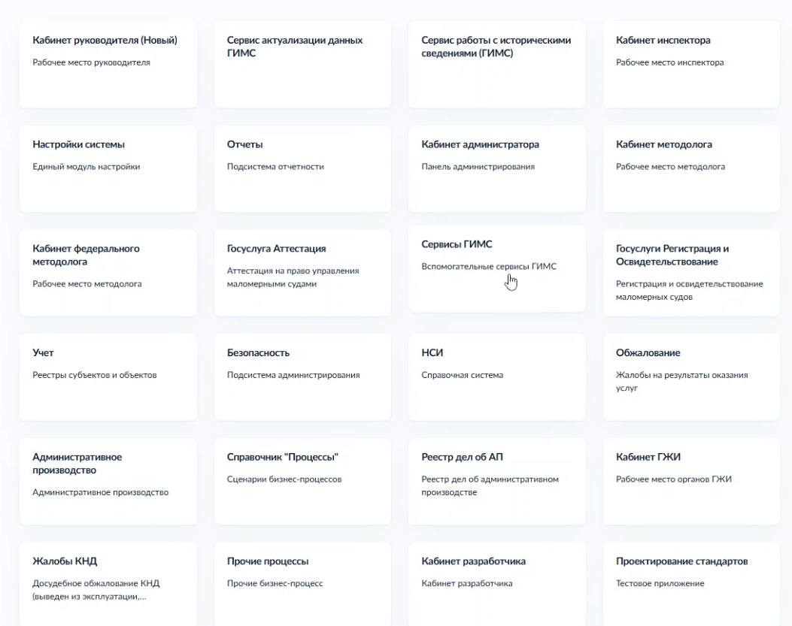
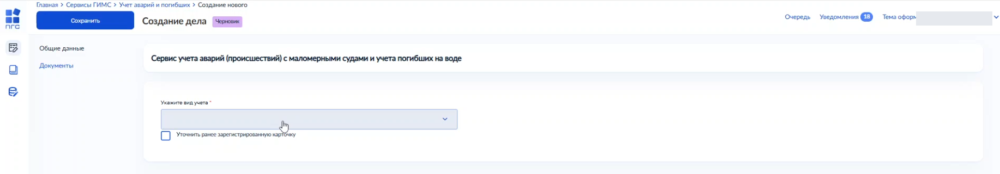
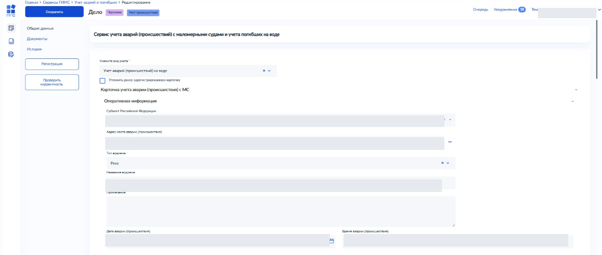
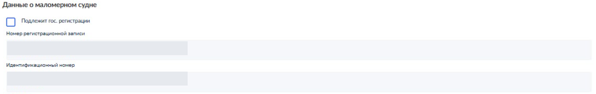
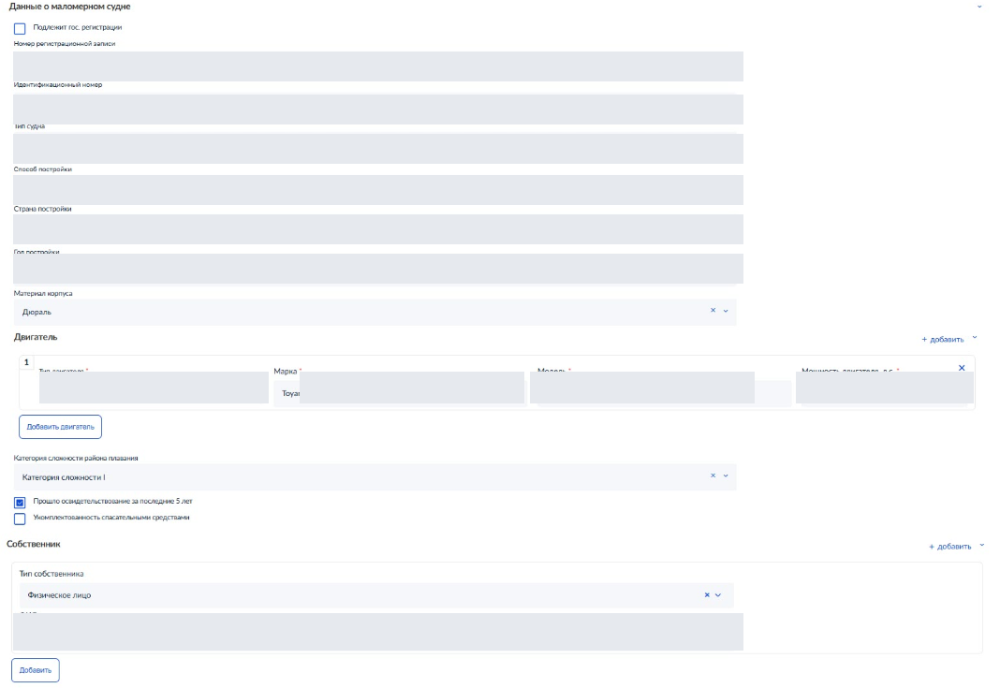
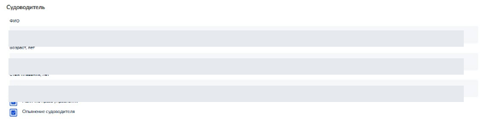
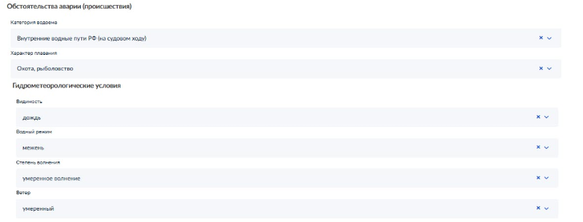
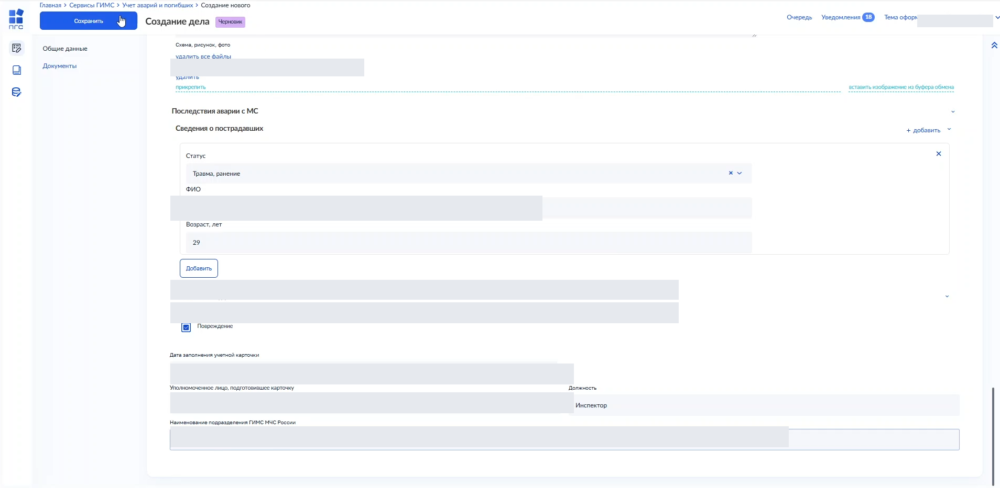
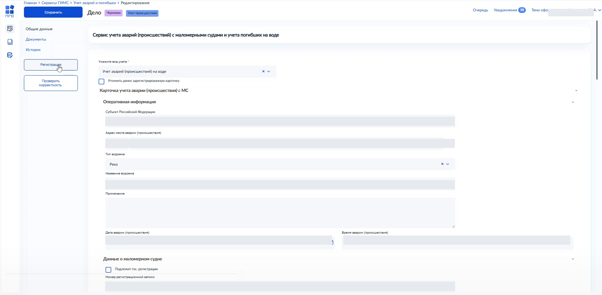

# Создание карточки учёта аварий (происшествий) с МС

Инструкция описывает создание карточки учёта аварии (происшествия) с маломерным судном во ФГИС ПГС.

> В иллюстрациях использованы обезличенные демонстрационные данные.

Процесс включает следующие этапы:

1. Авторизация во ФГИС ПГС и выбор модуля.
2. Создание нового дела и заполнение общей информации.
3. Заполнение данных о маломерном судне.
4. Заполнение данных о судоводителе.
5. Заполнение данных об обстоятельствах аварии.
6. Сохранение и регистрация дела.

## Авторизация во ФГИС ПГС и выбор модуля

Чтобы начать работу по созданию карточки аварии:

1. В главном меню выберите модуль «Сервисы ГИМС».

2. Откройте раздел «Учёт аварий и погибших».

## Создание дела и заполнение общей информации

Чтобы создать новое дело и заполнить общую информацию о маломерном судне:

1. Нажмите кнопку «Добавить дело». Откроется форма «Создание дела».
2. В поле «Укажите вид учёта» выберите «Учёт аварий на воде».
3. Убедитесь, что отметка в чекбоксе «Уточнить ранее зарегистрированную карточку» снята.

4. Заполните поля блока «Оперативная информация»:

   1. В поле «Субъект Российской Федерации» выберите значение из списка.
   2. В поле «Адрес места аварии (происшествия)» нажмите кнопку выбора адреса и введите или выберите адрес из подсказок.
   3. В поле «Тип водоёма» выберите значение из списка.
   4. Заполните поле «Название водоёма».

5. Заполните поля «Дата аварии (происшествия)» и «Время аварии (происшествия)»:

   1. Нажмите значок календаря и выберите дату происшествия.
   2. Введите время аварии в формате «ЧЧ:ММ».

## Заполнение данных о маломерном судне

Чтобы внести сведения о маломерном судне:

1. Перейдите к блоку «Данные о маломерном судне».
2. Установите или снимите флажок в чекбоксе «Подлежит гос. регистрации».

3. Поля «Номер регистрационной записи» и «Идентификационный номер» заполните, если данные известны; иначе оставьте пустыми.
4. В поле «Тип судна» выберите тип маломерного судна из списка.
5. Заполните поля «Способ постройки», «Страна постройки» и «Год постройки».
6. В поле «Материал корпуса» выберите значение из списка.
7. В блоке «Двигатель» нажмите кнопку «Добавить двигатель» и заполните поля «Тип двигателя», «Марка», «Модель» и «Мощность двигателя, л. с.».
8. Установите или снимите отметки в чекбоксах «Прошло освидетельствование за последние 5 лет» и «Укомплектованность спасательными средствами».
9. Поле «Собственник» оставьте незаполненным: на этом этапе тип собственника не выбирается.

## Заполнение данных о судоводителе

Чтобы внести сведения о судоводителе:

1. Перейдите к блоку «Судоводитель».
2. Заполните поля:

   - ФИО;
   - возраст;
   - стаж плавания;
   - наличие документа, удостоверяющего право управления маломерным судном.

## Заполнение данных об обстоятельствах аварии

Чтобы заполнить данные об обстоятельствах аварии:

1. Перейдите к блоку «Обстоятельства аварии (происшествия)» и заполните поля формы.
2. Заполните поля блока «Гидрометеорологические условия»:

   - «Видимость»;
   - «Водный режим»;
   - «Степень волнения»;
   - «Ветер».

## Сохранение и регистрация дела

Чтобы сохранить дело:

1. Нажмите кнопку «Сохранить» в верхней части формы «Создание дела».

2. Дождитесь завершения обработки документа.
3. После успешного сохранения и проверки данных убедитесь, что статус дела изменился на «Черновик».
4. Для окончательной регистрации дела нажмите кнопку «Регистрация».

5. Убедитесь, что система подтвердила изменение статуса дела на «Зарегистрировано».

## Готово

Дело сохранено во ФГИС ПГС.
