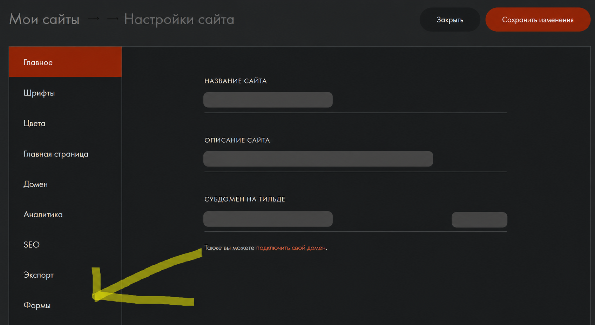
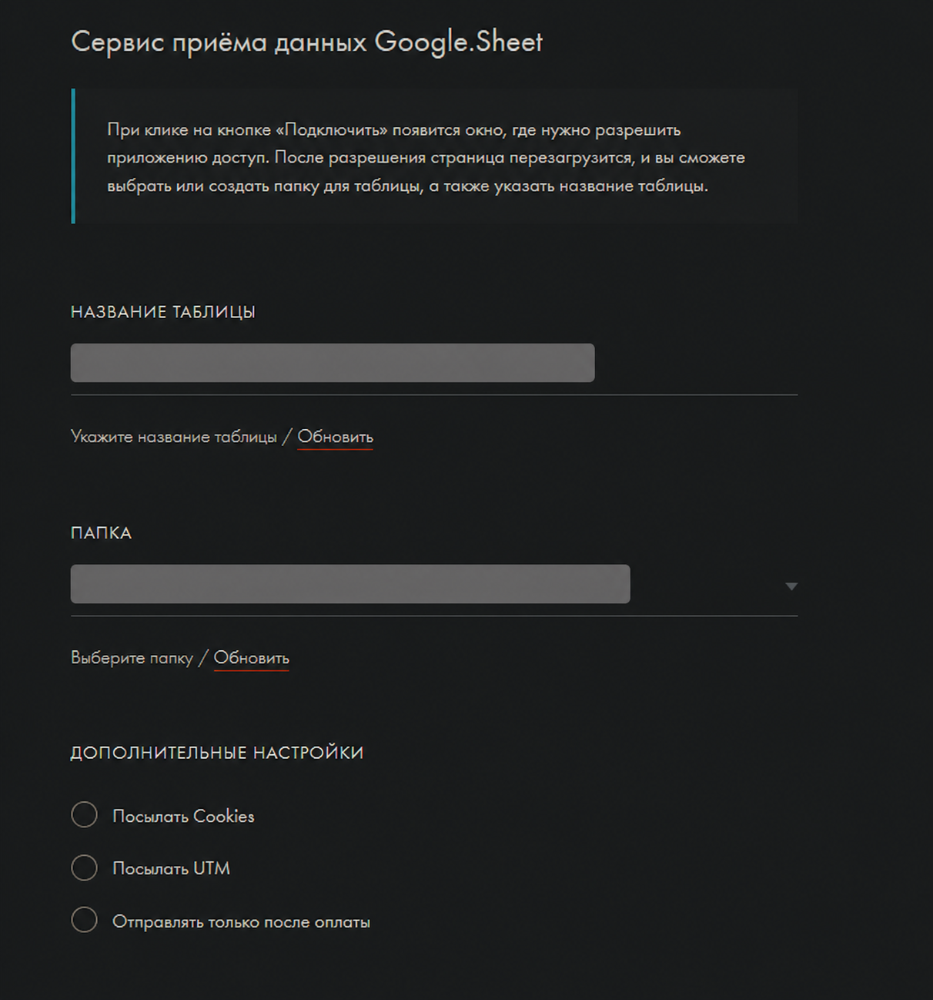

# Обработка заявок Tilda Publishing в Google Sheets

Инструкция описывает приём заявок из формы Tilda Publishing в Google Sheets и создание отдельной таблицы для каждой новой заявки с помощью Apps Script.

> В примерах используются условные значения. Имена таблиц и папок, идентификаторы Google Drive, учётные данные и персональные данные в инструкцию не включены.

## Подключение Google Sheets к форме

Чтобы настроить приём заявок:

1. Откройте настройки сайта в Tilda Publishing.
2. В боковом меню выберите раздел «Формы».



3. Подключите сервис приёма данных Google Sheets.
4. Подтвердите доступ к аккаунту Google в открывшемся окне.
5. Укажите название новой таблицы и папку Google Drive для её хранения.



6. Сохраните изменения и подключите сервис к нужной форме.
7. Опубликуйте страницу.

После отправки формы сервис добавляет новую строку в подключённую таблицу Google Sheets.

## Подготовка таблицы

Чтобы подготовить таблицу к обработке заявок:

1. Откройте созданную таблицу Google Sheets.
2. Убедитесь, что первая строка содержит названия полей формы.
3. Добавьте отдельный столбец статуса обработки. В примере он имеет номер `27`.
4. Для уже существующих заявок укажите в этом столбце значение `Обработано`, если их не нужно переносить повторно.

Столбец статуса нужен, чтобы скрипт не создавал дублирующие таблицы.

## Добавление Apps Script

Чтобы создать отдельную таблицу для каждой новой заявки:

1. В Google Sheets выберите «Расширения» → «Apps Script».
2. Если проект создан только для этой задачи, замените его содержимое кодом ниже. Не удаляйте код из общего проекта без предварительной проверки.
3. Укажите имя листа, номер столбца статуса и идентификатор целевой папки в блоке `SETTINGS`.
4. Сохраните проект.

```javascript
const SETTINGS = {
  sourceSheetName: 'Лист1',
  statusColumn: 27,
  processedValue: 'Обработано',
  targetFolderId: 'FOLDER_ID'
};

function createTablesForNewLeads() {
  const sourceSpreadsheet = SpreadsheetApp.getActiveSpreadsheet();
  const sourceSheet = sourceSpreadsheet.getSheetByName(SETTINGS.sourceSheetName);

  if (!sourceSheet) {
    throw new Error(`Лист «${SETTINGS.sourceSheetName}» не найден.`);
  }

  const lastRow = sourceSheet.getLastRow();
  const lastColumn = sourceSheet.getLastColumn();

  if (lastRow < 2) return;
  if (SETTINGS.statusColumn < 1 || SETTINGS.statusColumn > lastColumn) {
    throw new Error('Номер столбца статуса выходит за пределы таблицы.');
  }

  const headers = sourceSheet.getRange(1, 1, 1, lastColumn).getValues();

  for (let rowNumber = 2; rowNumber <= lastRow; rowNumber += 1) {
    const statusCell = sourceSheet.getRange(rowNumber, SETTINGS.statusColumn);
    if (statusCell.getValue() === SETTINGS.processedValue) continue;

    const values = sourceSheet.getRange(rowNumber, 1, 1, lastColumn).getValues();
    const createdSpreadsheet = SpreadsheetApp.create(
      `Заявка_${Utilities.formatDate(new Date(), Session.getScriptTimeZone(), 'yyyy-MM-dd_HH-mm-ss')}`
    );
    const createdSheet = createdSpreadsheet.getSheets()[0];

    createdSheet.getRange(1, 1, 1, lastColumn).setValues(headers);
    createdSheet.getRange(2, 1, 1, lastColumn).setValues(values);

    if (SETTINGS.targetFolderId && SETTINGS.targetFolderId !== 'FOLDER_ID') {
      const folder = DriveApp.getFolderById(SETTINGS.targetFolderId);
      DriveApp.getFileById(createdSpreadsheet.getId()).moveTo(folder);
    }

    statusCell.setValue(SETTINGS.processedValue);
  }
}
```

В `targetFolderId` укажите идентификатор папки Google Drive, а не ссылку на неё. Идентификатор расположен между `/folders/` и следующим символом `/` в адресе папки.

## Настройка запуска скрипта

Чтобы запускать обработку автоматически:

1. В редакторе Apps Script откройте раздел «Триггеры».
2. Нажмите «Добавить триггер».
3. Выберите функцию `createTablesForNewLeads`.
4. В качестве источника события выберите «По времени».
5. Укажите интервал, подходящий для процесса, например один раз в пять минут.
6. Сохраните триггер и подтвердите запрошенные разрешения.

Для получения данных через внешний сервис используйте триггер по времени. Такой способ не зависит от того, каким образом сервис добавляет строку в таблицу.

## Проверка обработки заявки

Чтобы проверить работу:

1. Отправьте тестовую форму без реальных персональных данных.
2. Убедитесь, что в исходной таблице появилась новая строка.
3. Запустите функцию `createTablesForNewLeads` вручную или дождитесь запуска триггера.
4. Проверьте, что для заявки создана отдельная таблица в указанной папке.
5. Убедитесь, что в исходной таблице в столбце статуса появилось значение `Обработано`.

## Что проверить при ошибке

- Новая строка не появляется — проверьте подключение Google Sheets к форме и публикацию страницы.
- Скрипт сообщает, что лист не найден — укажите точное имя листа в `sourceSheetName`.
- Не создаётся таблица в папке — проверьте идентификатор папки и разрешения аккаунта, от имени которого работает скрипт.
- Появляются дубли — проверьте номер столбца статуса и значение `processedValue`.
- Триггер не запускает обработку — выполните функцию вручную, проверьте разрешения и затем создайте триггер заново.

## Готово

Заявки из формы Tilda Publishing поступают в Google Sheets, а скрипт создаёт для каждой необработанной заявки отдельную таблицу в указанной папке Google Drive.
